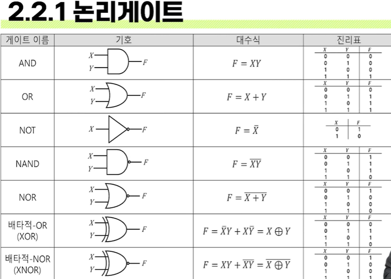

# # 컴퓨터 구조

## 01. 컴퓨터 구조의 개요 및 디지털논리회로 (1)

- 컴퓨터과학과 강지훈 교수님

### (0) 컴퓨터 구조

- 컴퓨터의 구조적 구성 요소
    - 애플리케이션
        - programs
    - 운영체제
        - device drivers
    - 아키텍처
        - instructions
    - 마이크로 아키텍처
        - datapaths, controllers
    - 로직
        - adders, memories
    - 디지털 회로
        - AND gates, NOT gates
    - 아날로그 회로
        - amplifiers, filters
    - 디바이스
        - transistors, diodes
    - 물리
        - electrons

### (1) 컴퓨터 시스템의 개요

- 컴퓨터 시스템의 구성
    - 소프트웨어
        - 시스템 소프트웨어
        - 응용 소프트웨어
    - 하드웨어
        - 입력 장치
        - 중앙 처리 장치
        - 기억 장치
        - 출력 장치
        - 시스템 버스
- 컴퓨터 시스템의 분류
    - 처리성능 및 규모에 따른 분류
        - 임베디드 컴퓨터
        - 마이크로 컴퓨터
        - 미니 컴퓨터
        - 메인프레임 컴퓨터
        - 슈퍼 컴퓨터
    - 구조에 따른 분류
        - 파이프라인 슈퍼 컴퓨터
            - 파이프라이닝 구조를 이용해 명령어 수준의 병렬성을 지원하며, 고속의 벡터 계산을 가능하게 함
        - 대규모 병렬처리 컴퓨터
            - 병렬로 구성된 다수의 처리장치를 이용해 태스크, 데이터 병렬성을 지원함

### (2) 컴퓨터와 디지털 논리회로(1)

- 디지털논리회로의 개요
    - 디지털 논리회로
        - 컴퓨터와 같은 디지털 기반 장치를 구성하는 기본 회로
        - 2진 논리를 디지털 논리 게이트로 구현한 것
        - 집적회러(IC: Integrated Circuits)로 구성
    - 디지털 논리회로는 저장요소의 존재 여부에 따라 두 가지로 분류
        - 조합 논리회로 - 가산기, 디코더 등
        - 순서 논리회로 - 레지스터, 카운터 등
- 논리 게이트와 불대수
    - 논리 게이트
        - 디지털 논리회로를 구성하는 기본적인 요소
        - 2진 정보만 다루며, 2진 논리 연산을 수행하는데 사용하는 소자
    - 기본적인 논리 연산
        - 논리 합
        - 논리 곱
        - 논리 부정

- 불대수
    - 불대수(Boolean algebra)
        - 0 또는 1의 값을 갖는 논리 변수와 논리 연산을 다루는 대수
    - 불함수의 표현
        - 논리 변수들의 상호 관계를 나타내기 위해 변수, 연산기호, 괄호 및 등호 등으로 표기하는 대수적 표현
    - 불함수와 논리 회로도
        - 논리 연산을 표현하는 불함수는 논리 게이트들로 구성되는 논리 회로도로 작성 가능
    - 불함수와 진리표(Truth table)
        - 논리식에서 모든 입력 조합에 대한 출력 값을 나열한 표
    - 불함수와 진리표와의 관계
        - 어떠한 불함수에 대한 진리표는 오직 하나만 존재함
        - 진리표는 불함수에 대한 모든 입력 조합에 대한 출력을 나열한 표
            - 출력 값을 계산하는 과정은 나타내지 않음
        - 이로 인해, 연산 과정이 달라도 입력 조합에 대한 결과가 동일한 불함수가 존재할 수 있음
            - 따라서, 동일한 진리표에 대한 불함수와 논리회로도는 여러 개가 될 수 있음
        - 동일한 입력에 동일한 출력이라면 최대한 단순한 회로도가 효율적
    - 불함수의 간소화 방법
        - 대수적인 방법
            - 불대수의 기본 공식을 이용하여 불함수를 간소화
        - 도표를 이용한 방법
            - 불대수의 기본 공식을 기반으로 카르노 도표(Karnaugh map)를 이용한 간소화
        - 테이블을 이용한 방법
    - 불함수 간소화
        - 여러 불함수가 동일한 진리표를 갖는다면 불함수의 형태가 달라도 결국 동일한 작업이라는 의미임
        - 진리표에서 불함수를 유도하여 진리표를 만족하는 간소화된 불함수를 도출할 수 있음
        - 진리표에서 각 변수 조합은 최소항 또는 최대항으로 표현할 수 있으며, 이를 통해 구조화된 형태의 정규형 불함수를 나타낼 수 있음
    - 최소항
        - 주어진 진리표의 모든 변수를 정상형 또는 부정형으로 한번씩 포함해서 논리곱으로 결합한 형태이며, 단 하나의 입력 조합에서만 출력이 1이 되는 표현
        - 논리 변수 X,Y가 있는 경우, 논리곱(AND)으로 표현되는 4가지 항
        - XYZ -> 0의 값을 가지도록.
    - 최대항
        - 최소항과 동일하지만 변수를 논리합으로 결합한 형태이며, 단 하나의 입력 조합에서만 출력이 0이 되는 표현
        - 논리 변수 X,Y가 있는 경우, 논리합(OR)으로 표현되는 4가지 항
        - X+Y+Z -> 1의 값을 가지도록.
    - 정규형 불함수
        - 불함수를 최소항으로 나타낼 경우 각 최소항들을 논리합(OR)으로 결합하고, 최대항은 논리곱(AND)으로 결합하여 표현함
    - 불함수의 대수적 간소화
        - 공통된 것을 찾아서 나두고, 반대의 값을 가진 것은 소거
        - (사람의 숙련도에 따라 값이 달라짐)
    - 카르노 도표(Karnaugh map)를 이용한 간소화
        - 입력 변수의 개수를 기반으로 여러 개의 사각형으로 된 표
