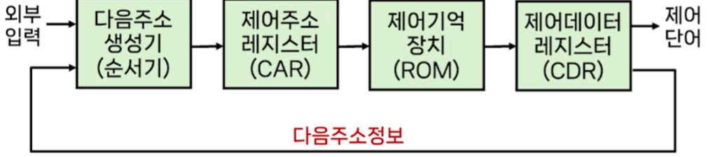

# # 컴퓨터 구조

## 06. 제어장치 (1)

- 컴퓨터과학과 강지훈 교수님

### (1) 제어장치의 개요, 구성, 구현 방법

- 제어장치(Control Unit)의 정의
    - 컴퓨터 시스템의 모든 장치들을 유기적으로 제어하는 장치
- 제어장치의 역할
    - 기억장치에 저장된 프로그램으로부터 명령어를 순차적으로 읽어와 연산코드(Opcode) 부분을 해독(Decode)
    - 해독 결과에 따라 컴퓨터 시스템의 각 요소를 동작시키는 제어신호를 발생시킴
- 컴퓨터의 명령어 처리
    - 제어장치는 CPU에 입력된 명령어의 실행에 사용될 구성 요소들을 작동시키기 위한 제어신호를 발생 시킴
    - 하나의 명령어는 한 클럭 동안에 수행되는 마이크로 연산의 집합으로 구성됨
        - 명령어는 마이크로 연산의 연속적인 실행으로 수행됨
    - 제어장치는 필요한 마이크로 연산을 처리장치가 연속적으로 수행하도록 제어신호를 보내 명령어를 처리하게 하는 역할을 함
- 제어장치의 구성
    - 제어장치의 구성 요소
- 제어장치의 명령어 수행 과정
    1. 프로그램 카운터(PC)에 저장된 주소로 기억장치에 접근
    2. 기억장치에서 명령어를 읽어와 명령어 레지스터(IR)에 저장하고, 프로그램 카운터를 1 증가
    3. 읽어온 명령어에서 연산코드는 명령어 해독기로, 오퍼랜드는 주소처리기로 보냄
    4. 주소처리기는 명령어 수행에 필요한 오퍼랜드의 주소 또는 다음 명령어의 주소를 계산
    5. 제어신호 발생기에서 연산코드를 해독하여 명령어 수행을 위한 제어신호를 생성

- 제어장치의 구현
    - 제어장치의 유형
        - 마이크로 프로그램(Microprogram)에 의한 제어장치
            - 제어신호를 마이크로 명령어로 작성하여 기억장치에 저장하고, 이를 읽어서 제어신호를 생성
                - 장점: 제어신호를 수정하고자 할 때 융통성이 뛰어남
                - 단점: 제어기억장치에서 명령을 인출하는 별도의 시간 때문에 속도가 느림
        - 하드웨어에 의한 제어장치 (하드와이어드 - Hardwired 제어)
            - 논리 게이트, 플립플롭, 디코더 등으로 구성하여 제어신호를 직접 생성
                - 장점: 회로로 직접 동작하기 때문에 속도가 빠름
                - 단점: 명령어 집합 변경이나 기능 추가 시 회로 수정이 필요

### (2) 마이크로 프로그램에 의한 제어

- 제어 방식
    - 제어변수 값들을 결합하여 표현하고, 연속적으로 읽어 제어신호를 발생시켜 동작시키는 방식
- 제어장치의 역할
    - 일련의 마이크로 연산이 순차적으로 수행되도록 제어
    - 제어를 위해 제어변수로 제어단어를 사용
- 제어 단어
    - 제어단어는 0과 1로 된 비트열로 표현
    - 각 제어단어에는 마이크로명령어(microinstruction)가 포함
        - 마이크로명령어는 하나 혹은 다수의 마이크로연산을 나타냄
    - 제어단어를 이용하여 처리장치의 여러 구성요소들이 특정 시점에서 연산을 시작하도록 프로그램이 가능

- 제어장치의 구성도
    - 외부 입력 -> 다음주소 생성기(순서기) -> 제어기억 장치(ROM) -> 제어데이터 레지스터(CDR) -> 제어 단어 or 순서기
    - 구성요소
        - 제어기억장치
            - 모든 제어정보를 항상 저장하고 있는 기억장치(ROM)
        - 제어 주소 레지스터(CAR: Control Address Register)
            - 제어기억장치에 있는 마이크로 명령어의 주소를 나타냄
        - 다음 주소 생성기(순서기)
            - 다음에 수행될 마이크로명령어의 주소를 생성
        - 제어 데이터 레지스터(CDR: Control Data Register)
            - 제어기억장치에서 읽어온 마이크로 명령어를 임시로 저장(일반적으로 생략)
- 구성요소의 동작 원리(1)
    - 제어기억 장치
        - 마이크로 명령어들이 저장되어 있음
        - 마이크로 명령어는 하나 또는 다수의 마이크로 연산을 나타내는 제어단어 포함
        - 마이크로 명령어가 수행되면, 다음에 수행될 마이크로 명령어의 주소를 결정해야 함
            - 이를 위해 현재 마이크로 명령어 내에 다음 마이크로 명령어의 주소 정보가 포함되어 있어야 함
    - 다음주소 생성기 - 순서기(1)
        - 다음에 수행될 마이크로 명령어의 주소 생성
        - 생성된 주소는 다음 클럭 펄스가 입력될 때 CAR로 이동외어 ROM으로부터 다음 마이크로 명령어를 읽어내는데 사용됨
        - 마이크로 명령어 내에는 처리장치의 마이크로 연산을 실행시키는 제어 비트와 실행될 마이크로 명령어의 순서를 정하는 비트가 포함되게 됨
        - 다음에 실행될 마이크로 명령어의 주소는 순서기의 입력에 따라 다양한 방법으로 결정 될 수 있음
            1. CAR의 1증가
            2. 제어기억장치의 주소를 CAR에 적재
            3. 외부로부터 온 주소를 CAR에 적재
            4. 제어동작을 시작하는 초기주소 적재
    - 제어 주소레지스터(CAR)
        - 다음에 읽을 마이크로 명령ㅇ어의 주소를 저장하는 레지스터
    - 제어 데이터레지스터(CDR)
        - 제어기억장치에서 읽어온 마이크로 명령어를 임시 저장하는 레지스터
        - 다음 마이크로명령어를 읽어오기 전 까지 현재의 마이크로 명령어를 저장함
- 제어장치의 동작
    - 제어기억장치에 저장된 마이크로명령어(제어단어 포함)에 의해 동작
