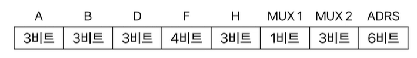
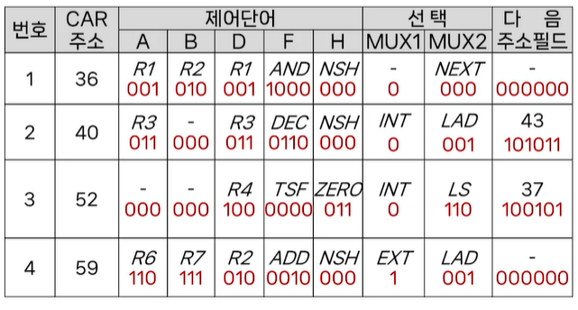
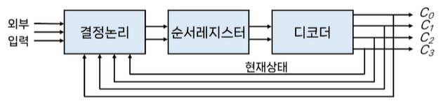

# # 컴퓨터 구조

## 07. 제어장치 (2)

- 컴퓨터과학과 강지훈 교수님

### (1) 마이크로명령어 형식

- 마이크로명령어
    - 마이크로프로그램에 의한 제어방식에서 제어기억장치에 있는 제어단어
    - CPU의 각 구성 요소에 어떤 동작을 시킬지 지정하는 제어신호의 집합
        - ALU, 레지스터 등등
    - 하나의 마이크로명령어는 하나 이상의 마이크로연산을 지정할 수 있음
    - 마이크로명령어들이 순차적으로 실행되면서 마이크로프로그램을 이룸
        - 명령어 한 개를 실행하기 위해 여러 개의 마이크로명령어가 순차 실행됨
- 마이크로명령어 형식
    - 마이크로명령어의 구성내역(26비트 예시)
        - 8개 필드로 구성
          
            - A, B, D 필드: 출발 및 도착 레지스터 선택
            - F 필드: ALU 연산 선택
            - H 필드: 시프트 연산 선택
            - MUX 1 필드: 0과 1로서 내부와 외부 주소를 선택
            - MUX 2 필드: 상태비트의 값에 따라 CAR을 구동
            - ADRS 필드: ROM의 2진 번지에 해당하는 10진 주소

- 마이크로명령어 형식의 예시

| 비트    | 필드     | 기호              | 기능                         |
  |-------|--------|-----------------|----------------------------|
| 1~3   | `A`    | `INP`, `R1~R7`  | 출발 레지스터 선택                 |
| 4~6   | `B`    | `INP`, `R1~R7`  | 출발 레지스터 선택                 |
| 7~9   | `D`    | `NONE`, `R1~R7` | 도착 레지스터 선택                 |
| 10~13 | `F`    | ALU의 연산 참조      | ALU 연산 선택                  |
| 14~16 | `H`    | 시프터의 연산 참조      | 시프터 연산 선택                  |
| 17    | `MUX1` | `INT`, `EXT`    | MUX1 선택 (`INT=0`, `EXT=1`) |
| 18~20 | `MUX2` | 상태비트 참조         | MUX2 선택                    |
| 21~26 | `ADRS` | 주소              | ROM의 단어 선택                 |

- MUX2의 기능 선택

| 2진코드 |  기호  | 기능                        |
|:----:|:----:|---------------------------|
| 000  | NEXT | CAR을 증가(다음 주소로 간다)        |
| 001  | LAD  | CAR에 주소를 적재(무조건 분기)       |
| 010  |  LC  | 캐리가 있으면 적재(C=1이면 분기)      |
| 011  | LNC  | 캐리가 없으면 적재(C=0이면 분기)      |
| 100  |  LZ  | 제로면 적재(Z=1이면 분기)          |
| 101  | LNZ  | 제로가 아니면 적재(Z=0이면 분기)      |
| 110  |  LS  | 부호가 바뀌었으면 적재(S=1이면 분기)    |
| 111  |  LV  | 오버플로우가 발생했으면 적재(V=1이면 분기) |

### (2) 마이크로프로그램의 작성

- 마이크로프로그램
    - 제어기억장치에 저장된 일련의 마이크로명령어들의 집합
        - 마이크로프로그램 루틴(microprogram routine)
    - CPU의 명령어 하나를 실행하기 위해 필요한 마이크로명령어들의 집합
    - 마이크로프로그램을 이용해 제어장치를 구현
        - 마이크로프로그램에 의한 제어장치
- 레지스터 전송문
    - 마이크로프로그램 루틴은 20번지에서 시작하여 외부 번지로 분기한다고 가정

| 주소 | 마이크로 연산과 분기조건                                   |
|:--:|-------------------------------------------------|
| 20 | R3 ← R1 − R2, CAR ← CAR + 1                     |
| 21 | if (C = 1) then (CAR ← 23) else (CAR ← CAR + 1) |
| 22 | R4 ← R4 + R1, CAR ← 26                          |
| 23 | if (Z = 0) then (CAR ← 25) else (CAR ← CAR + 1) |
| 24 | R4 ← R4 + 1, CAR ← 26                           |
| 25 | R4 ← R4 + R2, CAR ← CAR + 1                     |
| 26 | 출력 ← R4, CAR ← 외부주소                             |

- 기호 마이크로 프로그램

| 주소 | A  | B  |  D   |  F  |  H  | MUX1 | MUX2 | 다음주소 |
|:--:|:--:|:--:|:----:|:---:|:---:|:----:|:----:|:----:|
| 20 | R1 | R2 |  R3  | SUB | NSH |  -   | NEXT |  -   |
| 21 | -  | -  | NONE | TSF | NSH | INT  |  LC  |  23  |
| 22 | R4 | R1 |  R4  | ADD | NSH | INT  | LAD  |  26  |
| 23 | -  | -  | NONE | TSF | NSH | INT  | LNZ  |  25  |
| 24 | R4 | -  |  R4  | INC | NSH | INT  | LAD  |  26  |
| 25 | R4 | R2 |  R4  | ADD | NSH |  -   | NEXT |  -   |
| 26 | R4 | -  | NONE | TSF | NSH | EXT  | LAD  |  -   |

- 2진 마이크로프로그램

|   주소   |  A  |  B  |  D  |  F   |  H  | MUX1 | MUX2 |  다음주소  |
|:------:|:---:|:---:|:---:|:----:|:---:|:----:|:----:|:------:|
| 010100 | 001 | 010 | 011 | 0101 | 000 |  0   | 000  | 000000 |
| 010101 | 000 | 000 | 000 | 0000 | 000 |  0   | 010  | 010111 |
| 010110 | 100 | 001 | 100 | 0010 | 000 |  0   | 001  | 011010 |
| 010111 | 000 | 000 | 000 | 0000 | 000 |  0   | 101  | 011001 |
| 011000 | 100 | 000 | 100 | 0001 | 000 |  0   | 001  | 011010 |
| 011001 | 100 | 010 | 100 | 0010 | 000 |  0   | 000  | 000000 |
| 011010 | 100 | 000 | 000 | 0000 | 000 |  1   | 001  | 000000 |

- 마이크로프로그램의 개념
    - 제어장치 설계를 위한 시스템적인 접근과정
    - 마이크로명령어 형식을 설정하면 마이크로프로그램의 작성과정은 컴퓨터의 프로그램 작성과정과 유사
    - 이러한 이유로 펌웨어(firmware)라고도 함

### (3) 하드웨어에 의한 제어

- 하드웨어에 의한 제어장치
    - 주어진 시간에 처리장치에서 수행할 마이크로연산을 결정해주는 제어상태를 갖는 순서회로
- 제어장치의 설계
    - 입력신호들에 따라 출력신호들을 발생하도록 내부논리 설계
    - 각 제어신호에 대한 부울 표현식이 입력함수로 구현
    - 결국 제어장치의 설계는 순서회로의 설계
    - 일반적으로 제어순서의 상태도를 이용하여 설계
- 제어장치의 구현 방법
    - 상태 플립-플롭을 이용한 제어방식
    - 순차 레지스터와 디코더를 이용한 제어방식
- 하드웨어에 의한 제어
    - 상태 플립-플롭을 이용한 제어방식의 구성도
        - 외부입력에 의한 결정논리에서 출력 C0, C1, C2의 상태가 결정되며, 이들은 순서적으로 한 개 상태씩 동작된다.
    - 순서 레지스터와 디코더를 이용한 제어
        - 레지스터: 제어상태의 순서를 정하는데 사용
        - 디코더: 각 상태마다 하나의 출력만을 나오도록 사용
        - n-비트 순서 레지스터: n개의 플립플롭과 게이트로 구성

- 동작원리
    - 2 비트로 된 레지스터와 2x4 디코더를 이용한 네가지 상태의 순서제어논리
        - 순서레지스터는 2개의 플립플롭을 가지며, 레지스터의 다음 상태는 현재 상태와 외부입력에 의해 결정되고, 제어 출력신호는 디코더의 출력이 된다.
    - 장점
        - 순서회로를 사용함으로써 부품 수는 최소화 되고 동작 속도는 극대화
    - 단점
        - 시스템이 복잡해지면 설계가 어렵고, 한번 구성되면 바꾸기 어려움
    - 하드웨어에 의한 제어 방식은 RISC(reduced instruction set computer)방식에 사용됨
