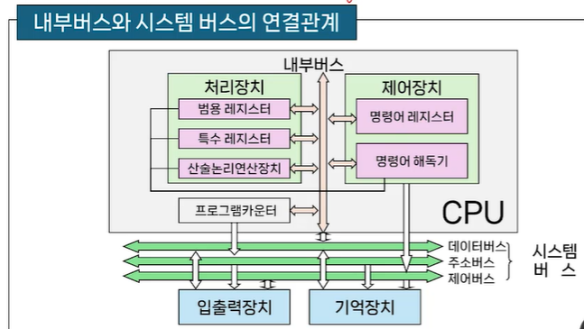

# # 컴퓨터 구조

## 08. 중앙처리장치 (1)

- 컴퓨터과학과 강지훈 교수님

### (1) 중앙처리장치의 개요 및 내부구조

- 중앙처리장치(CPU - Central Processing Unit)
    - 컴퓨터의 두뇌라고 부르는 핵심 구성 요소
    - 컴퓨터에서 명령어를 수행하고 데이터를 처리하는 장치
    - 프로그램이 수행되는 전반적인 과정을 제어
    - 내부적으로 처리장치와 제어장치로 구성
- 내부구조
    - 산술논리연산장치(ALU)
        - 산술연산장치, 논리연산장치, 시프터, 상태 레지스터, 보수기
        - 상태 레지스터(status/flag register)
            - 연산결과의 상태를 나타내는 플래그(flag)를 저장하는 레지스터
        - 보수기(complementer)
            - ALU내의 데이터에 대해 보수연산을 수행
    - 레지스터 세트
        - CPU내의 레지스터 집합
        - 기억장치 중 액세스 속도가 가장 빠름
        - 이를 이용해 CPU에서의 빠른 처리속도를 지원
        - 빠른 속도를 갖지만 가격이 비싸고 용량대비 물리적인 크기가 다른 기억장치보다 상대적으로 큼
            - CPU내의 레지스터의 수는 제한적임
    - 제어장치
        - 프로그램에 의한 연산의 순서대로 기억장치, 연산장치, 입출력장치에 제어신호를 발생
        - 제어장치의 동작
            - 1단계: 명령어를 해독하고, 명령어 레지스터에 저장
            - 2단계 명령어 레지스터에 저장된 명령어 실행
    - 내부버스
        - ALU와 레지스터 간의 데이터 전송을 위한 통로
            - 데이터 버스와 제어 버스로 궝
        - 외부장치(기억장치, 입출력장치와 데이터 전송)
            - 시스템 버스와 연결
            - 시스템 버스: 데이터, 주소, 제어 버스로 구성

- 중앙처리장치의 내부 구조
    - 중앙처리장치의 구성요소

### (2) 레지스터

- 레지스터의 종류
    - 범용 레지스터(general purpose register)
        - 데이터를 일시적으로 저장
        - 연산에 사용될 오퍼랜드(피연산자-변수)가 연산을 위해 임시 저장되는 공간
    - 특수 레지스터(special purpose register)
        - 특수한 기능을 수행
        - 컴퓨터 시스템 운영을 위한 참조 정보가 저장되는 공간
- 범용 레지스터
    - 데이터 저장과 같은 일반적인 목적을 위한 레지스터
    - CPU 내부에 있는 소규모의 일시적인 기억장치로, 프로그램의 진행 도중 가까운 시간 내에 사용할 데이터나 연산결과를 일시적으로 기억시키는데 사용
    - 데이터를 연산할 때 메모리로부터 데이터를 인출할 경우 호출시간이 많이 걸리기 때문에 CPu 내부의 레지스터에 데이터를 기억시켜두고 연산

- 특수 레지스터
    - 기억하는 데이터에 따른 분류
        - 주소, 명령어, 데이터
- 주소를 기억하는 레지스터
    - 프로그램 카운터(PC: Program Counter)
        - 다음에 수행될 명령어가 있는 주소를 저장하고 있음
            - 즉, 데이터가 저장되어 있는 기억장치의 주소를 지정
        - 현재 처리하려고 하는 데이터를 인출한 후에 자동적으로 값이 증가
        - 프로그램 카운터의 비트 수는 기억장치의 용량과 연고나이 있음
            - 기억장치 전체 영역이 256MByte (=228)라면 프로그램 카운터의 비트 수는 28비트가 필요함
    - 기억장치 주소 레지스터(MAR: Memory Address Register)
        - 기억장치 주소를 임시 저장하는 레지스터
    - 스택 포인터(SP: Stack Pointer)
        - 스택을 활용한 주소지정방식에서 사용
        - 스택 영역의 Top 주소를 저장하는 레지스터
        - 스택 영역은 프로그램 실행 중 필요할 때마다 실제 데이터를 기억하는 공간으로써 기억장치에 존재함
    - 제어 주소 레지스터(CAR: Control Address Register)
        - 제어기억장치에 있는 바이크로명령어의 주소를 나타낸다.
    - 인덱스 레지스터(XR: indeX Register)
        - 인덱스 된 주소지정방식에서 사용
        - 명령어 주소 영역에 대한 상대적인 변위 값을 저장하는데 사용
    - 베이스 레지스터(BR: Base Register)
        - 명령어의 주소 부분에 저장된 변위 값에 더해질 기주소를 저장하는데 사용
    - 명령어 레지스터(IR: Instruction Register)
        - 프로그램의 수행 중 가장 최근에 기억장치로부터 인출되어진 명령어를 저장
        - 명령어 레지스터의 비트 수는 명령어의 연산코드의 비트 수와 같다
        - 명령어 레지스터에 있는 명령어는 명령어 해독기(decoder)에 의해 해독된 후 그 명령어에 해당되는 제어신호가 각 구성요소에 전달
- 데이터를 기억하는 레지스터
    - 기억장치 버퍼 레지스터(MBR: Memory Buffer Register)
        - 기억장치로 쓰여질 데이터나 혹은 기억장치로부터 읽혀질 데이터를 임시로 저장하는 레지스터
    - 누산기(AC: Accumulator)
        - 데이터를 일시적으로 저장하는 레지스터
        - 입력장치로부터 데이터를 받아들이거나, 출력장치로 데이터를 전송하는데 사용
        - 산술 및 논리연산이 이루어질 경우에는 오퍼랜드나 연산 결과를 일시적으로 기억하는 레지스터

### (3) 명령어 사이클

- 명령어 사이클의 개념
    - 컴퓨터의 기본적인 기능은 기억장치에 기억되어 있는 프로그램을 실행하는 것
        - 실행되는 프로그램은 명령어로 구성
    - 중앙처리장치는 기억장치에 저장되어 있는 명령어를 인출하여 실행함으로써 프로그램을 수행
    - 이러한 명령어의 수행과정을 명령어 사이클이라 함
- 명령어 수행 과정
    - 중앙처리장치에서의 명령어 수행과정은 기억장치와 중앙처리장치의 레지스터들의 동작을 통해 살펴볼 수 있음

- 명령어 사이클(instruction cycle)
    - 한 개의 명령어를 CPU에서 수행하는데 필요한 전체 수행 과정
- 명령어 사이클의 종류
    - 인출 사이클(fetch cycle)
    - 실행 사이클(execute cycle)
    - 간접 사이클(indirect cycle)
    - 인터럽트 사이클(interrupt cycle)
- 명령어 수행 과정
    - 명령어 인출
        - 기억장치로부터 명령어를 가져오는 과정
            - 인출된 명령어의 주소는 PC에 들어있고, 인출된 명령어는 IR로 옮겨짐
    - 명령어 해석
        - 명령어를 해독하는 과정
            - 명령어의 종류에 따라 필요한 경우 오퍼랜드의 인출 수행
    - 명령어 실행
        - 지정된 연산을 실행하는 과정
            - 간접주소지정인 경우 기억장치로부터 데이터가 들어있는 유효주소를 인출
    - 저장
        - 명령어 실행단계에서 수행된 연산 결과가 레지스터 혹은 기억장치에 쓰여지는 과정
    - 인터럽트 처리
        - 명령어 실행 도중에 입출력장치와 같은 다른 장치에 의해 인터럽트가 들어오면 그에 합당한 서비스를 제공하는 과정
- 명령어를 실행하는 과정
    - 명령어 인출과정을 통하여 IR레지스터에 실린 명령어를 해독하고, 해독한 명령어에 따라 필요한 연산이 수행
    - 수행되는 연산들의 기능
        - 데이터의 이동 기능: 기억장치와 CPU 혹은 입출력장치 사이에 데이터의 이동
        - 데이터의 처리 기능: 산술 혹은 논리연산을 통한 데이터 처리
        - 데이터의 저장 기능: 연산결과를 기억장치에 저장
        - 제어 기능: 프로그램의 실행 순서를 결정
- 명령어 실행 예시
    - LOAD 명령어
        - 데이터 이동을 위한 명령어로써 원하는 기억장치의 데이터를 CPU의 내부 레지스터인 누산기로 가져오는 명령어
            - (1) 누산기로 이동할 데이터가 들어있는 주소가 MAR에 적재
            - (2) MAR 레지스터에 있는 주소의 데이터가 MBR에 적재
            - (3) MBR에 들어있는 데이터를 누산기에 저장
            - T0: MAR <- IR(adrs)
            - T1: MBR <- M[MAR]
            - T2: AC <- MBR
    - ADD 명령어
        - 데이터 처리명령어로서 누산기에 있는 데이터와 기억장치에 있는 데이터를 더한 후에 그 결과를 누산기에 저장하는 명령어
            - (1) 더해질 데이터가 들어있는 기억장치의 주소가 MAR에 적재
            - (2) MAR에 있는 기억장치 주소에 해당하는 데이터가 MBR에 적재
            - (3) 누산기에 있는 데이터와 MBR에 있는 데이터가 더해지고, 결과가 누산기에 저장
            - T0: MAR <- IR(adrs)
            - T1: MBR <- MAR
            - T2: AC <- AC + MBR
    - STORE 명령어
        - 연산결과를 갖고 있는 누산기의 데이터를 기억장치에 저장하는 동작을 수행
            - (1) 저장되어질 주소가 MAR에 적재
            - (2) 누산기에 있는 데이터가 MBR에 적재
            - (3) MBR에 있는 데이터가 MAR에 있는 주소로 저장
            - T0: MAR <- IR(adrs)
            - T1: MBR <- AC
            - T2: M[MAR] <- MBR
    - 분기 혹은 점프 명령어
        - 제어기능을 수행하는 명령어로써 프로그램의 순서를 바꾸는 명령어
        - 즉, 다음에 수행할 명령어는 PC가 가지는 주소의 명령어가 아니라, 분기 혹은 점프 명령어에 있는 주소에 해당하는 명령어가 됨
            - (1) 분기 혹은 점프 명령어에 있는 주소가 PC에 적재
            - T0: PC <- IR(ADRS)
- 간접 사이클
    - 간접주소지정방식에서 오퍼랜드의 유효주소를 결정하는 과정
        - 인출 사이클에서 인출된 명령어가 간접주소지정방식을 사용하면 간접 사이클이 실행 사이클보다 먼저 실행
            - (1) 명령어의 주소가 MAR에 실린다
            - (2) MAR이 지정한 주소의 데이터가 MBR에 실린다.
            - (3) MBR에 있는 데이터가 IR의 주소 필드에 실린다.
            - T0: MAR <- IR(adrs)
            - T1: MBR <- MAR
            - T2: IR(ards) <- MBR
- 인터럽트 사이클
    - 인터럽트 요청이 발생했을 때 실행되는 과정
        - 실행 사이클이 끝난 직후에 인터럽트가 발생했는지를 검사하며, 발생하였다면 인터럽트 서비스 루틴(ISR: Interrupt Service Routine)이 시작되도록 함
    - CPU는 기본적으로 순차 실행 흐름으로 동작함
        - 인축 -> 실행 -> 인출 -> 실행...
    - 외부 장치나 예외 상황은 CPU의 순서를 기다려주지 않음
        - 이러한 사건을 처리하기 위해서는 순차 실행 루프 중간에 끼어들 수 있는 사이클이 필요함
    - (1) 현재 수행하고 있는 명령어를 처리한 후, 다음에 수행할 명령어 주소를 갖고 있는 PC의 내용을 스택에 저장
    - (2) 요청된 인터럽트 서비스 루틴(ISR: Interrupt Service Routine)을 호출하여 그 서비스 루틴의 시작 주소를 PC에 저장
    - T0: MBR <- PC
    - T1: MAR <- SP, PC <- ISR(adrs)
    - T2: M[MAR] <- MBR
