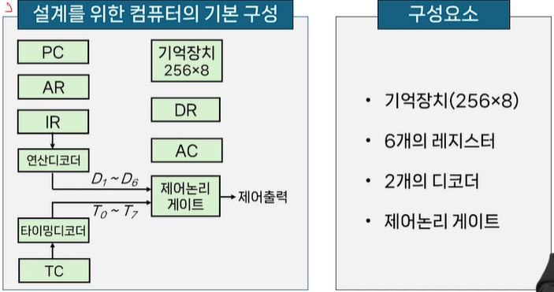
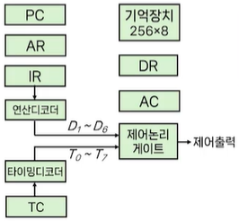
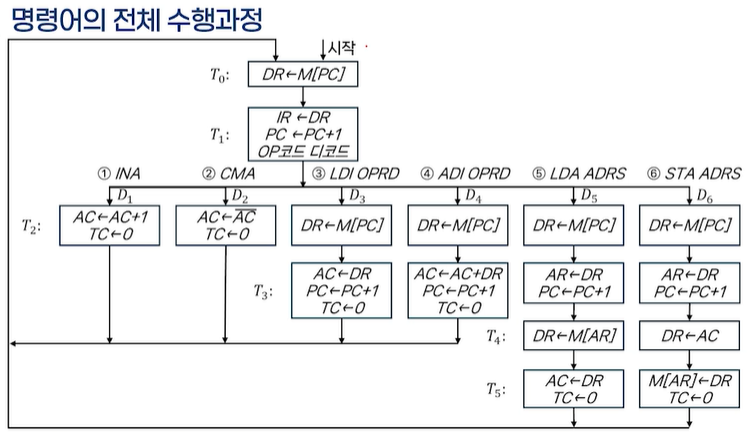
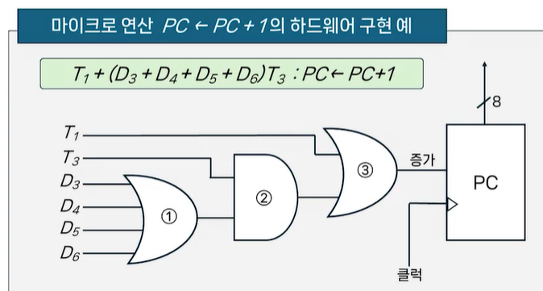
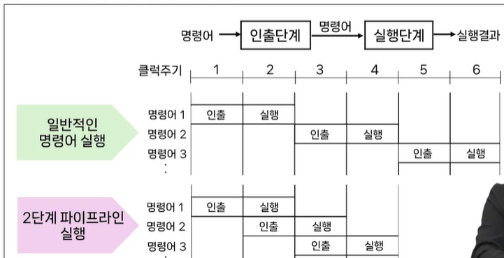
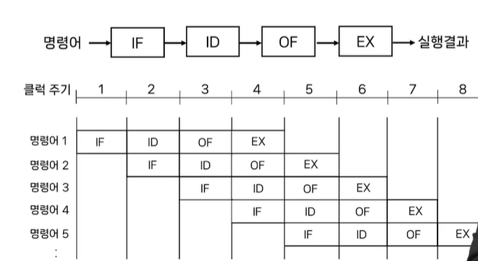
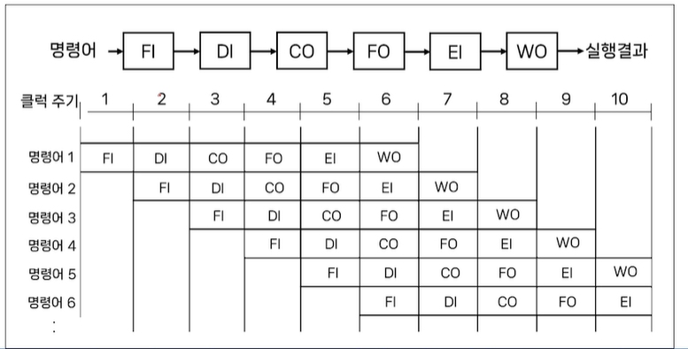

# # 컴퓨터 구조

## 09. 중앙처리장치 (2)

- 컴퓨터과학과 강지훈 교수님

### (1) 간단한 구조의 컴퓨터 설계

- 설계 과정
    - 기본적인 컴퓨터 구성 설계
    - 컴퓨터 명령어 설계
    - 명령어 분석을 통한 제어논리 설계
    - 하드웨어에 의한 제어장치 설

- 기본적인 컴퓨터 구성 설계
  

| 레지스터기호 | 비트수 | 레지스터이름   | 설명                                               |
|--------|:---:|----------|--------------------------------------------------|
| DR     |  8  | 데이터 레지스터 | 기억장치에서 읽어온 단어의 내용이나 기억장치에 쓰여질 단어의 내용을 저장         |
| AR     |  8  | 주소 레지스터  | 오퍼랜드의 주소를 저장                                     |
| AC     |  8  | 누산기      | 데이터 처리가 이루어지는 특수 레지스터                            |
| IR     |  8  | 명령어 레지스터 | 명령어의 연산코드를 저장                                    |
| PC     |  8  | 프로그램 카운터 | 수행하려는 명령어의 주소를 저장                                |
| TC     |  3  | 타이밍 카운터  | 타이밍 변수 `T₀`~`T₇`까지를 계수, 명령어 실행의 각 단계를 구분하기 위한 장치 |

- 명령어의 설계
    - 6개 명령어 예시
        - 실제 연산코드에 필요한 비트 수는 사용하는 연산의 종류 수와 관계 있음.
        - 즉, 2n개의 연산을 수행하기 위해서는 최소한 n 비트가 필요

| 연산 코드      | 기호 이름      | 기능               | 전송문              |
|------------|------------|------------------|------------------|
| `00000001` | `INA`      | AC를 증가           | `AC ← AC + 1`    |
| `00000010` | `CMA`      | AC의 보수           | `AC ← AC̅`       |
| `00000011` | `LDI OPRD` | 즉치 값을 AC에 적재     | `AC ← OPRD`      |
| `00000100` | `ADI OPRD` | 즉치 값을 AC에 더함     | `AC ← AC + OPRD` |
| `00000101` | `LDA ADRS` | AC로 적재           | `AC ← M[ADRS]`   |
| `00000110` | `STA ADRS` | AC의 내용을 기억장치에 적재 | `M[ADRS] ← AC`   |

- 명령어 인출 단계
    - PC가 지정한 번지에 있는 연산코드를 기억장치로부터 DR로 읽어 옴
    - 다음에 연산코드는 DR로부터 IR로 전송되고, PC는 기억장치의 다음 주소를 지정하기 위해 1증가
        - T0: DR <- M[PC]
        - T1: IR <- DR, PC <- PC + 1

- 명령어 실행 단계(INA: AC+1 명령어의 예시)
    - 타이밍 변수 T2 동안에 연산코드는 IR에 있으며, 연산 디코더 출력 중의 하나만이 1이 됨
    - 제어장치는 디코더의 출력을 사용해서 다음 마이크로 연산을 지정
        - INA 명령은 연산코드가 00000001 이므로, 디코더의 출력에서 D1을 1로 함
    - D1T2 : AC <- AC + 1, TC <- 0
    - T2 시간에 D1 = 1이면, AC는 1 증가하고 TC는 0으로 리셋 됨
    - TC를 0으로 리셋함으로써 제어는 타이밍 변수 T0로 되돌하가며, 인출단계를 다시 시작하고 다음 명령어의 연산코드를 읽게 됨
- 명령어 실행 단계(LDI OPRD: AC에 즉치 값 즉재 명령어의 예시)
    - LDI 명령의 연산코드는 00000011이므로 디코더 출력 D3가 1이 됨
    - D3T2 : DR <- M[PC]
    - D3T3 :  AC <- DR, PC <- PC + 1, TC <- 0
    - D3 = 1일 때 타이밍 변수는 T2, 이 시간에 오퍼랜드를 기억장치로부터 인출하여 DR에 적재
    - T3시간에 DR로 읽어온 오퍼랜드는 AC로 전송하고, PC는 다시 1 증가
    - 명령어의 실행을 끝낼 때에는 항상 TC를 0으로 리셋시켜서 인출 단계로 되돌아감
- 명령어 실행 단계(LDA ADRS: AC에 적재 명령어의 예시)
    - LDA명령은 연산코드가 00000101 이므로 디코더 출력 D5가 1이 됨
    - D5T2 : DR <- M[PC]
    - D5T3 : AR <- DR, PC <- PC + 1
    - D5T4 : DR <- M[AR]
    - D5T5 : AC <- DR, TC <- 0
    - T2 시간에 ADRS의 값이 인출되며, T3 시간에 이 주소는 DR에서 AR로 전송되고, PC는 다시 증가
    - ADRS는 오퍼랜드의 주소이므로 T4시간에 오퍼랜드를 DR에 옮김
    - T5 시간에는 오퍼랜드를 DR에서 AC로 전송하고 제어는 인출 단계로 돌아 감

- 제어논리의 설계
    - 마이크로 전송문, 마이크로 연산, 제어 함수
        - 레지스터 전송 표현
            - 컴퓨터가 명령어가 수행하는 연산을 정의하고 컴퓨터의 내부 동작을 나타내는데 유용한 방법
            - 전송문에서 나타낸 제어 함수와 마이크로 연산이 디지털 시스템을 설계하는데 사용
        - 마이크로 연산
            - 레지스터의 종류와 데이터 처리장치에서 수행해야 할 디지털 함수를 나타냄
        - 제어 함수
            - 논리 게이트들을 이용한 논리회로로 구현할 수 있으며, 이렇게 구현된 제어논리들이 마이크로 연산을 수행하게 되기 때문에 하드웨어에 의한 제어장치를 구현할 수 있게 된다
    - 제어함수의 유도
        - 명령어 수행단계에서의 모든 전송문을 조사해서 같은 마이크로 연산을 수행하는 문장을 찾아 제어함수를 유도
            - PC <- PC + 1의 동작을 찾으면
                - T1 + (D3 + D4 + D5 + D6)T3 : PC <-
                  PC + 1
                - 타이밍 변수 T1일 때 수행하며, T3에서 디코더 출력이 D3, D4, D5,
                  D6일 때도 수행

- 제어함수의 하드웨어 구현
  
- 간단한 컴퓨터의 설게를 위한 제어함수

| 제어함수                                             | 마이크로 연산        |
|--------------------------------------------------|----------------|
| C₁ = T₀ + (D₃ + D₄ + D₅ + D₆)·T₂                 | `DR ← M[PC]`   |
| C₂ = T₁ + (D₃ + D₄ + D₅ + D₆)·T₃                 | `PC ← PC + 1`  |
| C₃ = T₁                                          | `IR ← DR`      |
| C₄ = D₁·T₁                                       | `AC ← AC + 1`  |
| C₅ = D₂·T₂                                       | `AC ← A̅C`     |
| C₆ = D₃·T₃ + D₅·T₅                               | `AC ← DR`      |
| C₇ = D₄·T₃                                       | `AC ← AC + DR` |
| C₈ = (D₅ + D₆)·T₃                                | `AR ← DR`      |
| C₉ = D₅·T₄                                       | `DR ← M[AR]`   |
| C₁₀ = D₆·T₄                                      | `DR ← AC`      |
| C₁₁ = D₆·T₅                                      | `M[AR] ← DR`   |
| C₁₂ = (D₁ + D₂)·T₂ + (D₃ + D₄)·T₃ + (D₅ + D₆)·T₅ | `TC ← 0`       |

### (2) 명령어 파이프라이닝

- 파이프라이닝(pipelining)
    - 어떤 일을 실행하는데 있어서 하나의 일을 여러 단계로 나누어, 중첩되게 실행함으로써 성능을 높이는 방법
- 명령어 파이프라이닝(instruction pipelining)
    - CPU의 처리속도를 향상시키기 위한 방법 중의 하나로써, CPUP의 내부 하드웨어를 여러 단계로 나누어 처리하는 기술
        - 하나의 처리기를 여러 개의 부 처리기로 나누어 각각의 처리기가 서로 다른 데이터를 처리하는 구조
        - 명령어 파이프라이닝을 명령어 수행 사이클에 적용하면 여러 개의 명령어가 중첩되어 실행 되도록 구현할 수 있음
- 명령어 파이프라이닝 방법
    - 2단계 명령어 파이프라이닝
        - 명령어가 수행되는 컴퓨터 사이클을 2단계로 나누어 실행
            - 명령어 인출 단계
            - 명령어 실행 단계
        - 2단계 파이프 라이닝 실행 흐름도
            - 
        - 실행과 문제점
            - 실행 속도
                - 명령어의 수행을 인출과 실행 단계가 중첩되도록 하면 명령어의 처리 속도를 2배 향상될 수 있음
            - 문제점
                - 2단계 명령어 파이프라인은 두 단계의 처리시간이 동일해야 한다는 제약이 발생
            - 해결책
                - 파이프라인의 각 단계의 수를 늘려서 각 단계의 처리시간을 같게 할 수 있음
                - 즉, 단계의 세분화를 통해 각 단계간의 시간 차이를 최소화 하는 것
    - 4단계 명령어 파이프라이닝
        - 명령어 수행단계를 4단계로 나누어 수행하는 구조
            - 명령어 인출 단계(IF)
            - 명령어 해독 단계(ID)
            - 오퍼랜드 인출 단계(OF)
            - 명령어 실행 단계(EX)
        - 4단계 파이프라이닝 실행 흐름도
            - 
        - 4단계 명령어 파이프라인의 실행
            - 실행과정
                - 두 번째 클럭 주기에서부터 명령어 단계가 중첩되어 처리되며, 최대 4개의 단계들이 동시에 처리
            - 실행속도
                - 2단계 명령어 파이프라인에 비하면 더 많은 단계의 중첩으로인해 처리 속도가 향상될 수 있음
    - 6단계 명령어 파이프라이닝
        - 명령어 수행단계를 4단계로 나누어 수행하는 구조
            - 명령어를 인출하는 FI(Fetch Instruction) 단계
            - 명령어를 해독하는 DI(Decode Instruction) 단계
            - 오퍼랜드를 계산하는 CO(Calculate Operand) 단계
            - 오퍼랜드를 인출하는(Fetch Operand) 단계
            - 명령어를 실행하는 EI(Execute Instruction) 단계
            - 연산된 결과 오퍼랜드를 저장하는 WO(Write Operand) 단계
        - 6단계 파이프라이닝 실행 흐름도
            - 
        - 6단계 명령어 파이프라인의 실행
            - 실행과정
                - 최대 6개의 명령어 단계가 동시에 처리
            - 실행속도
                - 2단계나 4단계 명령어 파이프라인에 비해 더 많은 단계의 중첩으로 처리 속도가 더욱 향상될 수 있음
            - 속도향상을 위한 조건
                - 모든 단게에서의 실행시간이 같아야 함
                - 래치시간이 각 단계의 실행시간보다 무시할 정도로 작아야 함
                - 실행되어야 할 명령어의 수가 많아야 함
                - 속도 향상비(Spped up) = (파이프라인을 사용하지 않은 경우의 소요시간) / (파이프라인에 의한 소요 시간)

### (3) CISC와 RISC

- 명령어 세트의 복잡성에 따라 분류
    - CISC (Complex Instruction Set Computer)
        - 명령어에 따라 다양한 길이를 갖는 가변길이 명령어 형식을 사용
        - 명령어 수행시간이 1 클럭에서 많게는 수백 클럭까지 소요
        - 약 200여 개 이상의 명령어를 갖고 있음
    - RISC (Reduced Instruction Set Computer)
        - 고정길이의 명령어 형식을 사용하기 때문에 명령어 집합이 단순
        - 모든 명령어가 1워드 단위로 고정되어 있기 때문에 1개 명령어를 수행하는데 1개 클럭만이 소요
        - 약 30여 개의 명령어만을 가지고 있음
- 제어장치의 구성
    - CISC
        - 마이크로프로그램에 의한 제어방식으로 제어장치를 구성
    - RISC
        - 하드웨어에 의한 제어방식으로 제어장치를 구성
- 레지스터 구조
    - CISC
        - CPU 내부의 범용 레지스터의 수가 적음
        - 기억장치에 있는 데이터를 액세스하기 위해서는 기억장치 접근이 자주 발생하며, 이는 컴퓨터의 성능저하의 요인이 됨
    - RISC
        - CPU 내부에 많은 수(약 32개에서 특수한 경우 200여 개 이상)의 범용 레지스터가 존재함
        - 처리하고자 하는 데이터를 미리 CPU의 내부 레지스터로 가져와서 실행 할 수 있으므로 처리 속도의 향상을 도모할 수 있음
- 파이프라인 적용 효율
    - CISC
        - 명령어의 길이가 가변적이기 때문에 각 단계별의 처리시간을 동일하게 해주는 것이 어려우므로 파이프라인 구조에서는 비효율적
    - RISC
        - 명령어가 고정길이 명령어이기 때문에 각 단계별의 처리시간을 동일하게 해주는 것이 용이하므로 파이프라인 구조에 효율적으로 사용
