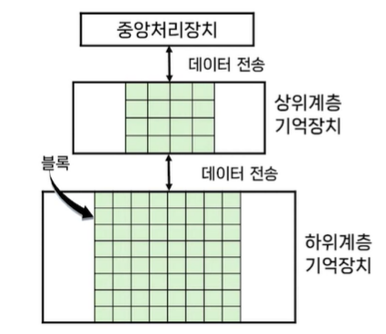
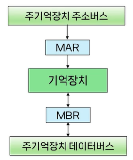
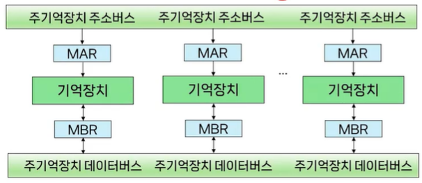
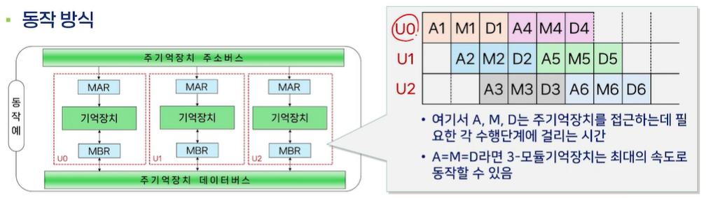
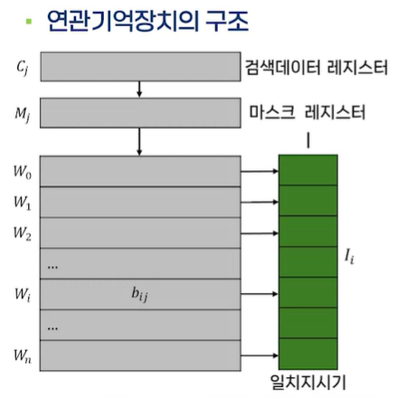
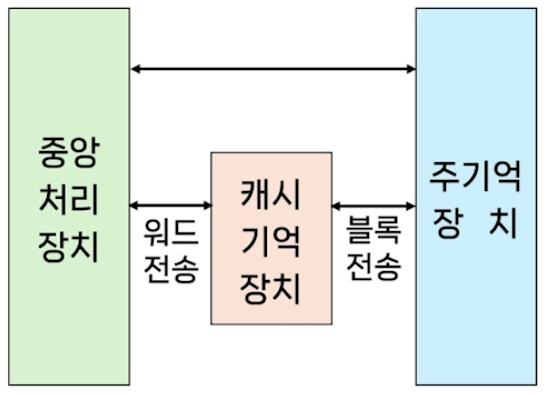
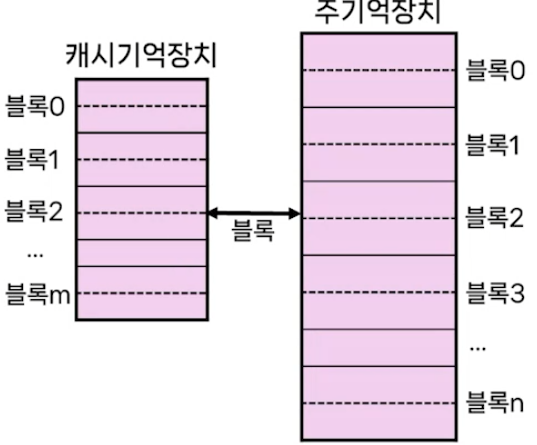
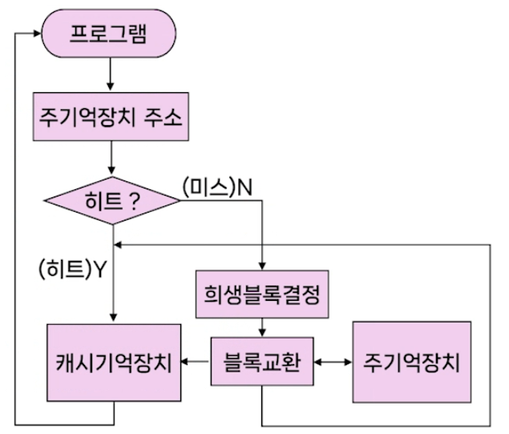

# # 컴퓨터 구조

## 10. 기억장치 (1)

- 컴퓨터과학과 강지훈 교수님

### (1) 기억장치의 개요

- 기억장치
    - 프로그램과 데이터를 저장하는 장치
    - 주기억장치
        - 처리에 즉시 필요한 프로그램과 데이터를 저장
        - 중앙처리장치와 직접 데이터 교환 가능
    - 보조기억장치
        - 컴퓨터에서 사용하는 모든 자료를 영구적으로 저장
        - 중앙처리장치와 직접적인 자료고환이 불가능하며, 주기억장치를 통해서만 가능
        - 주기억장치에 비해 가격이 저렴하고 용량이 크리만, 자료의 전송속도는 느림
    - 기억장치의 설계
        - 컴퓨터 시스템에서 기억장치 설계는 비용과 용량을 고려하여 주기억장치와 보조기억장치를 구성해야 함
        - 일반적으로 주기억장치는 비트 당 비용이 높기 때문에 보조기억장치에 비해 작은 용량으로 구성됨
            - 또한, 실제로 보조기억장치의 모든 데이터를 항상 사용하는 것은 아니기 때문에 보조기억장치 크기의 용량을 필요로 하는 경우는 거의 없음
        - 보조기억장치 -> 주기억장치 -> 캐시기억 장치 -> 레지스터
- 지역성의 원리(Locality)
    - 프로그램 실행 시, 일정 시간 동안 기억장치 접근이 특정 영역에 집중되는 경향
        - 즉, 어떤 주소가 한 번 참조되면 주변 주소들이 가까운 시간 내에 반복적으로 참조될 가능성이 높고, 그 밖의 영역은 상대적으로 참조 빈도 낮음
    - 시간적 지역성(temporal Locality)
        - 최근에 접근한 데이터나 명령어가 가까운 미래에도 다시 사용될 가능성이 높음
    - 공간적 지역성(spatial locality)
        - 접근한 주소와 가까운 주소가 곧 접근될 가능성이 높음
- 프로그램의 지역성
    - 반복적으로 명령어와 데이터를 접근하게 되는 루프를 포함하는 대부분의 프로그램은 상당히 큰 시간적 지역성을 보임
        - 예를 들어 반복문 처리 시 코드블록 내부의 같은 변수에 반복적으로 접슨
    - 또한, 대개의 명령어들이 순차적으로 접근되기 때문에 큰 공간적 지역성을 보임
        - 예를 들어 레코드나 배열의 요소에 접근할 때 인접 주소에 연속적으로 접근
- 기억장치의 계층구조
    - 보조기억장치 -> 주기억장치 -> 캐시기억 장치 -> 레지스터
    - 우측으로 갈 수록
        - 접근시간 감소, 접근속도 증가, 비용 증가, 용량 감소
    - CPU가 직접 접근 가능
        - 레지스터
        - 캐시기억장치
        - 주기억장치
    - 먼저 주기억장치에 적재되어야 CPU가 접근 가능
        - 보조기억장치
    - 기억장치 계층
        - 속도와 크기가 다른 기억장치를 여러 층으로 구성한 것
        - 지역성의 원리를 이용하여 기억장치 계층을 구현
    - 계층구조의 목적
        - 전체 기억장치를 구성하는데 있어서 가격은 최소화하면서 가능한 한 빠른 접근속도와 대용량의 크기를 제공하기 위해
            - 입출력의 경제성 확보
    - 기억장치 계층간 관계
        - 
        - 상위 계층: 하위계층 기억장치가 기억하고 있는 내용의 일부를 저장
        - 하위 계층: 모든 데이터가 저장됨
        - 블록(block): 두 계층 간에 전송되는 정보의 단위(데이터의 최소 단위)
        - 히트(hit): CPU에 의해서 요구되는 데이터가 상위 계층의 어떤 블록에 있을 때
        - 미스(miss): 상위 계층에서 찾을 수 없을 때
        - 히트율(hit ratio): 상위계층에서 찾을 수 있는 기억장치 접근비율
        - 미스율(miss ratio): 상위계층에서 찾을 수 없는 기억장치 접근비율
- 기억장치 성능평가 요인
    - 기억용량(capacity)
    - 접근 시간(access time)
        - 기억장치에 읽기 쓰기 명령이 요청된 후 실제 읽기/쓰기 명령이 끝나는 시간
    - 사이클 시간(cycle time)
        - 하나의 액세스를 시작한 시간부터 다음 액세스를 시작할 때까지의 시간
    - 기억장치 대역폭(bandwidth)
        - 기억장치의 데이터 처리속도를 말하며, 데이터 전송률이라고도 함
    - 가격(cost)
- 프로그램 실행 중 필요한 데이터를 일시적으로 저장하는 기억장치
    - 주기억장치는 컴퓨터 시스템에서의 필수적인 하드웨어 요소
        - 휘발성
        - CPU와 직접 연결
        - 빠른 접근속도
        - 실행 공간
    - 주기억장치 성능평가의 중요한 요인
        - 접근시간
            - 주기억장치의 접근시간은 CPU의 클럭 사이클과 비교하여 많은 차이
                - 두 장치 간의 속도차이의 개선필요
        - 대역폭
            - 주기억장치의 대역폭은 CPU와 보조기억장치, 입출력장치들이 공동으로 사용하므로 제한적
        - 기억용량
            - 아무리 큰 용랴으이 주기억장치도 기억용량의 증가가 요구됨
    - 주기억장치 개선방법
        - 속도차이: 복수모듈기억장치, 연관기억장치, 캐시기억장치
        - 기억용량: 가상기억장치

### (2) 복수모듈 기억장치

- 주기억장치의 대역폭
    - 명령어 수행속도의 제한적인 요소
    - 중앙처리장치와 입출력장치가 주기억장치를 경쟁적으로 이용하기 때문에 병목현상 발생
    - 대역폭의 개선방법
        - 속도가 빠른 기억소자를 이용하여 설계
        - 주기억장치에서 한 번에 읽을 수 있는 단어의 비트 수를 증가
        - 기억장치의 구조적 개선 -> 복수모듈 기억장치
- 기억장치 모듈 구조
    - 
    - 기억장치 모듈이 하나인 주기억장치
    - 단일 기억장치 모듈로 구성된 주기억장치에서 세개의 단어를 읽으려면 적어도 세 개의 기억장치 사이클을 필요로 함
    - 결국 CPU와 같이 주기억장치에서 읽은 데이터를 처리하는 장치들이 아무리 속도가 빨라져도 결국 기억장치 사이클이 작업시간 지배
- 복수모듈 기억장치의 개요
    - 기억장치 모듈을 여러 개 가지고 있는 기억장치
        - 각 모듈은 독자적인 주기억장치
    - 기억장치를 구성하고 있는 모듈 수만큼 단어들을 동시에 접근 가능
    - 
    - 복수모듈 기억장치의 동작(3개의 모듈: 3-모듈)
        - 하나의 모듈에 기억장치 버스를 통하여 주소를 보내는 동안
        - 다른 모듈에서는 미리 보낸 주소를 해독하여 접근하며
        - 또 다른 모듈에서는 인출한 데이터를 버스를 통해 외부로 내보냄
            - 이런 동작이 동시에 이루어져서 기억장치의 대역폭을 높일 수 있음
            - 또한 버스를 구성하는 데이터 선들의 수가 많을 때에는 모든 모듈에 병렬로 접근 가능
    - 동작 방식
        - 
        - 한 모듈에 주소를 보내는 동안(A), 다른 모듈에서는 미리 보낸 주소를 해독하여 기억장소에 접근하며(M), 또 다른 모듈에서는 읽어낸 데이터를 데이터버스를 통해 외부로 보냄(D)
    - 문제점
        - 한 개의 버스를 공유할 경우 동시에 버스 사용을 요구하면 버스경합 발생
        - 동시에 한 개 이상의 모듈들이 동일 버스를 사용하면 데이터 간의 충돌
    - 해결 방법
        - 메모리 인터리빙(memory interleaving)
            - 버스경합이나 기억장치충돌과 같은 문제를 해결하기 위하여 기억장치를 복수 모듈로 구성하고 각 모듈이 동시에 접근할 수 있게 하는 방식
            - CPU가 한번에 여러 모듈로 동시에 주소를 보낼 수 없기 때문에, 연속된 주소를 서로 다른 모듈에 교대로 배치하여 순차적으로 전송하고, 각 모듈이 번갈아 동작하도록 하여 결과적으로 여러
              모듈을 병행 접근할 수 있게 하는 방법

### (3) 연관기억장치

- 일반적인 기억장치는,
    - 많은 경우 데이터가 저장된 주소를 알아야 함
    - 하지만 몇몇 경우에는 주소가 아닌 내용을 기반으로 해당 내용이 저장되어 있는지 빠르게 확인해야 하는 상황이 존재함
        - 캐시 메모리의 태그 비교
        - TLB의 가상 페이지 번호 비교
        - MAC 주소 테이블 검색 등
- 연관기억장치(associative memory)
    - 기억장치에 저장된 데이터의 내용을 이용하여 기억장치에 접근할 수 있는 기억장치
    - 내용 주소화 기억장치(CAM: Content Addressable Memory)라고도 함
- 연관기억장치의 구조
    - 
    - 구성요소
        - 병렬검색을 위한 검색데이터 레지스터 C
        - 마스크 레지스터 M
        - 일치 지시기 I
        - n 개의 단어와 단어 당 m비트를 갖는 n x m 배열의 셀(cell)
    - M은 C의 데이터 검색 과정에서 검색할 필요가 없는 비트들을 마스크 하는데 사용되며, I는 검색 결과가 원하는 정보와 일치하는지를 표시하는데 사용한다.
    - n x m 배열의 셀(cell)은 기억 장소로서, 각 단어의 같은 위치의 비트를 비트 슬라이스(bit slice)라고 한다
- 연관기억장치의 장점(32K x 16 단어의 예)
    - 32K x 16 RAM
        - 최대 32,000개의 기억장치 사이클(memory cycle) 필요
        - 0번지 부터 마지막 주소까지의 단어를 주소의 순서대로 한 단어 씩 읽어서 주어진 데이터와 비교
    - 연관기억장치
        - 16개의 연관기억장치 사이클(associative memory cycle)필요
        - 32,000 단어 모두에 대해 한 비트 씩 병렬로 읽어내어 비교
        - 연관기억장치의 기억소자들은 병렬 판돈회로가 포함되기 때문에 가격이 매우 비쌈

### (4) 캐시기억장치(1) - 캐시기억장치의 원리

- 캐시기억장치(Cache memory)의 용도
    - 주기억장치의 수행속도 개선을 위한 하나의 방법
    - 캐시는 주기억장치보다 속도가 빠른 기억소자로 구성
    - 중앙처리장치와 주기억장치 간의 속도 차이를 줄여주는 역할을 수행
        - 중앙처리장치가 주기억장치에 접근하는 대신 캐시기억장치에서 데이터를 가져오게 하여 성능 향상을 달성함
    - 
- 캐시기억장치의 원리
    - 캐시기억장치는 가격이 비싸기 때문에 기억용량은 주기억장치의 용량보다 훨씬 작음
    - 데이터를 필요로 할 때마다 매번 캐시로 데이터를 가져온다면 효율성이 저하됨
        - 따라서, 중앙처리장치가 주기억장치에 있는 데이터를 캐시기억장치에서 접근하려면 그 데이터를 미리 캐시기억장치로 옮겨 놓아야 하며, 이를 위해서는 필요한 데이터를 미리 예측할 수 있어야 함
    - 기억장치 접근에 대한 지역성의 원리를 이용하여 데이터를 캐시기억 장치에 옮겨 놓을 수 있음
- 데이터 접근의 지역성 원리
    - 최근에 접근한 프로그램과 데이터는 미래에 다시 접근될 가능성이 높음
    - 지역성은 최근에 접근한 것을 기초로 하여 가까운 미래에 접근할 명령어와 데이터를 예측할 수 있는 수단이 됨
    - 캐시기억장치와 기억장치에서 기억장치의 성능개선을 위한 수단으로 사용
- 어떤 단어를 캐시기억장치로 옮겨 놓기 위해서는...
    - 데이터 접근의 지역성을 기초로 그 단어를 포함하는 블록을 캐시기억 장치로 미리 옮겨 놓으면 됨
    - 필요 데이터와 인접한 데이터들 까지 한번에 옮겨 놓으면 지역성의 특성에 따라 미래에 접근할 데이터를 예측하는 형태로 작동함
    - 블록(Block)
        - 주기억장치 내에 연속적으로 저장된 일정한 수의 단어
        - 주기억장치와 캐시기억장치는 모두 같은 수의 단어로 구성된 블록단위로 매핑 되어 관리됨
- 2 단어 블록의 구성도
    - 
    - 캐시기억장치와 주기억장치의 블록
        - 프로그램이 어떤 단어에 접근할 때 발생되는 두 가지 경우
            - 그 단어를 포함한 블록이 캐시기억장치에 저장되어 있는 경우
            - 그 단어를 포함한 블록이 캐시기억장치에 저장되어 있지 않는 경우
        - 캐시 히트(Cache hit): 접근하고자 하는 단어가 캐시기억장치에 저장되어 있는 경우
        - 캐시 미스(Cache miss): 저장되어 있지 않은 경우
- 캐시기억장치의 동작 원리
    - 
    - 캐시 히트일 경우
        - 캐시기억장치에서 데이터를 직접 가져옴
    - 캐시 미스일 경우
        - 주깅억장치에서 데이터를 가져와야 함
        - 주기억장치에서 데이터를 캐시기억장치에 옮겨 놓은 다음 캐시기억장치에 접근
        - 만일 캐시기억장치에 가용 공간이 없다면 캐시기억장치의 블록 중에서 하나를 희생블록으로 선택하여 주기억장치 내의 데이터 블록과 교환
    - 희생 블록(victim block)
        - 캐시 미스가 되었을 때 필요한 데이터를 캐시에 가져오기 위해서는 한 블록을 저장할 수 있는 공간을 확보해야 함
        - 하지만 공간이 없다면 특정 블록을 주기억장치로 보내고 (쫒아내야 함) 공간을 확보해야 함
            - 캐시의 가용 공간 확보를 위해 주기억장치로 쫒겨나는 블록을 희생블록이라고 함
        - 캐시에 있는 블록중에서 가장 사용되지 않을 것으로 생각되는 블록을 선택 -> 최근 사용되지 않은 블록을 선택
            - 이때 캐시와 주기억장치 사이에서 블록 교환(block replacement)을 수행함
- 캐시의 적중률
    - 블록교환이 자주 일어나는 것은 주 기억장치 접근을 빈번히 이루어지게 하므로 시간적 낭비가 발생함
    - 따라서 데이터를 접근하려 할 때 캐시기억장치에서 히트되는 비율을 나타내는 적중률을 높여 블록교환은 최소화 시켜야 함
    - 적중률은 캐시 기억장치의 성능을 측정하는 데 사용되며, 적중률이 높을수록 우수하며 보통 0.95~0.99 정도면 우수한 것으로 평가됨
    - 적중률 = 캐시기억장치 히트 수 / 전체 메모리 참조횟수
