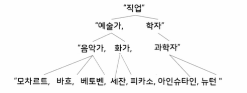
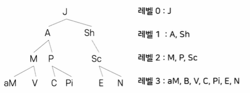

# # 자료구조

## 07. 트리

- 컴퓨터과학과 정광식 교수님

### (1) 트리의 개념

- 트리의 정의
    - 검색의 편리함
    - 논리적 계층
    - 계급적 특성

### (2) 트리의 표현 방법

- 트리의 구성
    - 노드: 트리의 항목/트리에 저장되는 데이터의 묶음
    - 부모노드 - 자식노드: 상하 계층구조가 있고 직접적으로 연결된 노드들로서 상위 계층의 부모 노드와 하위 계층의 자식 노드를 의미함
    - 루트 노드: 트리의 최상위 노드(부모가 없는 노드)
    - 서브트리: 부모 노드를 삭제하면 생기는 트리들
    - 잎 노드: 트리의 맨 끝(바닥)에 있으면서, 자신의 서브트리를 갖지 않는 노드
- 진입/진출차수
    - 루트 노드: 진입 차수 = 0
    - 루트를 제외한 모든 노드의 진입 차수 : 1
    - 잎 노드: 진출 차수 = 0
- 내부 노드와 형제
    - 내부 노드: 루트도 아니고 잎도 아닌 노드
    - 형제: 같은 부모를 갖는 노드들
- 트리의 레벨
    - 노드의 레벨: 루트로부터 그 노드까지 이어진 선(경로)의 길이
    - 트리의 깊이: 트리의 레벨에서 가장 큰 값에 1을 더한 것

### (3) 추상 자료형

- 트리의 추상 자료형 (ADT, Abstract Data Type)
    - 트리 객체의 정의: 루트 노드를 갖는 유한 리스트
        - (1) Tree Create()
        - (2) Destroy(Tree)
        - (3) Tree Copy_Tree(Tree)
        - (4) Insert(n)
        - (5) Delete()
        - (6) Search()
        - (7) Traverse()
        - (8) Root()
        - (9) Parent(n)
        - (10) Children(n)
        - (11) IsRoot(n)
        - (12) IsInternal(n)
        - (13) IsLeaf(n)
        - (14) IsEmpty()
        - (15) Replace(n, m)

### (4) 이진 트리

### (5) 이진 트리 연산

### (6) 일반 트리를 이진 트리로 변환
