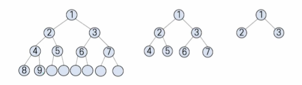
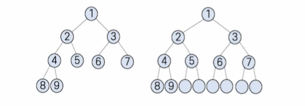

# # 자료구조

## 07. 트리

- 컴퓨터과학과 정광식 교수님

### (1) 트리의 개념

- 트리의 정의
    - 검색의 편리함
    - 논리적 계층
    - 계급적 특성


### (2) 트리의 표현 방법

- 트리의 구성
    - 노드: 트리의 항목/트리에 저장되는 데이터의 묶음
    - 부모노드 - 자식노드: 상하 계층구조가 있고 직접적으로 연결된 노드들로서 상위 계층의 부모 노드와 하위 계층의 자식 노드를 의미함
    - 루트 노드: 트리의 최상위 노드(부모가 없는 노드)
    - 서브트리: 부모 노드를 삭제하면 생기는 트리들
    - 잎 노드: 트리의 맨 끝(바닥)에 있으면서, 자신의 서브트리를 갖지 않는 노드
- 진입/진출차수
    - 루트 노드: 진입 차수 = 0
    - 루트를 제외한 모든 노드의 진입 차수 : 1
    - 잎 노드: 진출 차수 = 0
- 내부 노드와 형제
    - 내부 노드: 루트도 아니고 잎도 아닌 노드
    - 형제: 같은 부모를 갖는 노드들
- 트리의 레벨
    - 노드의 레벨: 루트로부터 그 노드까지 이어진 선(경로)의 길이
    - 트리의 깊이: 트리의 레벨에서 가장 큰 값에 1을 더한 것


### (3) 추상 자료형

- 트리의 추상 자료형 (ADT, Abstract Data Type)
    - 트리 객체의 정의: 루트 노드를 갖는 유한 리스트
        - (1) Tree Create()
        - (2) Destroy(Tree)
        - (3) Tree Copy_Tree(Tree)
        - (4) Insert(n)
        - (5) Delete()
        - (6) Search()
        - (7) Traverse()
        - (8) Root()
        - (9) Parent(n)
        - (10) Children(n)
        - (11) IsRoot(n)
        - (12) IsInternal(n)
        - (13) IsLeaf(n)
        - (14) IsEmpty()
        - (15) Replace(n, m)

### (4) 이진 트리

- 이진 트리 — 정의
    - 모든 노드의 차수가 2 이하인 트리
    - 수학적으로 이론 정리가 쉽고, 컴퓨터 내부 구현에도 효율적
    - 각 노드는 최대 2개의 자식 노드를 가짐 → 일반성 유지
    - 자식에게 방향 개념(왼쪽·오른쪽) 을 부여할 수 있음
    - 왼쪽 노드 · 오른쪽 노드 간의 개념적(의미적) 관계를 정의해 사용할 수 있음
- 가득 찬 이진 트리(pergect binary tree)
    - 이진 트리의 각 레벨에서 허용되는 최대 개수 노드를 가지는 트리
    - 
- 완전 이진 트리
    - 높이가 k인 이진 트리가 0 레벨부터 k−2 레벨까지는 모두 꽉 차 있고 마지막 k−1 레벨에서 노드들이 왼쪽부터 오른쪽으로 빈틈없이 차례대로 채워진 이진 트리.
    - 

### (5) 이진 트리 연산

- 이진 트리의 순회
    - 이진 트리의 각 노드를 (빠짐없이 그리고 중복없이) 한 번씩 방문하는 것
- 이진 트리의 전위 순회
    - 루트 노드 - 왼쪽 자식 노드(왼쪽 서브트리) - 오른쪽 자식노드(오른쪽 서브트리)
- 이진 트리의 중위 순회
  -왼쪽 자식 노드(왼쪽 서브트리) - 루트 노드 - 오른쪽 자식노드(오른쪽 서브트리)

- 전위 순회

```C
void preorder(node* root) {
    if (root != NULL) {
        printf("%c", root->data);   // 루트 노드 방문
        preorder(root->left);       // 왼쪽 서브트리 순회
        preorder(root->right);      // 오른쪽 서브트리 순회
    }
}
```

- 후위 순회

```C
void postorder(node* root) {
    if (root != NULL) {
        postorder(root->left);   // 왼쪽 서브트리 방문
        postorder(root->right);  // 오른쪽 서브트리 방문
        printf("%c", root->data); // 루트 노드 방문
    }
}
```

- 이진 트리의 생성/삽입/삭제
    - 일반적인 이진 트리를 생성하는 것은 연결 리스트 연산을 사용함
    - 첫 노드를 생성하면 루트 노드가 되고 새로운 노드를 추가하려면 연결 리스트의 삽입 연산을 사용함
    - 노드를 삭제할 때, 삭제하려는 노드가 잎 노드인 경우
        - → 해당 노드를 가리키는 포인터를 NULL로 지정하면 됨
    - 잎 노드가 아닌 경우에는
        - → 삭제하려는 노드의 자식 노드에 대한 추가 처리가 필요함

### (6) 일반 트리를 이진 트리로 변환

- 이진 트리로 변환 방법
    - 일반 트리에 대해 각 노드의 형제 노드들을 서로 연결한다.
    - 각 노드에서 가장 왼쪽 자식에 대한 링크만 남기고 나머지 자식 링크는 모두 제거한다.
    - 변환된 구조에서 루트 노드는 반드시 왼쪽 자식 노드 하나만 갖도록 한다.
