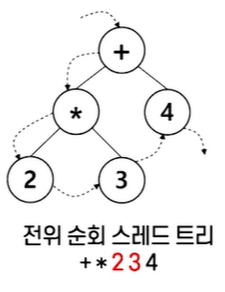
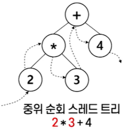
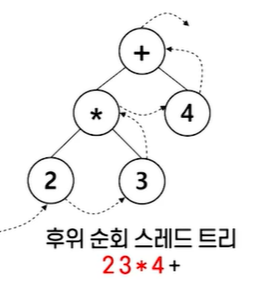
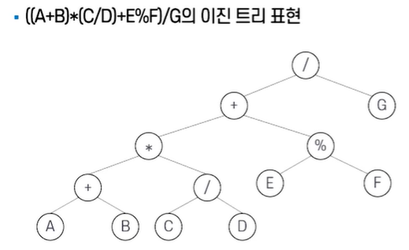
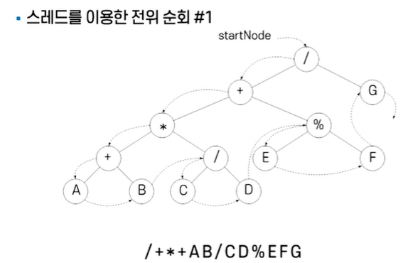
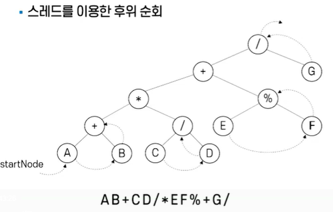

# # 자료구조

## 08. 스레드 트리

- 컴퓨터과학과 정광식 교수님

### (1) 스레드 트리

- 스레드 트리
    - 이진 트리의 노드 순회 방식에는 전위 순회, 중위 순회, 후위 순회가 있음.
    - 재귀(순환 함수)를 쓰지 않고 이진 트리를 순회할 때, 아직 다시 돌아와야 할 미방문 노드들을 스택에 저장해 관리해야 하는 번거로움이 생김.
    - 스레드 트리(threaded tree)
        - → 노드에 ‘스레드(thread)’라는 추가 포인터를 두어, 트리 순회를 더 편리하게 수행할 수 있도록 한 이진 트리 구조.
    - 스레드: 순회 방법에 따라 방문순서를 유지하는 포인터
- 세가지 순회에 대한 스레드 트리
    - 전위 순회
        - 
    - 중위 순회
        - 
    - 후위 순회
        - 

### (2) 스레드 트리 구현

- 스레드 트리 구현 — 포인터 필드의 추가
    - 구현 방법(1): 포인터 필드의 추가
        - 포인터 필드의 추가란, 노드 안에 스레드를 저장하는 포인터를 더 넣는 것.
        - 하나의 노드는 다음과 같은 필드들로 구성됨
            - 왼쪽 스레드 포인터 left_thread
            - 왼쪽 자식 포인터 *left
            - 데이터 data
            - 오른쪽 자식 포인터 *right
            - 오른쪽 스레드 포인터 right_thread
        - 오른쪽 스레드(right thread)
            - 정해진 **순회 순서에서 그 노드의 ‘후속 노드’**를 가리킴.
        - 왼쪽 스레드(left thread)
            - 정해진 **순회 순서에서 그 노드의 ‘선행 노드’**를 가리킴.

```C
```c
typedef struct tfNode {
    struct tfnode *left;
    struct tfnode *lthread;
    char data;
    struct tfnode *right;
    struct tfnode *rthread;
} tfnode;
```

- 스레드의 구현 방법(1): 포인터 필드의 추가
    - 추가된 포인터 필드를 이용한 중위 순회 연산과정
        1. 순회할 트리의 시작 노드를 가리키는 포인터 `startNode`를 매개변수로 하는 함수의 이름을 `inorder()`로 합니다.
        2. 노드를 가리킬 수 있는 `tfNode` 타입의 포인터 `ptr`을 생성하고 시작 노드를 가리키도록 합니다.

```C
```c
void inorder(tfNode *startNode) {
    tfNode *ptr;
    ptr = startNode;
    while (ptr != NULL) {
        printf("%c", ptr -> data);
        ptr = ptr -> rthread;
    }
}
```

- 스레드의 구현 방법(2): 빈 포인터의 활용
    - 노드의 빈 포인터 필드를 활용:  
      기존 이진 트리의 노드 구조를 그대로 사용하면서,  
      노드에 있는 사용하지 않는 포인터(빈 포인터)를 활용하는 방법
    - 추가 기억장소를 사용하지 않아도 되는 장점이 있음
    - 어떤 노드 X에 대해 오른쪽 포인터가 NULL이면 이 포인터를 노드 X의 후행 노드를 가리키도록 함
    - 왼쪽 포인터가 NULL이면 노드 X의 선행 노드를 가리키도록 함
    - 잎 노드의 빈 포인터 필드의 활용
    - 이진 트리의 포인터 개수 (노드의 개수를 n개라 가정함)
        - 왼쪽 서브트리를 가리키는 포인터 n개 + 오른쪽 서브트리를 가리키는 포인터 n개  
          ⇒ 2n개의 포인터
    - 노드의 빈 포인터 필드의 활용
        - 루트 노드를 제외한 각 노드 개수는 모두 진입 차수가 1이 됨
        - 루트 노드를 제외한 전체 노드, 즉 누군가로부터 가리켜져야 할 노드의 개수: n-1
        - (각 노드의) NULL이 아닌 포인터 개수: n-1
        - 따라서 2n - (n-1) = n+1 개의 NULL 포인터가 노드에 존재함
    - 각 노드에 대해 포인터가 스레드로 사용 중인지, 아니면 서브트리에 대한 포인터인지를 구분하기 위해  **스레드 사용여부 태그 필드**가 필요함 (삽입/삭제 연산에서 반드시 필요함)
    - 전위 순회: 각 노드의 오른쪽 포인터 필드를 스레드로 사용하는 제한을 가정함
        - 어떤 노드의 왼쪽 포인터가 실제 왼쪽 자식을 가리키면(실선) 그대로 두고,
        - NULL이면 전위 순회로 순회할 때 다음으로 순회되는 노드(후행 노드)를 가리키도록(점선) 지정함

- ((A+B)*(C/D)+E%F)/G 의 이진 트리 표현
    - 
- 스레드를 이용한 전위 순회
    - 
- 스레드를 이용한 후위 순회
    - 

### (3) 스레드 트리 순회, 삽입, 삭제
