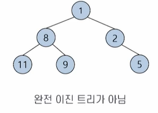
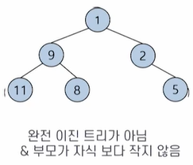
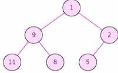

# # 자료구조

## 09. 힙

- 컴퓨터과학과 정광식 교수님

### (1) 우선순위 큐

- 큐
    - 먼저 들어간 데이터가 먼저 삭제되는 자료구조
    - 먼저 줄을 선 사람이 먼저 서비스를 받는 구조 (Ready Queue → CPU → 완료)
- 우선순위 큐
    - 우선순위 큐: 대기 리스트에서 **우선순위가 높은 사람이** 먼저 서비스를 받는 구조
- 우선순위 큐의 작동 방식
    - 첫째, 삭제 명령이 실행되면 저장된 데이터 중에서 **가장 작은 값(또는 가장 큰 값)**이 삭제된다.
    - 둘째, 나머지 데이터들은 어떤 순서로 저장되든 문제가 되지 않는다.

### (2) 힙 추상 자료형

- 힙의 정의
    - 피라미드 모양으로 쌓아 올린 더미
    - 무엇인가를 쌓아놓은 더미이고 항상 가장 위에 있는 것을 우선 꺼내는 구조
    - 부모-자식 노드 사이에서 (부분적으로) 정렬된 **완전 이진 트리**로 구성
    - 부모 노드는 자식 노드보다 우선순위가 높음
- 힙의 추상 자료형
    - 힙 객체의 정의: 부분적으로 정렬된 완전 이진 트리로,  
      부모 노드는 자식 노드보다 우선순위가 높다
- 힙의 추상 자료형
    - 연산:
        1. `insert(element)` :: 힙에 데이터 삽입
        2. `delete()` :: 힙(루트)에서 데이터 삭제
        3. `peek()` :: 힙(루트)에서 데이터 읽어오기
        4. `isEmpty()` :: 힙이 비었는지 확인
        5. `size()` :: 힙에 저장한 데이터 개수 확인
- 힙의 종류
    - **최소 힙** : 루트가 전체 노드 중에서 최소값인 힙
        - 트리의 모든 노드가 자식 노드보다 작은 값을 가짐
        - 트리의 레벨에 따라 데이터가 순서를 갖지는 않음
        - 탐색 트리처럼 왼쪽 노드와 오른쪽 노드 사이에 크기 제한도 없음
        - 루트가 가장 작은 값을 갖고 부모는 자식보다 작은 값을 가짐
- 힙이 아닌 경우
    - 
    - 
    - 

### (3) 힙에서 삭제 및 삽입 연산
