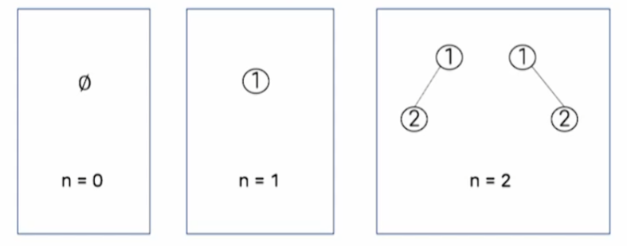
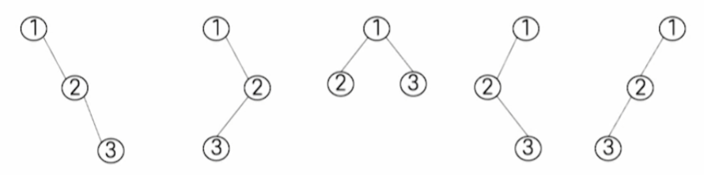

# # 자료구조

## 10. 선택트리, 숲, 이진트리 개수

- 컴퓨터과학과 정광식 교수님

### (1) 선택 트리

- 합병 정렬
    - 차례로 **정렬된 k개의 데이터 목록**을 순서를 유지하는 **하나의 데이터 리스트**로 만드는 과정
    - 일반적으로 데이터 목록이 k개인 경우, k-1번 비교를 통해 데이터 목록에서 가장 작은 값이나 가장 큰 값을 결정할 수 있음
    - **선택 트리를 이용하여 비교 횟수를 줄일 수 있음**

- 승자트리
    - 각 노드가 **두 자식 노드의 작은 값**을 갖는 **완전 이진 트리**
    - 작은 값이 승자가 되어 올라가는 토너먼트 경기와 유사
    - 트리의 각 노드는 두 자식 노드 값의 승자를 자신의 값으로 함
    - 결과적으로 루트의 값이 트리에서 가장 작은 값이 됨
    - 첫 번째 단계에서는 비교 횟수를 줄이지는 못했지만, 두 번째 비교 단계부터는 비교 횟수가 감소됨
    - 재구성 과정에서 빈 리스트가 생기면 큰 값(∞)을 넣어줌

- 패자트리
    - 각 노드가 두 자식 노드 중에서 더 작은 값을 갖는 완전 이진 트리라는 점은 승자트리와 같지만,  
      **패자트리는 루트 노드 위에 최상위 0번 노드를 가짐**
    - 최상위 0번 노드에는 **최종 승자**를 저장함
    - 잎 노드들이 각 리스트의 head를 가리킴
    - 트리의 각 내부 노드에는 **승자가 아닌 패자를 저장함**  
      (즉, 패자를 부모 노드에 저장하고 승자는 부모의 부모 노드로 올라가서 다시 경쟁)
    - 루트에는 마지막 패자를 저장하고 최종 승자는 0번 노드에 저장

### (2) 숲

- 숲의 정의
    - 분리된 트리 모임
    - 0개 이상의 분리된 트리 집합
    - 숲: n(n ≥ 0)개 이상의 분리된 트리의 집합
    - 트리에서 루트(혹은 다른 노드)를 제거하면 숲을 쉽게 얻을 수 있음
    - 반대로 숲을 연결하면 트리를 만들 수도 있음

- 숲의 이진트리 변환
    - 먼저 각 트리(Tᵢ)를 이진 트리(Tᵢᴮᵀ)로 바꿈  
      (이때 Tᵢᴮᵀ의 루트는 왼쪽 서브트리만 가짐)
    - 다음은 Tᵢᴮᵀ의 루트를 최상위 루트로 하고,  
      왼쪽 자식은 그 왼쪽 서브트리,  
      오른쪽 자식은 나머지들의 이진 트리(BT₂–ₙ)가 되도록 함

### (3) 이진 트리 개수

- 노드와 이진 트리의 관계
    - 노드 개수에 따른 가능한 이진 트리
    - 

- 노드 개수가 3개인 이진 트리의 개수
    - 노드가 3개인 이진 트리에서 **전위 순회 방문 순서가 1, 2, 3**인 이진 트리
    - 

- 노드 개수가 3개인 이진 트리의 개수
    - 어떤 이진 트리에 대한 **전위 순회와 중위 순회 방문 순서**가 주어지면  
      트리 구조를 유일하게(한 개) 정할 수 있음

- 노드 개수가 3개인 이진 트리의 개수
    - 1부터 n까지 수를 **스택에 넣었다가 가능한 모든 방법으로 삭제하여 생성할 수 있는 경우의 수**와  
      n개의 노드를 가진 상이한 이진 트리의 수가 같음
    - 전위 순회 방문 순서를 스택에 넣고 push/pop 연산을 이용하여  
      중위 순회 방문 순서를 만들어내면서, **유일한 이진 트리를 결정**할 수 있음

- 스택을 이용한 이진 트리의 순회
    - push()
        - 트리 생성 과정으로 껍데기 노드와 왼쪽 서브 트리를 나타냄
        - 삽입될 노드보다 먼저 pop()할 원소가 존재함
        - 삽입될 노드의 왼쪽 서브 트리가 될 노드가 존재함
    - pop()
        - 껍데기 노드에 값을 넣고 오른쪽 서브 트리로 이동하는 것
        - 왼쪽 서브 트리와 오른쪽 서브 트리의 중간에 도달했다는 의미
        - 중위순회에서 노드에 값을 넣은 후, 오른쪽 서브 트리로 이동함  

