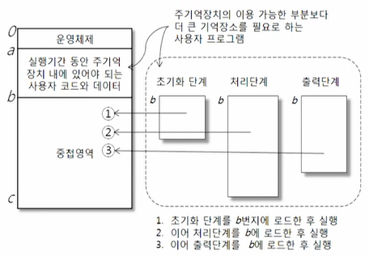

# # 컴퓨터과학 개론

## 07. 운영체제

- 컴퓨터과학과 정광식 교수님

### (1) 운영체제의 개념

- 운영체제의 개요
    - 개념
        - 컴퓨터 하드웨어와 응용프로그램(프로그래머) 혹은 컴퓨터 사용자 사이의 인터페이스를 제공하는 시스템 소프트웨어
        - 사용자 측면에서는 하드웨어에 대한 지식이 없어도 하드웨어에 접근하고 사용할 수 있는 하드웨어 사용의 편리성을 제공함
        - 시스템 측면(개발자 측면)에서는 제한적인 컴퓨터 자원을 효율적으로 사용하기 위한 컴퓨터 자원 관리의 효율성을 제공함
- 컴퓨터 시스템과 운영체제와의 관계

- 운영체제 역할
    - 역할
        - 관리대상인 자원의 범주에 아래의 역할을 수행함
            - 프로세서 관리자
            - 주기억장치 관리자
            - 장치 관리자
            - 파일 관리자
    - 프로세서(CPU) 관리자의 역할
        - 프로세스에게 프로세서(중앙처리장치-CPU)를 할당함
        - 프로세스를 위한 중앙처리장치의 할당과 관리를 담당하고, 이를 위해 각 프로세스의 상태를 모니터링함
        - 프로세스에게 중앙처리장치의 할당이 필요한 경우를 찾아내고 효율적인 관리를 위해 프로세스의 실행 상태를 변화시키기도 함
    - 주기억장치 관리자의 역할
        - 프로세스에게 주기억장치를 할당하고 프로세스로부터 할당된 주기억장치를 회수함
        - 제한된 주기억장치를 여러 프로세스가 나누어 사용하기 위해 효율적인 주기억장치의 관리가 필요함
        - 주기억장치 관리자도 주기억장치를 할당 받고 상주하면서, 주기억장치 관리자에 의해서 보호되고 관리됨
    - 장치 관리자의 역할
        - 시스템 개발자에 의해 구현된 운영체제의 스케줄링 기법에 따라 비디오 디스플레이, 키보드, 프린터, 디스크 드라이브와 같은 시스템의 모든 장치를 가장 효율적으로 관리하고 동작 시킴
        - 프로세스에게 할당된 장치를 반환하여 다른 프로세스가 사용할 수 있도록 함
    - 파일 관리자의 역할
        - 컴파일러, 인터프리터와 같은 시스템 프로그램과 각종 응용 프로그램, 그리고 데이터 파일 등의 모든 파일에 대한 읽기와 쓰기 동작을 관리함
        - 파일에 대한 프로세스의 접근을 관리하여 데이터 보호를 보장함
        - 파일을 위한 컴퓨터 자원의 할당과 회수 등을 수행함

### (2) 운영체제의 작업 처리방식

- 작업 처리방식
    - 일괄처리 시스템
        - 개념(batch processing system)
            - 작업 간 전환을 줄여 컴퓨터 시스템을 최대한 활용하기 위하여 일괄처리 방식이 등장함
            - 일괄처리 시스템은 처리할 작업이 발생할 때마다 즉각적으로 처리하지 않고 처리해야 할 작업이 일정량에 도달할 때까지 여러 작업을 모아 놓음
                - 모아져 있는 작업을 한꺼번에 처리하는 방식임
                - 예를 들면, 빨래가 생길 때마다 세탁기에 넣고 돌리는 것이 아니라 일정량이 되면 한꺼번에 세탁기에 넣고 돌리는 것과 비슷하다
            - 컴퓨터 시스템 사용의 효율성은 높일 수 있었으나 작업의 결과를 빠르게 확인할 수 없는 단점이 존재함
            - 일정량의 작업이 모아질 때까지 기다려야 하고, 정해진 시기이후에만 모아진 작업의 처리가 가능함
    - 다중프로그램 시스템
        - 개념(multiprogramming system)
            - 여러 개의 프로그램을 효율적으로 실행시키기 위해 컴퓨터의 여러 자원을 관리함
            - CPU를 사용하고 있는 작업 A가 CPU의 사용을 멈추고 입출력 장치를 사용하게 되면, 아무도 사용하지 않는 CPU를 다른 작업 B에게 할당함
            - 작업 A가 CPU 사용을 멈추고 입출력 자원 장치를 사용하면, 그 동안에 CPU는 다른 작업에게 할당될 수 있으며 효율적인 컴퓨터 자원의 활용이 가능함
            - 입출력 장치의 사용을 완료한 작업 A가 다시 CPU를 요청하면, CPU를 사용하고 있는 다른 작업이 입출력 장치를 사용해서 CPU가 사용되지 않을 때 작업 A에게 CPU가 할당됨
            - 여러 개의 프로그램들이 컴퓨터 자원이 쉬는 시간에 서로 양보하며 사용하는 방식을 이용하여 작업들을 처리할 수 있다면 컴퓨터 자원의 사용을 최적화 시킬 수 있음
            - 기본적으로 처리 속도가 느린 입출력 장치와 처리속도가 빠른 CPU의 속도 차이를 이용하여 컴퓨터 자원의 활용도와 처리능력을 증대시킴
            - 주기억장치에 여러개의 작업(프로그램)이 동시에 존재하면서 주변장치 (입출력 장치, 네트워크 장치 등)가 사용되는 동안 CPU가 다른 작업에 할당되는 개념으로 1960년 중반에 등장
    - 시분할 처리 시스템
        - 개념(time-sharing precessing system)
            - 대화식 작업에서 사용자와 컴퓨터는 네트워크를 통해 상호작용을 하므로 컴퓨터가 사용자의 요구를 빠르게 처리해줘야 함
            - 동시적인 대화식 사용자의 다중 프로그래밍을 위해서 개발된 것이 바로 시분할 처리 시스템
            - CPU의 시간을 일정 간격의 작은 시간으로 쪼개서 각 사용자에게 시간 간격이 할당되고, 그 동안 직접 컴퓨터와 대화식으로 작업을 수행할 수 있도록 개발됨
            - 많은 사용자들이 동시에 컴퓨터를 공유하면서도 각 사용자들은 자기 혼자 컴퓨터를 사용하고 있는 것과 같은 서비스를 받게 됨
            - 기억장치 관리, 디스크 스케줄링, 실행중인 작업 간의 통신, 입출력 장치의 사용에 대한 제어 및 관리 등의 복잡한 기능들이 요구되고, 이에 따라 운영체제는 점점 복잡해짐
            - 컴퓨터 자원의 효율성은 더욱 높아지고 컴퓨터 사용에 대한 만족도가 높아짐

### (3) 기억장치의 구성

- 개념
    - 컴퓨터 시스템에서 사용되는 기억장치는 접근속도, 비용 및 장치의 용량에 따라 계층적으로 구성됨
    - 높은 가격에서 낮은 가격 순
        - 레지스터
        - 캐시
        - 주기억장치
        - 보조 기억장치
- 개념
    - CPU의 처리속도는 저장 장치에 비해서 엄청나게 빠르므로 CPU가 사용하려는 프로그램 코드와 데이터는 CPU 레지스터나 캐시 기억장치에 있어야 함
    - 레지스터나 캐시 기억장치의 용량의 한계로 인해 주기억 장치에도 저장된 프로그램 코드나 데이터에 접근할 수 밖에 없음
    - 프로그램이나 데이터의 크기는 일반적으로 주기억장치보다 크기 때문에 당장 필요하지 않은 프로그램 코드나 데이터는 사용될 때까지 보조기억장치에 저장해 놓고, 이에 대한 실행이나 참조가 발생하는 시점에
      주기억장치로 이동됨
    - CPU와 주기억장치 사이의 속도 차이로 인한 지연 문제를 방지하기 위해서 CPU와 주기억장치 사이에 주기억장치보다 빠른 속도의 기억장치인 캐시를 이용함
    - CPU가 어떤 프로그램 코드나 데이터가 필요한 경우, 느린 속도의 주기억장치에 접근해서 필요한 것을 검색하는 것이 아니라 우선적으로 빠른 속도의 캐시를 검색함
    - 만일 캐시 기억장치에 원하는 프로그램 코드나 데이터가 있다면 즉시 사용할 수 있음
    - 캐시 기억장치에 원하는 내용이 존재하지 않는 경우에는 주기억장치를 검색해서 CPU로 가져가서 처리하고, 그 프로그램 코드나 데이터를 차후의 사용을 위해 캐시 기억장치에도 복사함
    - CPU 내에는 여러 레지스터가 존재하며, CPU에 직접 내장되어 있기 때문에 기억장치 중에서 가장 빠른 처리 속도를 제공함
    - PCU에서 데이터나 프로그램 코드를 사용할 때는 레지스터에 프로그램 코드나 데이터를 저장하고, CPU 연산을 처리함

### (4) 주기억장치의 할당

- 단일 사용자 연속 기억장치 할당
    - 개념
        - 하나의 사용자 프로그램만이 전체 주기억장치에 할당되는 방식임
        - 실행될 프로그램이 주기억장치의 용량을 초과하면 실행할 수 없음
        - 단순하여 구현하기 쉽지만 큰 프로그램을 수행할 수 없음
    - 문제점
        - 하나의 프로그램이 모든 기억장치, 주변장치 및 CPU 등을 할당 받아 사용하기 때문에 유휴 자원에 대한 낭비가 심하고, 하나의 프로그램을 실행시키는 동안 다른 프로그램들은 기다려야 하므로 대기
          시간이 길어짐
        - 주기억장치의 크기보다 큰 프로그램을 실행할 수 없음
        - 큰 프로그램을 수행하기 위해서 오버레이 기법이 제시됨
    - 오버레이 기법
        - 주기억장치의 이용 가능 영역보다, 큰 프로그램을 작은 네 프로그램으로 쪼갬
        - 사용자 프로그램은 아래 네 부분으로 이루어짐
            - 실행 기간 동안 주기억장치 내에 있어야 하는 프로그램 코드와 데이터
            - 초기화 단계를 수행하는 프로그램 코드
            - 처리 단계를 수행하는 프로그램 코드
            - 출력 단계를 수행하는 프로그램 코드
        - 네 부분의 프로그램은 필요한 시기엔 주기억장치에 번갈아 적재하며 실행되며, 주기억장치의 이용가능 영역보다 큰 프로그램도 실행할 수 있게 됨
        - 

- 고정 분할 다중 프로그래밍 기법
    - 개념
        - 단일 사용자 연속 기억장치 할당 기법이 한 번에 하나의 프로그램만 실행시킬 수 있는 문제점을 보완하기 위해 개발됨
        - 다중 프로그래밍 시스템(여러 개의 프로그램이 실행되는 시스템)에서 주기억장치를 여러 개의 고정된 크기의 영역으로 분할하고, 실행 중인 여러 개의 프로세스에게 각각 할당하는 기법임
        - 주기억장치 내부에는 여러 개의 프로그램(프로세스)들이 공존하기 때문에 한 작업이 입출력을 요구할 때, CPU는 다른 프로그램에게 할당되어 연산을 처리할 수 있음
    - 단편화의 예
        - 100MB 크기의 공간(주기억장치)에 95MB 크기만큼 공간을 차지하는 작업이 실행된다면 나머지 5MB 크기의 공간은 낭비가 된다고 볼 수 있음
        - 반대로 100MB 크기의 공간(주기억장치)에 5MB 크기의 작업이 실행된다면 95MB 크기만큼 공간이 낭비되는 일이 발생함
        - 100MB 크기의 고정된 크기로만 메모리를 분할하였기 때문에 낭비 공간이 발생함
        - 분할된 영역들마다 낭비 공간이 발생할 수 있기 때문에 많은 공간이 낭비될 수 있음
- 동적 분할 프로그래밍 기법
    - 개념
        - 고정 분할 다중 프로그래밍 기법의 단편화 문제를 해결하기 위해 개발됨
        - 프로그램이 주기억장치에 적재될 때마다 모든 작업이 필요로 하는 크기(고정된 크기가 아니라 다양한 크기) 만큼 연속된 공간을 할당해주는 기법
        - 처음에는 필요한 크기의 주기억장치 분할에 의한 할당이 가능하기 때문에 단편화가 발생하지 않음
    - 외부 단편화
        - 시간이 지남에 따라 외부 단편화(영역의 크기가 너무 작아서 어떤 작업에도 할당되지 못하고 비어 있는 상태)가 발생함
    - 외부 단편화 예
        - 전체가 100MB인 공간에 50MB, 30MB, 10MB, 7MB 크기의 작업을 할당하면, 3MB 만큼의 공간이 남으며 남은 모든 작업의 크기가 5MB이상일 경우 3MB는 낭비 공간이 되어버림
    - 통합(coalescing)
        - 인접된 공백을 합쳐서 더 큰 하나의 공백으로 만드는 방법
    - 집약(compaction)
        - 주기억장치 내의 흩어진 모든 공백을 하나로 모아서 하나의 커다란 저장 공간을 만드는 방법

### (5) 가상기억장치

- 개요
    - 주기억장치에서 이용 가능한 영역보다 큰 프로그램을 작은 단위로 쪼개어 실행시키기 위해 보조기억장치의 주소를 주기억장치의 주소로 변환하여 프로그램에게 제공되는 가상의 기억장치를 말함
    - 보조기억장치의 주소를 주기억장치의 주소로 변환하는 기법
    - 가상기억장치에서 가장 중요한 부분은 실행중인 프로그램(프로세스)에 의해 참조되는 주소(가상 주소)를 변환하여 주기억장치에서 사용하는 주소(실 주소, 물리적 주소)로 연결시켜주는 것임
    - 실행 중인 프로그램(프로세스)이 주기억장치에서 데이터를 접근하기 위해서 가상주소만을 참조하지만, 프로세스는 실제로 실 기억 장치에서 실행되어야 하므로 운영체제가 가상 주소를 실 주소로 바꾸는 주소 변환
      절차가 필요함
    - 가상기억장치 시스템에서는 실행 프로그램이 참조할 주소가 반드시 주기억장치의 주소일 필요는 없음
    - 가상 주소의 범위는 주기억장치에서 사용할 수 있는 실 주소보다 더 크며 사용자의 논리적으로 통합된 주소 공간과 컴퓨터의 물리적 공간(주기억 장치의 주소와 보조기억장치의 주소)을 연결시켜주는 개념임
- 페이징 기법
    - 개요
        - 보조기억장치로부터 프로그램 코드나 데이터를 페이지(page)라고 불리는 동일한 크기의 블록으로 쪼개어서 주기억장치에 적재하여 접근하는 기법
        - 주기억장치도 페이지 크기와 같은 크기로 분할되며 이를 주기억장치의 페이지 프레임(page frame)이라고 부름
        - CPU에서 프로세스를 실행하기 위해서는 프로세스의 실행될 페이지가 주기억장치에 적재되어 있어야 함
        - 페이지는 보조 기억장치로부터 주기억장치로 옮겨져서 페이지 프레임에 적재되며, 이때 페이지는 사용가능한 페이지 프레임을 할당받아 주기억장치에 적재됨
- 세그먼테이션 기법
    - 개요
        - 프로그램 코드나 데이터를 일정하지 않은 서로 다른 크기로 분할하여 주기억장치에 적재하여 접근함
        - 프로그램 코드나 데이터를 서로 다른 크기로 분할한 블록을 세그먼트(segment)라고 부름
        - 개발자들은 프로그램을 모듈 단위로 작성하는 습관에 기반을 두고 있기 때문에 사용자가 직접 작성한 프로그램 모듈이나 데이터의 모듈은 논리적 개념에 의해서 다른 크기의 블록으로 나뉠 수 있으며, 이
          블록을 세그먼트라고 함
