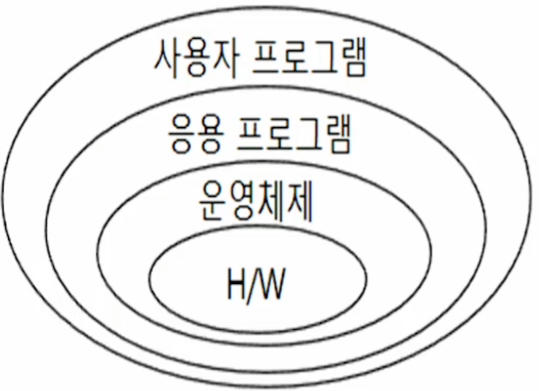

# # 컴퓨터과학 개론

## 07. 운영체제

- 컴퓨터과학과 정광식 교수님

### (1) 운영체제의 개념

- 운영체제의 개요
    - 개념
        - 컴퓨터 하드웨어와 응용프로그램(프로그래머) 혹은 컴퓨터 사용자 사이의 인터페이스를 제공하는 시스템 소프트웨어
        - 사용자 측면에서는 하드웨어에 대한 지식이 없어도 하드웨어에 접근하고 사용할 수 있는 하드웨어 사용의 편리성을 제공함
        - 시스템 측면(개발자 측면)에서는 제한적인 컴퓨터 자원을 효율적으로 사용하기 위한 컴퓨터 자원 관리의 효율성을 제공함
- 컴퓨터 시스템과 운영체제와의 관계

- 운영체제 역할
    - 역할
        - 관리대상인 자원의 범주에 아래의 역할을 수행함
            - 프로세서 관리자
            - 주기억장치 관리자
            - 장치 관리자
            - 파일 관리자
    - 프로세서(CPU) 관리자의 역할
        - 프로세스에게 프로세서(중앙처리장치-CPU)를 할당함
        - 프로세스를 위한 중앙처리장치의 할당과 관리를 담당하고, 이를 위해 각 프로세스의 상태를 모니터링함
        - 프로세스에게 중앙처리장치의 할당이 필요한 경우를 찾아내고 효율적인 관리를 위해 프로세스의 실행 상태를 변화시키기도 함
    - 주기억장치 관리자의 역할
        - 프로세스에게 주기억장치를 할당하고 프로세스로부터 할당된 주기억장치를 회수함
        - 제한된 주기억장치를 여러 프로세스가 나누어 사용하기 위해 효율적인 주기억장치의 관리가 필요함
        - 주기억장치 관리자도 주기억장치를 할당 받고 상주하면서, 주기억장치 관리자에 의해서 보호되고 관리됨
    - 장치 관리자의 역할
        - 시스템 개발자에 의해 구현된 운영체제의 스케줄링 기법에 따라 비디오 디스플레이, 키보드, 프린터, 디스크 드라이브와 같은 시스템의 모든 장치를 가장 효율적으로 관리하고 동작 시킴
        - 프로세스에게 할당된 장치를 반환하여 다른 프로세스가 사용할 수 있도록 함
    - 파일 관리자의 역할
        - 컴파일러, 인터프리터와 같은 시스템 프로그램과 각종 응용 프로그램, 그리고 데이터 파일 등의 모든 파일에 대한 읽기와 쓰기 동작을 관리함
        - 파일에 대한 프로세스의 접근을 관리하여 데이터 보호를 보장함
        - 파일을 위한 컴퓨터 자원의 할당과 회수 등을 수행함

### (2) 운영체제의 작업 처리방식

- 작업 처리방식
    - 일괄처리 시스템
        - 개념(batch processing system)
            - 작업 간 전환을 줄여 컴퓨터 시스템을 최대한 활용하기 위하여 일괄처리 방식이 등장함
            - 일괄처리 시스템은 처리할 작업이 발생할 때마다 즉각적으로 처리하지 않고 처리해야 할 작업이 일정량에 도달할 때까지 여러 작업을 모아 놓음
                - 모아져 있는 작업을 한꺼번에 처리하는 방식임
                - 예를 들면, 빨래가 생길 때마다 세탁기에 넣고 돌리는 것이 아니라 일정량이 되면 한꺼번에 세탁기에 넣고 돌리는 것과 비슷하다
            - 컴퓨터 시스템 사용의 효율성은 높일 수 있었으나 작업의 결과를 빠르게 확인할 수 없는 단점이 존재함
            - 일정량의 작업이 모아질 때까지 기다려야 하고, 정해진 시기이후에만 모아진 작업의 처리가 가능함
    - 다중프로그램 시스템
    - 시분할 처리 시스템

### (3) 기억장치의 구성

### (4) 주기억장치의 할당

### (5) 가상기억장치
