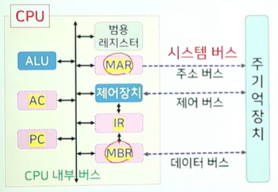
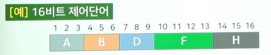
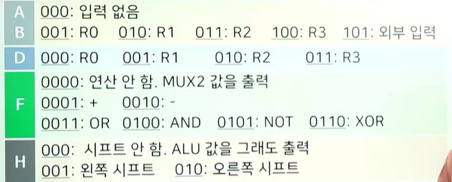
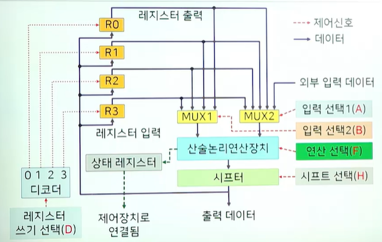
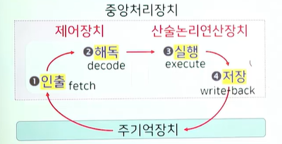
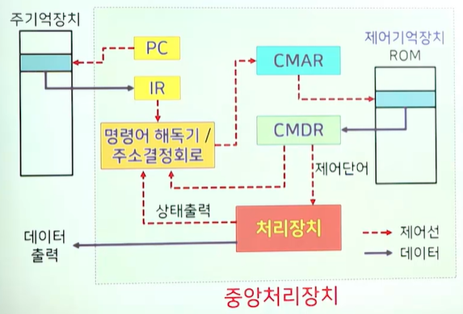

# # 컴퓨터과학 개론

## 10. 컴퓨터 구조(2)

- 컴퓨터과학과 이관용 교수님

### (1) 명령어

- 명령어 집합 구조
    - 내장 프로그래밍 개념으로부터 직접적으로 도출된 개념
        - ISA Instruction Set Architecture -> HW와 SW의 교량 역할을 하는 개념
        - 명령어 집합
            - 컴퓨터 시스템 내에 정의되어 있는 기본적인 명령어들의 집합
            - 모든 컴퓨터는 자신만의 명령어 집합을 가짐
                - 명령어 종류, 명령어 형식, 주소지정방식 등을 고려해서 결정됨
        - 명령어 집합이 결정되면 그에 상응하는 하드웨어 구조가 결정됨
- 명령어 집합에 따른 컴퓨터 구조
    - CISC 복합 명령어 집합 컴퓨터, Complex Instruction Set Computer
        - 복합 명령어를 포함하여 명령어와 주소지정방식의 수를 많이 사용
        - 많은 복잡한 명령어를 탑재하여 프로그램 전체 명령어 개수를 줄여 실행 시간 단축을 노림
        - 연산코드 해석·실행 제어장치가 복잡해지는 단점
    - RISC (Reduced Instruction Set Computer · 단축 명령어 집합 컴퓨터)
        - 명령어를 단순화하고 개수를 줄여 하드웨어를 간단화
        - 각 명령어의 길이를 가능한 짧게 하여 명령어 실행 시간 최소화
        - 높은 처리량·빠른 속도 지향
        - 제어장치가 비교적 단순하며 일반적으로 하드웨어로 구성됨

- 기본적인 명령어 종류
    - 데이터 전송 명령어
        - 데이터 이동(레지스터<->레지스터, 주기억장치<->레지스터, 기억장치<->기억장치 등)
    - 데이터 처리 명령어
        - 산술 명령어, 논리연산 명령어, 비트 단위 명령어, 시프트 명령어 등
    - 프로그램 제어 명령어
        - 프로그램의 제어 흐름 관리: 무조건적 분기, 조건적 분기
    - 입출력 명령어
        - 보조기억장치 및 입출력장치 등과 정보 교환, 인터럽트 관련
        - 인터럽트: 프로그램의 정상 수행을 멈추고 CPU 이외의 장치 요구를 처리하게 하는 기능
- 명령어 형식
    - 기본 형식
        - 각 명령어는 실행에 필요한 모든 정보를 포함해야 함
        - 기본 형식: 연산자 코드(OP code) · 오퍼랜드(operand)
        - 연산자 코드(OP code)
            - CPU가 처리할 연산의 종류를 지정
            - OP 코드에 할당된 비트 수가 CPU가 수행할 수 있는 최대 명령어 개수를 결정
        - 오퍼랜드(피연산자, operand)
            - 명령어가 사용할 데이터 또는 그 데이터가 저장된 기억장치의 주소
            - 오퍼랜드의 크기·개수는 명령어 집합 구조(ISA)와 명령어 형식에 따라 달라짐
- 목적지 개수에 따른 구분
    - 연산의 대상 데이터가 어디서 추출되고, 결과를 어디에 저장할지에 따른 구분
        - 3-주소 명령어: 연산자 코드 + 오퍼랜드 × 3
            - 예) 목적지, 원천1, 원천2
        - 2-주소 명령어: 연산자 코드 + 오퍼랜드 × 2
            - 예) 목적지(겸 원천1), 원천2
        - 1-주소 명령어: 연산자 코드 + 오퍼랜드 × 1
            - 예) 누산기(ACC) + 한 개의 주소
        - 0-주소 명령어: 연산자 코드만
            - 예) 스택 기반 연산 (피연산자는 스택에서 암시적으로 사용)
- 명령어 형식
    - 목표 식: W = X * (Y + Z)
- 3-주소 명령어

```nginx
ADD Y, Z, R1 ; R1 ← Y + Z
MUL X, R1, W ; W ← X * R1
```

- 2-주소 명령어

```nginx
MOVE Y, R1       ; R1 ← Y
ADD  Z, R1       ; R1 ← Z + R1
MUL  X, R1       ; R1 ← X * R1
MOVE R1, W       ; W  ← R1
```

- 1-주소 명령어(누산기 AC 사용)

```nginx
LOAD  Y          ; AC ← Y
ADD   Z          ; AC ← Z + AC
MUL   X          ; AC ← X * AC
STORE W          ; W  ← AC
```

- 0-주소 명령어(스택)

```nginx
PUSH Y
PUSH Z
ADD              ; PUSH(POP() + POP())
PUSH X
MUL              ; PUSH(POP() * POP())
POP  W           ; W ← POP()
```

- 주소지정방식 addressing mode
    - 연산에 사용될 데이터가 기억장치의 어디에 위치하는 지를 지정하는 방법
        - 명령어 개수/길이를 줄이고, 기억장치 사용에 대한 융통성 증가시킴
        - 유효주소 effective address
            - 주소지정방식에 의해 계산되어 실제 데이터가 저장된 주소
            - 아래로 갈수록 느린 접근
                - 즉시 immediate 주소지정방식
                    - 연산자 코드 = 실제 데이터 저장됨
                        - 레지스터/변수의 초기화에 유용
                - 레지스터 register 주소지정방식
                    - 연산자 코드 = 레지스터 번호 저장됨 -> 실제 데이터
                    - 레지스터 간접 register-indirect 주소지정방식
                        - 연산자 코드 = 레지스터 번호 -> 주기억장치 주소 -> 실제 데이터
                - 직접 direct 주소지정방식
                    - 연산자 코드 = 주기억장치 주소 저장 (유효주소)
                    - 주기억장치 주소를 통해 실제 데이터 접근
                - 상대 relative 주소지정방식
                    - 연산자 코드 = 내용 + 레지스터 내용 = 유효주소 -> 실제 데이터
                        - 레지스터 내용
                            - 프로그램 카운터
                                - 분기형 명령어에서 주로 사용
                            - 인덱스 레지스터
                                - 인덱스된 주소지정방식 -> 배열 인덱싱에 주로 사용
                            - 베이스 레지스터
                                - 베이스 레지스터 주소지정방식
                - 간접 indirect 주소지정방식
                    - 연산자 코드 = 주기억장치 주소를 통해 실제 데이터를 참조하는 주기억장치 주소를 저장
                    - 연산자 코드 -> 주기억장치 주소 -> 주기억장치 주소 -> 실제 데이터

### (2) 중앙처리장치

- 명령어를 하드웨어에 구현하는 방법
    - (1) 마이크로 프로그램에 의한 제어장치
        - Micro-programmed control device
        - 산술·논리연산과 명령어 수행 순서의 조작 회로가 제어기억장치에 저장된 비트 패턴(마이크로 연산) 으로 동작
        - 각 명령어는 여러 개의 마이크로 연산으로 구현됨
        - 명령어 집합 변경/추가가 용이
        - 주로 CISC 구조에서 사용됨
    - (2) 직접 회로로 구성된 제어장치
        - Hard-wired control device
        - 연산 및 명령어 수행 회로가 기억장치에 의존하지 않고 직접 구성된 제어 회로로 동작함
        - 수행 속도가 빠름
        - 명령어 집합 변경에 유연하지 않음(구조 변경이 어려움)
        - 명령어 수가 적은 RISC 구조에서 주로 사용됨
- 레지스터
    - 범용 레지스터
    - 특수 레지스터
    - 누산기 AC(AC, Accumulator)
        - 데이터나 연산 결과를 일시적으로 저장하는 레지스터
    - 기억장치 버퍼 레지스터 (MBR, Memory Buffer Register)
        - 기억장치에 저장될 데이터 또는 기억장치에서 읽어온 데이터를 임시로 저장
    - 기억장치 주소 레지스터 (MAR, Memory Address Register)
        - 현재의 PC 내용을 시스템 버스의 주소 버스로 출력하기 전에 일시적으로 저장
            - PC 내용 → 다음에 수행될 명령어가 저장되어 있는 기억장소의 주소



- 처리 장치
    - ‘연산장치 + 레지스터’를 묶어서 일컫는 표현으로 사용
        - 모든 기능은 비트 패턴으로 구성된 마이크로 연산으로 구현
    - 마이크로 연산의 분류 (예시)
        - (1) 레지스터 전송 마이크로 연산
            - R0 <- R1
        - (2) 산술 마이크로 연산
            - R0 <- R1 + R2
            - R2 <- R1 - R2
            - R1 <- R1 - 1 (감소 연산)
        - (3) 논리 마이크로 연산
            - R1 <- NOT R2
            - R0 <- R1 AND R2
            - R1 <- R1 OR R2
        - (4) 시프트 마이크로 연산
            - R1 <- SHL R2
            - R1 <- SHR R2
- 제어단어
    - 마이크로 연산을 처리장치에 직접 다루기 위해서 필요
        - 각 비트들이 처리장치의 논리회로 내의 각종 MUX와 디코더의 선택 제어선으로 연결되어 하드웨어를 회로 수준에서 직접적으로 통제하기 위한 것
        - 각 마이크로 연산은 제어단어 일대일 매핑
        - 예) 16비트 제어단어
            - 
            - 
- 처리장치의 구성
    - 
- 제어장치
    - 메모리에 저장된 명령을 어떻게 순차적으로 가져와서 수행할 것인가를 통제하는 것
        - 두 가지의 기본적인 기능
            - 처리장치를 구동해 특정 연산을 수행한 후, 처리장치 내 레지스터 값을 갱신하고 연산 결과를 출력
            - 현재 주어진 명령을 수행한 뒤, 다음에 수행할 명령의 주소 정보를 생성
    - 명령어 사이클 instruction cycle
        - 
- 제어장치의 구성 요소
    - 프로그램 카운터 PC, Program Counter
        - 다음에 수행될 명령어가 저장되어 있는 주기억장치의 주소 저장
    - 명령어 레지스터 IR, Instruction Register
        - 주기억장치에서 인출되어 현재 실행 중인 명령어 저장
    - 제어기억 장치 (control memory)
        - 마이크로 연산의 집합을 저장하는 기억장치
        - 보통 ROM으로 구현
    - 명령어 해독기
        - 주어진 명령어를 제어기억장치의 해당 마이크로명령이 시작하는 주소로 매핑해 주는 것
    - 주소 결정 회로
        - 명령어에 포함된 주소 정보, 제어단어와 연결된 주소 정보, 처리장치 구동 결과로 나오는 상태 비트 등으로부터 제어기억장치의 다음 수행할 마이크로명령 주소를 생성
    - 제어기억장치 주소 레지스터 (CMAR, Control Memory Address Register)
        - 제어기억장치에서 다음에 수행할 마이크로명령의 위치를 가리키는 주소 저장
    - 제어기억장치 데이터 레지스터 (CMDR, Control Memory Data Register)
        - 제어기억장치에서 가져온 다음 수행할 마이크로 연산 저장
        - 필요 시 CMDR 없이 제어기억장치의 출력이 다른 장치로 직접 연결될 수도 있음
- 제어장치의 구성
    - 

### (3) 입출력장치 및 병렬처리

- 입출력 시스템의 기본 구성요소
    - 입출력장치
        - 사용자와 컴퓨터 시스템을 연결해 주는 장치
        - 예: 키보드, 마우스, 모니터, 프린터, 디스크 등
    - 입출력장치 제어기
        - 서로 다른 기계·전자적 특성을 지닌 입출력장치를 물리/전자적으로 제어해 구동시키는 기기
        - 모터 회전, 헤드 이동, 입출력 매체의 위치 정렬 등의 작업 수행
        - 제어기가 입출력장치 내부에 포함될 수도 있고, 하나의 제어기로 여러 입출력장치를 제어하는 경우도 있음
    - 입출력장치 인터페이스
        - 입출력장치와 중앙처리장치/주기억장치 사이의 데이터 전송 속도, 데이터 처리 단위, 오류 확률 등의 차이를 상쇄해 올바른 전송을 하도록 하는 방법을 제공
    - 입출력 버스
        - 입출력 전용으로 사용되는 정보 회선의 묶음
            - 입출력장치와 중앙처리장치 사이의 정보 교환에 사용
        - 여러 장치의 동시 사용으로 인한 버스 충돌을 막기 위한 중재기가 필요
- 입출력 제어 방식
    - (1) CPU에 의한 제어 (Programmed I/O)
        - 독립된 입출력 제어기 없이, 장치의 데이터가 CPU를 거쳐 주기억장치와 읽고/쓰임
        - CPU가 전송에 지속 관여 → CPU 부하 큼
    - (1-a) 프로그램에 의한 방식(폴링)
        - CPU가 주기적으로 장치에 신호를 보내 상태를 확인하고 준비되면 입출력 수행
    - (1-b) 인터럽트에 의한 방식
        - 장치에 요청이 있을 때만 인터럽트로 CPU에 알림
        - CPU는 하던 일을 잠시 중단해 서비스 루틴 수행 후 복귀
    - (2) DMA 방식 (Direct Memory Access)
        - 장치 ↔ 주기억장치가 직접 데이터 전송
        - CPU는 초기 설정/허가만 수행, 실제 전송은 DMA 제어기가 담당
        - 대용량·고속 전송에 적합, CPU 부하 감소
    - (3) 채널 방식 (I/O Channel)
        - 입출력 전용의 별도 프로세서(채널) 사용
        - 버퍼링/블록 전송 및 간단한 산술·논리·분기 같은 제어 작업도 수행 가능
        - CPU는 채널에 작업을 지시하고 다른 작업을 병행

- 병렬처리
    - 파이프라인 처리기 pipeline processor
        - 프로그램 내에 내재하고 있는 시간적 병렬성을 활용하는 방법
        - CPU 내부의 일부 하드웨어 요소를 파이프라인 형태로 구성해 작업을 시간적으로 중첩하여 수행
        - 하나의 연산을 서로 다른 기능을 가진 여러 **단계(세그먼트)**로 분할하고, 각 단계가 동시에 서로 다른 데이터를 처리하도록 함
        - 현재 명령이 어떤 단계를 마쳐 다음 단계로 넘어가면, 바로 다른 명령을 들여보내 동일 단계를 동시 처리
        - 연달아 수행될 명령어들 사이에는 간섭(의존·자원 경합·제어 충돌) 없음이 전제됨
    - 멀티코어 구조
        - 하나의 CPU에 2개 이상 코어를 넣어 동시에 여러 개의 명령어를 처리하는 구조
        - 코어: CPU의 일부분으로, 명령을 가져와 수행하는 주 회로
        - 각 코어는 수행 중인 응용 프로그램의 프로세스/스레드를 하나씩 담당
    - GPGPU (General Purpose computing on Graphics Processing Unit)
        - 그래픽스 처리장치를 사용한 범용 연산
        - 그래픽 카드의 고도 병렬 처리 능력을 일반 연산에 활용하는 기술
