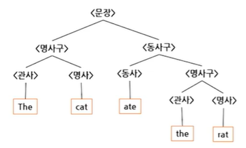
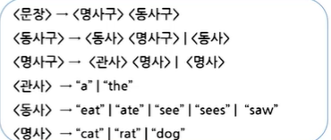

# # 컴퓨터과학 개론

## 11. 프로그래밍 언어(1)

- 컴퓨터과학과 정광식 교수님

### (1) 프로그래밍 언어의 개요

- 프로그래밍 언어의 개요
    - 개념
        - 프로그래밍 언어는 사람의 의도를 컴퓨터에게 전달하여 컴퓨터가 작업을 수행하게 하기 위해 만들어졌다.
        - 사람의 의도를 추상화·압축한 언어로 컴퓨터에 전달되어야 한다.
        - 동시에 컴퓨터에서 실행 가능한 이진 코드(binary code) 로 번역되어야 한다.
    - 일상 언어 vs 프로그래밍 언어
        - 만약 일상 언어로 프로그램을 작성할 수 있다면, 누구나 자신의 필요에 따라 프로그램을 만들 수 있음
        - 그러나 일상 언어로 작성된 프로그램은 의미가 애매모호할 수 있으며, 하나의 문장에 두 가지 해석이 생길 수 있음.
    - 프로그래밍 언어의 요구 조건
        - 의미적으로 애매모호함이 없어야 하며, 어떤 경우에도 동일한 의미로 해석되어야 한다.
        - 구문론적 측면에서 명확히 정의되고, 의미론적 측면에서 언제나 동일하게 해석되어야 한다.
        - 논리적으로 설계되어 컴퓨터가 처리할 수 있는 이진 코드로의 변환이 명확하고 정확해야 한다.
- 프로그래밍 언어의 전형
    - 종류
        - 프로그래밍 언어는 이진 코드에 가까운 어셈블리어와 자연어에 가까운 고급언어로 분류됨
        - 어셈블리어와 고급언어 사이에도 다양한 프로그래밍 언어가 존재함
    - 기계어
        - 0과 1의 이진수로 구성되는 언어로, 컴퓨터 하드웨어를 직접 제어하기 위한 전기 신호 표현 형태로 전달될 수 있는 수준의 언어
        - 0과 1로만 이루어져 사람이 의미를 이해하기 어렵고, 프로그램 작성이 매우 어려움
        - 하드웨어/컴퓨터 구조에 따라 기계어의 구성과 명령어(0과 1의 나열)가 달라져 범용성이 낮음
    - 어셈블리어
        - 기계어의 0과 1로 이루어진 명령어를 사람의 언어와 유사한 알파벳 심볼 형태로 바꾼 언어
        - 기계어보다 읽기 쉽지만, 컴퓨터가 실행하는 논리 순서에 맞춰 생각해야 하므로 이해하기 쉽지 않음
    - 초창기의 고급 프로그래밍 언어
        - 연산, 수행 제어, 메모리 접근 등의 프로그램을 사람의 자연어에 유사한 형태로 표현
        - 포트란(FORTRAN): 과학·공학 계산용, 최초의 고급언어 / 코볼(COBOL): 비즈니스용 언어 → 1950년대 말
        - 베이직(BASIC): 1960년대 중반 등장, 1980년대 마이크로컴퓨터에서 많이 사용됨
    - 함수형 프로그래밍 언어
        - 기본적으로 수식(expression) 의 연속으로 구성되며, 함수들을 사용해 수식을 변환한다.
        - 수식은 사칙연산뿐 아니라 일반적 의미의 모든 함수 호출을 포함하며, 한 함수의 결과를 다른 함수의 입력으로 사용한다(합성).
        - LISP(1950년대 말): 심벌 리스트를 연산의 기본 단위로 사용.
        - Scheme, ML 등도 함수형 언어에 포함된다.
        - 간단한 S-식 예시
            - (+ 3 2)
            - (length '(a b c))
            - (+ 1 (if t 23))
    - 구조적 프로그래밍 언어
        - 현대 프로그래밍 언어의 많은 개념이 구조적 프로그래밍에서 도입됨
        - 알골 60(Algol 60, 1950년대 말): 조건문·반복문으로 실행 흐름 제어, 블록(block) 구조와 함수 호출 등 핵심 개념을 도입
        - 이후의 구조적 프로그래밍 언어인 파스칼(Pascal), C, 모듈라-2(Modula-2) 등에 영향을 줌

```C
if (a >= b) {
    d = a - b;
    printf("%d", b);
} else
    printf("%d", a);
```

- 프로그래밍 언어의 전형 2
    - 논리형 프로그래밍 언어
        - 형식 논리로 사실(fact) 과 규칙(rule) 로 문제 도메인 모델을 정의한다.
        - 원하는 결과는 문제 도메인에 대한 질의(query) 를 던져 논리적 추론으로 얻는 선언형 언어다
        - 1970년대 등장, 1980년대 인공지능 분야에서 주목. 대표 언어: Prolog

```prolog
% 사실(facts)
father(a, b).
father(b, c).

% 규칙(rule)
grandfather(X, Z) :- father(X, Y), father(Y, Z).

% 예) 질의
% ?- grandfather(a, c).
% true.
```

- 프로그래밍 언어의 전형 3
    - 객체지향 프로그래밍 언어
        - 객체(object) 개념을 정의하고, 객체에 대한 연산(메서드) 과 성질(멤버 변수) 을 정의해 프로그램을 작성하는 언어
        - 구조적 프로그래밍 언어와 달리 객체 중심의 사고 틀을 제공
        - Simula 67: 최초로 클래스 개념을 가진 언어, 1960년대 말 등장
        - C++, Smalltalk-80: 1980년대 등장
        - Java: 1990년대 중반 등장, 현재 가장 대표적인 객체지향 프로그래밍 언어

```java
public class HelloWorldApp {
    public static void main(String[] args) {
        System.out.println("Hello World!");
    }
}
```

- 프로그래밍 언어의 전형 4
    - 스크립트 언어
        - 유닉스(Unix) 같은 운영체제의 관리·자동화를 위해 만들어져 사용되기 시작한 언어
        - 셸 스크립트(sh, bash, csh 등)와 패턴 처리 스크립트 언어(awk, sed)에서 시작
        - 펄(Perl), 파이썬(Python) 등 스크립트 언어들이 웹 기반 서비스에서 많이 사용됨

### (2) 프로그래밍 언어의 파스 트리

- 프로그래밍 언어의 파스 트리
    - 개요
        - 모든 언어는 사용할 수 있는 단어들의 집합과 단어들이 나열되어 구조를 이루는 규칙(문법) 에 따라 문장을 생성한다.
        - 각 문장은 실세계와 연결되는 의미를 가진다.
        - 
        - 
        - 대부분의 프로그래밍 언어는 형식 문법을 사용해 언어의 구조를 기술한다
        - 따라서 문장의 구조를 파스 트리(parse tree) 형태로 표현하면 이해가 빠르고 문법의 모호성을 파악하기 쉽다.
- 형식문법의 요소
    - 단말 심벌
        - 문장을 이루는 단어들을 단말(terminal) 심벌이라 한다.
        - 파스 트리에서 단말 노드(leaf) 에 해당한다.
        - 자연어에서는 사전에 나오는 모든 단어가 단말 심벌이 된다.
    - 비단말 심벌
        - 단말 심벌이 아닌 기호로, 복합적으로 나열된 단말/비단말의 조합을 생성한다(문법 규칙의 좌변에 위치).
        - 파스 트리의 내부 노드(가지 노드)에 해당한다.
        - 자연어 예: <문장(S)>, <명사구(NP)>, <동사구(VP)>.
    - 생성 규칙 (Production)
        - 정의: 하나의 비단말 심벌을 다른 단말/비단말의 나열로 치환하는 규칙
        - 표기: A → α (A: 비단말, α: 단말·비단말의 나열)
        - 예시(영어 미니 문법)
            - 문장(S)   → 명사구(NP) 동사구(VP)
            - 명사구(NP) → 관사(Det) 명사(N)
            - 명사(N)   → "dog" | "cat" | "rat"
            - 동사(V)   → "bark" | "chase" | "eat"
    - 시작 심벌
        - 문법의 가장 상위 계층 비단말 심벌로, 보통 문장(S) 을 시작 심벌로 둔다.
        - 파스 트리의 루트 노드(가장 위 노드)에 해당한다.

### (3) 프로그래밍 언어의 분석

- 프로그램 코드의 분석
    - 실행 가능 코드
        - 프로그래밍 언어로 작성된 코드는 사람이 읽고 이해하기는 쉽지만, 그 자체로는 컴퓨터가 이해하거나 실행할 수 없음.
        - 사람이 작성한 프로그램을 기계어의 이진 코드로 바꾸는 변환 과정(예: 컴파일/인터프리트)을 거치면, 컴퓨터가 이해하고 실행할 수 있는 프로그램이 됨.
    - 프로그램 코드의 분석
        - 사람이 작성한 프로그램은 어휘 분석과 구문 분석을 통해 프로그램에 문제가 없는지 확인한다.
        - 이 과정을 거친 뒤 코드 생성 단계에서 실제 실행 가능한 이진 기계어 코드가 생성된다.
        - 처리 순서: 어휘 분석 → 구문 분석 → 코드 생성
    - 어휘 분석
        - 프로그램을 이루는 문자열에서 단어(토큰) 를 추출하는 과정
        - 보통 공백·줄바꿈 등을 기준으로 분리하고, 분리된 단어를 이름(식별자)·숫자·연산자/기호 등으로 분류
        - 어휘 분석의 결과로 나온 각각의 단어를 토큰(token) 이라고 함
    - 구문 분석
        - 어휘 분석 결과로 나온 토큰들의 나열이 해당 프로그래밍 언어의 문법에 맞는지 확인하는 과정
        - 문법 적합성 확인을 위해 파스 트리(parse tree) 를 생성
    - 실행코드의 생성
        - 프로그래밍 언어에 대한 구문 분석 결과로 변수·상수·제어 흐름 등이 결정되면,
        - 각 명령을 어셈블리어로 풀어 쓰거나 혹은 직접 기계어(이진 코드) 로 변환하여 실행 코드가 생성된다.

### (4) 프로그래밍 언어의 공통 개념

- 대입문
    - 개요
        - 형식: <수식1> = <수식2>
        - 예) x = x + 1
    - <수식1> (l-value, 왼쪽 값)
        - 값이 저장될 위치(기억장치의 주소) 를 가리킨다.
        - 보통 변수, 배열 원소, 구조체 필드처럼 할당 가능한 대상이 온다.
    - <수식2> (r-value, 오른쪽 값)
        - <수식1>이 가리키는 위치에 저장될 값을 뜻한다.
        - 정수값, 실수값, 문자열, 표현식의 계산 결과, 함수 반환값 등이 온다
    - 메모
        - 상수 리터럴 등은 보통 l-value가 될 수 없다(언어별 예외 존재).
        - l-value가 필요한 곳에 r-value만 오면 대입 오류가 된다.
- 대입문
    - 개요
        - 정의: 대입문은 <수식2>의 값을 <수식1>이 가리키는 기억장치의 저장 장소(주소) 에 저장한다.
          형식 → <수식1> = <수식2>
            - 예) x = x + 1
        - 메모
            - <수식1>: l-value(저장될 위치·주소)
            - <수식2>: r-value(그 위치에 저장될 실제 값)
        - 메모리 변화 예시 — x = x + 1
- 초기 상태

```yaml
x → 0010
주소: 0000 0001 0010 0011 0100
값: 11   22   33   44   55
```

- 대입 후

```yaml
x → 0010
주소: 0000 0001 0010 0011 0100
값: 11   22   34   44   55
```

- 변수형 검사
    - 개요
        - 변수형(type)은 연산에 사용되는 상수(constant) 와 변수(variable) 의 종류를 지정한다.
        - 목적: 연산 수행 시 호환성이 없는 형 간 연산을 막아, 결과에서 발생할 수 있는 정보 손실을 최소화하기 위함.
        - 예) 정수를 문자열로 나누기 하거나, 복잡한 구조체(struct) 타입끼리 곱하기 등은 연산의 의미가 없음.
        - 정수와 실수의 덧셈을 정수형으로 수행하면 실수의 소수부가 손실됨
            - 예: 3 + 2.5를 정수형으로 계산 → 5 (0.5 손실)
            - 올바른 처리: 실수형으로 승격하여 계산 → 5.5
        - 형 검사(type checking): 서로 호환되지 않는 형 간 연산을 찾아내는 과정
        - 형 검사는 컴파일 단계와 실행 단계 중 언제 검사하느냐에 따라 두 가지로 나뉜다.
            - 정적(static) 형 검사: 컴파일 과정에서 수행.
            - 동적(dynamic) 형 검사: 프로그램 실행(run-time) 중에 수행.
        - 프로그래밍 언어마다 변수형을 다루는 방법과 제한 정도가 크게 다름.
        - 예) 숫자 10과 문자열 '33'을 더하는 연산을 허용하는 언어도 있고, 허용하지 않는 언어도 있음.
            - 암시적 형변환을 허용하면 '33' → 33으로 변환되어 결과가 43.
        - 불허하는 언어에서는 컴파일 오류나 런타임 오류, 혹은 문자열 결합("1033") 으로 처리되기도 함.

```C
x = 10 + '33';
print x;   // 43
```

- C 언어
    - 형 변환(type casting)
        - 올바른 연산을 위해 한 변수나 데이터의 형을 수동으로 전환하는 것.
        - C에서는 보통 (타입)식 형태로 사용한다. 예) (int)3.7, (double)a/b
        - 컴파일러 경고/메시지의 “cast” 가 바로 이 캐스팅을 의미한다.
