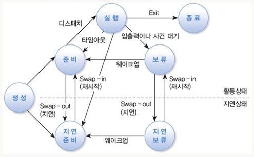

# # UNIX 시스템

## 09. 프로세스 관리

- 컴퓨터과학과 김희천 교수님

### (1) 프로세스

- 프로세스 정의
    - 커널에 등록되어 관리를 받는 '실행 중인 프로그램'
        - 커널은 프로세스 관리 블록(PCB)에 프로세스에 관한 정보를 저장
        - 프로세스는 시스템 자원을 사용하며 여러 상태 변화를 겪음
        - 각 프로세스는 유일한 PID를 가짐
    - 프로세스 예
        - systemd 프로세스는 PID가 1
            - 모든 사용자 프로세스의 조상 프로세스
        - 로그인을 하거나 터미널 창을 열면 'bash 프로세스'가 할당됨
        - 필요에 따라 프로세스는 자식 프로세스를 생성함
        - 데몬 프로세스는 서비스 요청을 처리하기 위한 백그라운드 프로세스
- 프로세스 관리 블록(PCB)
    - 커널에 등록된 각 프로세스에 대한 정보를 저장하는 영역
        - 프로세스들은 모두 커널 공간에 자신의 정보를 가짐
    - PCB에 저장되는 정보
        - PID와 PPID
        - UID와 EUID 및 GID와 EGID
        - 프로세스의 현재 상태
            - 실행/준비/보류/지연 등의 상태 정보와 CPU 사용 시간 등
        - 프로세스 우선순위
        - 프로세스가 사용중인 자원에 관한 정보
            - 메모리 주소, 입출력 장치, 파일 등
        - 모든 대기 중인 시그널의 목록
        - 문맥 교환 정보
- 명령의 실행과 프로세스의 생성
    - 셸에서 명령을 실행하면 새롱누 프로세스가 만들어져 처리됨
        - 시스템 호출 fork()를 호출하여 기존 부모 프로세스가 자신의 복사본 자식 프로세스를 만듦
        - 자식 프로세스는 시스템 호출 exec(program)에 의해 새로운 프로그램으로 대체되어 실행됨
        - 프로그램이 종료되면 자식 프로세스가 종료됨
        - 부모 프로세스는 보류 상태에 있다가 자식 프로세스가 종료되면서 깨어남
    - 예
        - 터미널 창에서 ls 명령을 실행하면 셸은 fork()를 호출하여 셸의 복사본(자식 프로세스)를 생성함
        - 자식 프로세스는 exec(ls)를 호출하여 ls 명령을 실행함
    - pstree 명령은 프로세스 트리(부모-자식 관계)를 보여주는 명령
- 포어그라운드(foreground) 프로세스
    - 셸 프롬프트에서 명령을 실행하면 포어그라운드 모드로 수행됨
        - 포어그라운드 프로세스는 터미날에 대한 제어권을 가짐
        - 포어그라운드 프로세스는 키보드 입력 및 화면 출력이 가능함
            - 터미날로부터 키보드 입력을 받을 수 있는 프로세스는 하나 뿐임
        - 포어그라운드 프로세스가 끝나기 전에는 다른 명령을 수행할 수 없음
    - 포어그라운드로 실행 중인 프로세스를 강제 중지하려면 Ctrl+c
    - 포어그라운드 실행 중에 Ctrl+z하면 백그라운드로 전환되며 멈춤(또는 지연) 상태가 됨
        - fg jobld 또는 bg jobld 명령을 수행하면 실행상태가 됨
- 백그라운드(background) 프로세스
    - 백그라운드로 실행하려면 셸 프롬프트에서 명령의 끝에 &를 추가하여 실행함
        - 백그라운드로 프로세스를 실행시키면 셸은 즉시 명령 대기 상태가 됨
            - 백그라운드 프로세스는 터미날 출력은 가능하나 키보드 입력을 받을 수는 없음
            - 백그라운드 프로세스가 키보드 입력이 필요하면 지연 상태가 됨
        - 입력 없이 장시간 실행되어야 하는 경우 주로 사용
        - 터미날 창을 종료하면 연결된 모든 백그라운드 프로세스도 종료됨
    - 백그라운드 프로세스를 포어그라운드로 전환하는 방법
        - 셸에서 fg jobld을 실행함
    - jobs 명령으로 백그라운드 프로세스의 상태를 점검할 수 있음
        - jobs -l 명령은 PID를 함께 보여줌
- 특수 권한(1)
    - SetUID
        - 일반 사용자가 passwd 명령으로 비밀번호를 수정하면, 결국 /etc/passwd 또는 /etc/shadow 파일이 수정되어야 함(권한 상승이 필요함)
        - 실행 파일에 SetUID가 설정되어 있으면 해당 파일이 실행될 때 실행시킨 사용자가 아닌 파일의 소유자 권한으로 실행 됨
            - 프로세스의 EUID는 파일의 소유자가 됨
        - 파일의 접근권한에서 소유자의 실행 권한에 x가 아닌 s가 표시됨
        - 설정 방법은 chmod 4755 file 또는 chmod u+s file
        - 해제 방법은 chmod 0455 file 또는 chmod u-s file
    - SetGID
        - 파일의 접근권한에서 그룹의 실행 권한에 s가 표시됨
        - SetGID가 설정된 파일을 실행하면 '실행자의 그룹 권한'이 아닌 '파일 소유자의 그룹 권한'으로 실행됨
        - 디렉터리에 설정된 경우, 그 디렉터리에 파일을 만들 때 '파일의 소유 그룹'이 '디렉터리의 소유 그룹'으로 지정됨. 그룹 구성원의 공유 공간으로 사용될 수 있음
        - 설정 방법은 chmod 2775 file 또는 chmod g+s file
    - StickyBit
        - 파일의 접근권한에서 기타 사용자의 실행 권한에 t가 표시됨
        - 주로 공유 디렉터리에 설정되며, 누구나 그 디렉터리에 파일을 생성할 수 있지마 파일의 소유자만 삭제할 수 있음
        - 설정 방법은 chmod 1777 file 또는 chmod o+t file

### (2) 프로세스의 상태

- 프로세스의 상태 변화
    - 제한된 자원 하에 멀티태스킹을 지원하는 운영체제에서 프로세스는 여러 상태 변화를 겪음

- ps 명령(1)
    - 프로세스의 현재 상태를 확인하는 명령
        - 특정 순간에 활동 중인 프로세스의 상태를 보여줌
    - ps [options]
        - 옵션 없이 ps 명령을 실행하면 현재 터미널과 연결되어 있는 프로세스 중 프로세스의 EUID가 현재 사용자의 UID와 같은 프로세스를 선택하여 보여줌
        - ps -e와 ps aux 명령은 모든 사용자의 모든 프로세스에 관한 많은 정보를 보여줌

| 옵션                        | 설명                                                           |
|---------------------------|--------------------------------------------------------------|
| `a`                       | 터미널과 연결된 **모든 사용자**의 모든 프로세스를 출력                             |
| `-A` 또는 `-e`              | **모든(every)** 사용자의 모든 프로세스를 출력                               |
| `u`                       | 현재 사용자의 프로세스를 **user-oriented 형식**으로 자세히 출력                  |
| `x`                       | 현재 사용자가 소유한 **모든 프로세스** 출력(터미널에 연결되지 않은 데몬도 포함)              |
| `-u users`                | **EUID가 지정 users(계정명/UID)** 인 프로세스만 선택(여러 명은 `,` 또는 공백으로 구분) |
| `U users`                 | **실제 UID(RUID)가 지정 users** 인 프로세스만 선택                        |
| `--user=users`            | `-u users`와 동일(효과적 사용자 기준 선택)                                |
| `-p PIDs`                 | 주어진 **PID 목록**의 프로세스만 출력                                     |
| `e`                       | 프로세스 정보에 **환경변수**까지 포함해 출력                                   |
| `l` 또는 `-l` 또는 `-f`       | 프로세스에 관한 **상세(long/full)** 정보를 출력                            |
| `-o format` 또는 `o format` | 출력할 **항목(서식)** 을 지정하여 출력 (예: `ps -o pid,ppid,uid,cmd`)       |

### (3) 프로세스 관리

- top 명령(1)
    - 현재 실행 중인 프로세스의 모니터링과 관리를 위한 대화식 돼구
        - 현재 실행 중인 개별 프로세스의 실시간 상황을 주기적으로 보여줌
            - 프로세스의 상태, cpu와 메모리 사용량 및 시스템의 부하 등을 확인
        - ps 명령의 동적 -대화식 버전
    - top [options]
    - 옵션
        - -d delay는 초 단위로 주기를 지정
        - -p pids와 -u user는 특정 프로세스나 사용자 프로세스로 한정
        - -S는 '총 누적 CPU 사용 시간(자식 프로세스 포함)'을 출력
    - 기본적으로 CPU 사용량이 많은 프로세스를 먼저 보여줌

| 옵션      | 설명                              |
|---------|---------------------------------|
| `Space` | 화면을 갱신함                         |
| `k`     | `kill` 명령을 수행                   |
| `r`     | `renice` 명령을 수행                 |
| `u`     | 명령 옵션에서 `-u`의 의미와 같음(사용자 기준 필터) |
| `M`     | `%MEM` 값으로 정렬                   |
| `N`     | `PID` 값으로 정렬                    |
| `P`     | `%CPU` 값으로 정렬                   |
| `T`     | `TIME+` 값으로 정렬                  |
| `q`     | `top` 명령을 종료                    |

- kill 명령
    - 프로세스에 시그널을 보내는 명령
        - 다른 프로세스에게 시그널을 보내도록 커널에게 요청하는 것
        - 시그널은 프로세스를 관리 방법이고 프로세스 간 통신 수단
        - 여러 종류의 시그널이 존재하며 기본 시그널은 TERM임
    - kill [-signal] pids
    - kill [-s signal] pids
        - signal은 시그널의 이름 또는 시그널 번호
        - kill pids 명령은 TERM 시그널을 보냄
        - kill -STOP 3188은 해당 PID를 가진 프로세스에게 멈춤 시그널을 보냄
    - killall 명령
        - 특정 프로세스에 한꺼번에 시그널을 보내는 명령
        - killall [options] [-s signal] [-u user] names
            - 프로그램이나 프로세스의 이름을 사용
            - killall -i-s 9 -u kdhong bash는 확인을 거쳐 kdhong 계정의 bash 프로세스에게 KILL 시그널을 보냄

- 시그널의 종류

| 번호 |  이름  | 의미                                                                          |
|---:|:----:|-----------------------------------------------------------------------------|
|  1 | HUP  | 터미널이 종료될 때 터미널에 연결된 모든 프로세스에게 보내짐. 데몬 프로세스가 **설정 파일을 다시 읽고 재시작**하도록 할 때도 사용 |
|  2 | INT  | Interrupt의 의미로, 터미널에서 `Ctrl+C`를 누르는 것과 같음                                   |
|  9 | KILL | Kill의 의미로 **프로세스를 강제로 즉시 종료**시킴                                             |
| 15 | TERM | Terminate의 의미로 `kill` 명령의 **기본 시그널**. 정상적인 종료 방법으로 끝내기 함                    |
| 18 | CONT | Continue의 의미로 **STOP 시그널로 중단된 프로세스를 재개**시킴                                  |
| 19 | STOP | Stop의 의미로 **프로세스를 잠시 중단**시킴                                                 |
| 20 | TSTP | Terminal Stop의 의미로 터미널에서 `Ctrl+Z`를 누르는 것과 같음                                |

- nicd와 renice 명령
    - 'nice 우선순위(NI) 값'을 조정하는 명령
    - NI 값은 -20(가장 높은 우선순위) ~ 19(가장 낮은 우선순위)
        - 우선순위가 높으면 CPU를 점유할 확률이 높음
        - 기본 NI 값은 0임
    - nice [options] [command]
        - 명령을 실행할 때 NI 값을 조정하는 명령
        - 일반 사용자는 NI 값을 0 이상으로만 지정할 수 있음
    - 옵션
        - -n adjustment 또는 -adjustment는 조정 수치 만큼 NI 값을 조정
        - nice -n +5 top 또는 nice -+5 top은 NI 값을 5 증가 시켜 우선순위를 낮춤
    - renice priority [options]
        - 실행 중인 프로세스의 NI 값(절댓값)을 바꾸는 명령
        - 일반 사용자는 자신이 소유할 프로세스의 우선순위를 낮출 수만 있음
    - 옵션
        - -p pids는 프로세스를 지정
        - -g gids는 그룹을 지정
        - -u users는 사용자를 지정
        - renice 10 -u jjpark는 관리자(또는 본인)가 jjpark 계정이 소유한 모든 프로세스의 NI 값을 10으로 조정함
- nohup 명령
    - HUP 시그날과 무관하게 백그라운드 명령이 스스로 종료될 때까지 계속 수행시키는 명령
        - 로그아웃을 하거나 터미날 창을 끝내면 백그라운드 프로세스에도 HUP 시그널이 보내짐
    - nohup 명령을 실행하는 경우, 명령 행의 끝에 '&'를 붙여 백그라운드로 실행해야 함
    - 예
        - nohup find -size + 100k > log.txt &
        - 표준 출력과 표준 에러 출력이 필요한 경우 ~/nohup.out 에 리다이렉션되어 덧붙여짐
    - 프로세스 관리를 위한 GUI
        - 데스크톱 메뉴에서 '프로그램 > 시스템 도구 > 시스템 정보'를 실행
        - 시스템 정보 창에서 모든 또는 자신이 소유한 프로세스의 상태를 보고 [편집] 메뉴에서 상태를 제어할 수 있음

### (4) cron 서비스

- cron 서비스
    - 지정된 시간에 주기적으로 자동 수행되는 작업을 수행함
    - crond 데몬 프로그램이 서비스를 제공
        - 1분 간격으로 crontab 파일을 검사하여 수행함
        - crontab 파일은 'cron 작업'의 리스트를 가지며 cron 작업의 수행 방법이 기록되어 있음
    - cron 서비스를 이용한 자동 스케줄
        - /etc/crontab 파일과 /etc/cron.d/ 디렉터리에 존재하는 파일
        - 시스템 수준에서 주기적으로 수행될 작업을 설정
    - crontab 명령
        - 개별 사용자는 crontab -e 명령을 이용하여 주기적으로 수행될 작업을 설정할 수 있음
    - 분(0~59), 시(0~23), 날짜(1~31), 달(1~12), 요일(0~7)
- crontab 명령
    - 일반 사용자가 자신의 cron 작업을, 자신의 crontab 파일에 등록할 때 사용해야 하는 명령
        - /var/spool/cron/username 파일로 만들어지나 수정 권한이 없음
    - crontab [options]
    - 옵션
        - -l은 crontab 파일의 내용을 출력함
        - -e은 crontab 파일을 vi로 편집할 수 있음
            - *****date >> ~/date.txt를 입력한 후 확인
        - -r은 crontab 파일을 삭제함
        - -u user는 지정된 사용자의 crontab 파일을 사용함(권한이 필요)
    - 지정된 시간에 일회성으로 작업을 예약하려면 at 명령을 사용함
