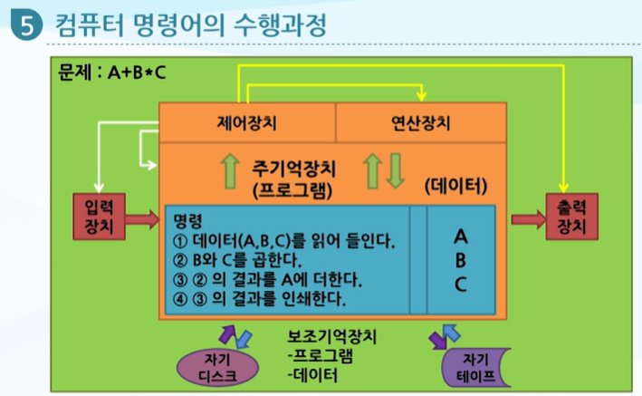

# 컴퓨터의 이해

## 03. 처리장치와 데이터 처리

- 컴퓨터과학과 강경현 교수

---

## 1. 학습 목차

1. 처리장치
2. 수치 데이터의 표현과 진법변환
3. 문자데이터의 표현방법
4. 주기억장치 주소, 데이터 저장, 명령어
5. 주기억장치의 발달과정
6. 입력, 처리, 출력의 데이터 처리과정

---

## 2. 처리장치

### 2-1. 처리장치의 구성

- 처리장치는 크게 다음으로 구성됨
    - CPU(Central Processing Unit)
    - 주기억장치(main memory)

### CPU의 주요 구성

- 제어장치(control unit)
- 레지스터(register)
- 산술논리연산장치(ALU: Arithmetic and Logic Unit)

### 핵심 정리

- CPU는 명령을 해석하고 실행하는 중심 장치임
- 주기억장치는 처리할 프로그램과 데이터를 저장하는 장치임

---

## 3. 중앙처리장치(CPU)

### 3-1. 중앙처리장치의 역할

- 중앙처리장치는 처리를 실행하는 전자회로임
- 내부에 레지스터가 들어 있음
- 프로그램의 명령어를 해석함
- 명령어가 명시한 대로 계산하고 데이터를 이동함
- 시스템의 입력과 출력을 제어함

### 3-2. 산술논리연산장치(ALU)

- 가감승제와 논리명령을 수행하는 전자회로
- 수행 작업 예:
    - 논리 연산
    - 비교
    - Shift 연산

### 3-3. 제어장치

- 컴퓨터 시스템 전체를 지시, 감독, 조정함
- 주요 역할:
    - 입력과 출력 제어
    - 연산 제어
    - 데이터 이동 제어

### 3-4. 프로세서 레지스터

- 처리할 명령어 또는 데이터를 임시로 저장하는 고속 기억장치임

### 핵심 정리

- CPU는 제어장치, ALU, 레지스터로 구성됨
- 제어장치는 전체 흐름을 지시하고,
  ALU는 실제 계산과 논리 연산을 수행함
- 레지스터는 CPU 내부의 빠른 임시 저장 공간임

---

## 4. 마이크로프로세서와 CPU 발전

### 4-1. 마이크로프로세서

- 마이크로프로세서는 연산장치와 제어장치를
  1개의 작은 실리콘 칩에 집적시킨 처리장치임

### 4-2. 주요 발전 사례

- 1971년 인텔 마이크로프로세서 4004
    - 크기: 3×4mm
    - 성능: ENIAC의 약 10배
- 1946년 ENIAC
    - 무게: 약 30톤
    - 길이: 약 25m
    - 높이: 약 2.5m
    - 폭: 약 1m
- 1998년 컴팩(Compaq) 알파 21264
    - 1990년대 슈퍼컴퓨터급 성능
- 2000년대 이후
    - 인텔 고성능 멀티코어 i3, i5, i7 등 발전
- 2023년
    - 코어 Ultra로 발전

### 발전 방향

- 성능 향상
- 메모리 지원 증가
- 전력소비량 감소
- 그래픽 성능 향상

### 핵심 정리

- CPU는 크기는 작아지고 성능은 크게 향상되어 왔음
- 마이크로프로세서의 발전은 인터넷, 멀티미디어, 통신, 방송 등 정보기술 통합의 기반이 됨

---

## 5. 수치 데이터의 표현과 진법변환

### 5-1. 데이터의 저장

- 컴퓨터 시스템의 전자회로는 전자신호인 임펄스(impulse)의 유무를 감지함
- 데이터의 기본 단위는 비트(bit: binary digit)임
- 데이터는 1 또는 0으로 저장됨
    - 전류가 흐르면 1
    - 전류가 흐르지 않으면 0
- 보통 8개의 비트가 모여 1바이트(byte)를 구성함

### 핵심 정리

- 컴퓨터는 모든 데이터를 0과 1의 조합으로 저장함
- 최소 기본 단위는 비트이고, 8비트는 1바이트임

---

## 6. 수치 데이터의 표현

### 6-1. 10진법

- 10진법은 10을 기저(base)로 사용하는 수 체계임
- 예시:

  253 = 2×10² + 5×10¹ + 3×10⁰

### 6-2. 2진법

- 2진법은 2를 기저(base)로 사용하는 수 체계임
- 2진수를 10진수로 변환할 수 있음
- 예시:

  (1010)₂ = 1×2³ + 0×2² + 1×2¹ + 0×2⁰
  = 8 + 0 + 2 + 0
  = (10)₁₀

### 핵심 정리

- 10진법은 10을 기준으로 자릿값을 계산함
- 2진법은 2를 기준으로 자릿값을 계산함
- 컴퓨터 내부에서는 2진수 기반으로 데이터를 표현함

---

## 7. 수치 데이터와 정수 표현

### 7-1. 정수 표현

- 정수는 비트열로 저장됨
- 부호가 있는 정수는 부호 비트(sign bit)를 사용함
- 32비트 정수의 경우:
    - 1비트는 부호 비트
    - 나머지 31비트는 수치 표현에 사용됨

### 7-2. 32비트 정수의 최대값

    2³¹ - 1 = 2,147,483,647

### 7-3. 워드(word)

- 1 word = 4 byte = 32 bit

### 핵심 정리

- 정수 데이터도 0과 1의 비트열로 저장됨
- 부호 있는 정수는 부호 비트를 사용함
- 1워드는 보통 4바이트, 즉 32비트로 설명됨

---

## 8. 문자데이터의 표현방법

### 8-1. 문자 데이터 표현

- 문자는 일정한 비트 수를 이용하여 표현함
- 표현 가능한 문자 수는 비트 수에 따라 달라짐

| 비트 수 | 표현 가능 문자 수 |
|------|------------|
| 6비트  | 64개        |
| 7비트  | 128개       |
| 8비트  | 256개       |

### 8-2. BCD

- BCD(Binary Coded Decimal)는 6비트 문자 코드 방식임

### 8-3. ASCII

- ASCII는 American Standard Code for Information Interchange의 약자임
- 7비트와 1비트 검증 비트를 사용함
- 미국 정보교환 표준 코드로,
  개인용 컴퓨터와 데이터 통신용으로 많이 사용됨

### 8-4. Unicode

- Unicode는 16비트로 확장된 문자 코드 체계임
- 세계의 모든 언어를 표현하기 위해 개발됨
- 1991년 IBM, 마이크로소프트 등 유명 컴퓨터 업체들로 구성된 컨소시엄이 개발함
- 16비트로 2¹⁶ = 65,536개의 문자를 표현할 수 있음
- 한글, 한자, 히브리어, 일본어, 그리스어의 대소문자 등 다양한 언어 표현 가능

### 핵심 정리

- ASCII는 주로 영문과 기본 문자를 표현하는 데 사용됨
- Unicode는 세계 여러 언어를 통합적으로 표현하기 위한 16비트 코드 체계임

---

## 9. 주기억장치 주소와 데이터 저장

### 9-1. 기억용량 단위

| 단위     | 크기                    |
|--------|-----------------------|
| 1 Byte | 8 bits                |
| 1 KB   | 2¹⁰ Byte = 1,024 Byte |
| 1 MB   | 2²⁰ Byte = 1,024 KB   |
| 1 GB   | 2³⁰ Byte = 1,024 MB   |
| 1 TB   | 2⁴⁰ Byte = 1,024 GB   |
| 1 PB   | 2⁵⁰ Byte = 1,024 TB   |

### 9-2. 호출시간 단위

| 단위     | 의미        |
|--------|-----------|
| 1 msec | 1 / 10³초  |
| 1 μsec | 1 / 10⁶초  |
| 1 nsec | 1 / 10⁹초  |
| 1 psec | 1 / 10¹²초 |

### 9-3. 좋은 기억소자의 조건

- 비트당 가격이 저렴함
- 호출시간이 짧음
- 부피가 작고 가벼움
- 전력 소모가 적음
- 비트 상태의 안정성이 좋아야 함

### 핵심 정리

- 기억용량은 Byte, KB, MB, GB, TB, PB 순으로 커짐
- 호출시간은 msec, μsec, nsec, psec 순으로 더 짧아짐
- 좋은 기억장치는 빠르고, 작고, 안정적이며, 전력 소모가 적어야 함

---

## 10. 주기억장치와 데이터 저장 방식

### 10-1. 주기억장치의 주소

- 주기억장치의 각 바이트는 단일 주소를 가짐
- 숫자, 영문자, 특수문자가 입력장치에서 읽혀 주기억장치로 보내지면
  비트 형태로 바뀌어 기억됨
- 한 번 데이터가 수록되면 내용이 바뀔 때까지 남아 있음

### 10-2. 프로그램 저장과 실행

- 고급언어로 작성한 프로그램은 기계어로 번역됨
- 번역된 기계어는 주기억장치에 저장됨
- 처리기 전자회로가 이를 해석하고 실행함

### 핵심 정리

- 주기억장치에는 데이터와 프로그램이 모두 비트 형태로 저장됨
- CPU는 주기억장치에 저장된 명령어를 읽고 해석하여 실행함

---

## 11. 기계어 명령어의 형식

### 11-1. 명령어 구성

- 기계어 명령어는 다음으로 구성됨
    - 명령부
    - 오퍼랜드부 또는 주소부

### 11-2. 명령부

- 실행될 동작을 명시함

### 11-3. 오퍼랜드부

- 명령 실행에 필요한 정보를 나타냄
- 예:
    - 레지스터명
    - 데이터 주소
    - 데이터의 길이 등

### 11-4. 예시: `SUM := A + B`

    MOV AX, A
    ADD AX, B
    MOV SUM, AX

### 코드 해석

- `MOV AX, A`
    - A 값을 AX 레지스터로 이동
- `ADD AX, B`
    - AX에 B 값을 더함
- `MOV SUM, AX`
    - 계산 결과를 SUM에 저장

### 핵심 정리

- 기계어 명령어는 어떤 일을 할지 나타내는 명령부와,
  대상 데이터를 나타내는 오퍼랜드부로 구성됨

---

## 12. 주기억장치의 발달과정

### 12-1. 진공관

- 최초의 주기억장치로 사용됨
- 단점:
    - 크고 약함
    - 열이 많이 발생함
    - 신뢰성이 떨어짐
    - 많은 전류가 필요함

### 12-2. 자기코어 기억장치

- 1950년대 포레스터(Jay W. Forrester)가 개발
- 약 20년 동안 사용됨
- 컴퓨터 발전에 크게 공헌함
- 지름 0.3~0.5mm 정도의 작은 고리 모양의 자성 물질을 사용함
- 주로 페라이트로 제작됨
- 전류가 오른쪽으로 흐르면 1,
  왼쪽으로 흐르면 0으로 기억됨
- 전원이 꺼진 후에도 기억됨

### 핵심 정리

- 초기 주기억장치는 진공관에서 시작됨
- 자기코어 기억장치는 전원이 꺼져도 기억이 유지되는 중요한 발전 단계였음

---

## 13. 반도체 기억장치

### 13-1. 반도체 기억장치의 특징

- 반도체 칩 속에 집적회로로 만들어 넣은 기억장치임
- 빠르고 경제적임
- 열을 많이 발생하지 않음
- 신뢰성이 높고 간편함
- 경제적이고 많은 용량을 가진 기억장치는 반도체 기술에 의해 실현됨
- 트랜지스터 발명 후 소형화 추세가 시작됨

### 13-2. 집적도 발전

- 1960년대 중반:
    - 한 칩에 약 1,000개 회로소자 집적
- 1970년대 중반:
    - 15,000개 이상 회로소자 집적
- 1980년대:
    - 1/4인치 칩에 100만 개 소자 집적
- 2000년대:
    - 1,000억 개 이상의 소자 집적

### 13-3. 반도체 기억장치의 장단점

- 장점:
    - 빠름
    - 경제적
    - 대용량화 가능
    - 신뢰성이 높음
- 단점:
    - 자기코어에 비해 계속적인 전류 공급이 필요함
    - 전기가 꺼지거나 방해를 받는 경우 데이터를 잃을 수 있음

### 접근속도 비교

- 자기코어 데이터 접근속도:
    - 마이크로초 수준
- 반도체 기억장치 데이터 접근속도:
    - 나노초 수준

### 핵심 정리

- 현재 주기억장치는 거의 반도체 기억장치를 사용함
- 반도체 기억장치는 빠르고 소형화에 유리하지만,
  전원 공급이 끊기면 데이터를 잃을 수 있음

---

## 14. RAM과 ROM

### 14-1. RAM(Random Access Memory)

- 임의 접근이 가능한 기억장치임

### SRAM

- Static RAM
- 전원이 공급되는 한 내용이 그대로 유지됨
- 주로 캐시메모리로 이용됨

### DRAM

- Dynamic RAM
- 전원이 공급되더라도 내용 소멸을 방지하기 위해
  계속적으로 리프레싱(refreshing)이 필요함
- 주기억장치로 많이 사용됨

### 14-2. ROM(Read Only Memory)

- ROM은 메모리가 제작될 때 데이터가 그 안에 기록됨
- 일반적으로 저장된 내용 변경이 어려움

### PROM

- Programmable ROM
- ROM과 같은 기능을 하지만,
  사용자가 PROM을 조립해 넣기 전에 프로그램이나 데이터를 기록할 수 있음

### 핵심 정리

- SRAM은 빠르고 캐시메모리에 주로 사용됨
- DRAM은 주기억장치로 많이 사용됨
- ROM은 제작 시 데이터가 기록되는 읽기 전용 메모리임
- PROM은 사용자가 한 번 프로그램할 수 있는 ROM 계열임

---

## 15. 메모리 기술

### 15-1. DRAM 발전

- 64K, 256M, 1GB, 32GB DRAM 등으로 발전
- 2024년 10월 삼성전자는 세계 최초로
  12나노 24GB GDDR7 DRAM을 개발함

### 15-2. 플래시메모리

- Flash memory
- 비파괴 메모리 기술
- 전력이 필요 없는 비휘발성 메모리
- 충격에 강함

### 15-3. 캐시메모리

- 빠르지만 값이 비쌈
- CPU와 주기억장치 사이의 속도 차이를 줄이는 데 활용됨

### 핵심 정리

- 메모리 기술은 고용량, 고속, 저전력, 소형화 방향으로 발전함
- 플래시메모리는 전원이 없어도 데이터를 유지하는 비휘발성 메모리임
- 캐시메모리는 빠르지만 비용이 높음

---

## 16. 입력, 처리, 출력의 데이터 처리과정

### 16-1. 데이터 처리의 기본 단위

| 단위  | 설명                   |
|-----|----------------------|
| 필드  | 데이터를 구성하는 하나의 단위     |
| 레코드 | 여러 필드의 모임, 하나의 처리 단위 |
| 파일  | 레코드들이 모여 하나의 파일을 구성  |

### 예시: 편지 봉투

- 필드:
    - 우편번호
    - 주소
    - 이름
- 이 필드들이 모이면 주소 레코드가 됨
- 여러 주소 레코드가 모이면 주소 파일이 됨

### 16-2. 기록매체

- OMR
    - Optical Mark Recognition
- OCR
    - Optical Character Recognition
- 카드
- 자기테이프
- 자기디스크

### 핵심 정리

- 데이터는 필드 → 레코드 → 파일의 구조로 묶여 처리됨
- 기록매체에 저장된 레코드는 한 번에 한 레코드씩 주기억장치로 읽어 들일 수 있음

---

## 17. 기본적인 자료 처리과정

### 17-1. 처리 흐름

- 입력장치를 통해 수집된 데이터가 처리장치에 전달됨
- 처리장치는 데이터를 가공하여 정보를 만듦
- 만들어진 정보는 출력장치로 전달됨
- 필요한 정보는 보조기억장치에 축적됨

### 흐름 정리

| 단계     | 역할             |
|--------|----------------|
| 입력장치   | 데이터 수집, 데이터 전달 |
| 처리장치   | 데이터 가공, 정보 검색  |
| 출력장치   | 정보 전달, 정보 표시   |
| 보조기억장치 | 정보의 축적         |

### 핵심 정리

- 데이터 처리 과정은 입력 → 처리 → 출력 → 저장의 흐름으로 이해할 수 있음

---

## 18. 데이터 입력과 결과 출력

### 18-1. 입력 방법

- 주기억장치에 데이터를 입력하는 방법
    - 음성
    - 키보드
    - 마우스
    - 펜
    - 터치스크린
    - OMR
    - OCR
    - MICR 카드
    - 자기테이프
    - 자기디스크
    - HDD
    - CD-ROM
    - DVD
    - USB 메모리 등

### 18-2. 출력 방법

- 출력 장치 또는 매체
    - 프린터
    - CRT
    - LCD 터미널
    - 자기테이프
    - 자기디스크
    - HDD
    - CD-ROM
    - DVD
    - USB 메모리 등

### 핵심 정리

- 입력은 데이터를 컴퓨터 내부로 전달하는 과정임
- 출력은 처리 결과를 사용자나 저장장치로 전달하는 과정임

---

## 19. 컴퓨터 명령어의 수행과정

### 19-1. 예시: `A + B * C`

- 입력장치에서 데이터 A, B, C를 읽어 들임
- B와 C를 곱함
- A와 곱셈 결과를 더함
- 연산 결과를 인쇄하거나 출력함

### 수행 흐름

1. 입력장치에서 데이터 A, B, C를 읽어 들임
2. 제어장치가 명령을 해석함
3. ALU가 B와 C를 곱함
4. ALU가 A와 계산 결과를 더함
5. 제어장치가 결과를 출력장치로 전달함

### 핵심 정리

- 제어장치는 명령의 흐름을 지시함
- ALU는 실제 산술·논리 연산을 수행함
- 주기억장치는 프로그램과 데이터를 저장함

---

## 20. 정리하기

1. 처리장치는 크게 중앙처리장치(CPU)와 주기억장치로 구성됨

2. 중앙처리장치는 제어장치, 산술논리연산장치, 레지스터로 구성됨

3. 데이터는 전자신호의 유무에 따라 0과 1의 비트로 저장됨

4. 8개의 비트가 모여 1바이트를 구성함

5. 문자 데이터는 ASCII, Unicode 등의 코드 체계를 통해 표현됨

6. 주기억장치의 각 바이트는 고유한 주소를 가짐

7. 기계어 명령어는 명령부와 오퍼랜드부로 구성됨

8. 주기억장치는 진공관, 자기코어, 반도체 기억장치 순으로 발전해 왔음

9. RAM은 주기억장치로 사용되며,
   SRAM은 캐시메모리,
   DRAM은 주기억장치로 많이 사용됨

10. 데이터 처리 과정은 입력, 처리, 출력, 저장의 흐름으로 이루어짐

---

## 21. 핵심 요약

### 21-1. 처리장치

- CPU와 주기억장치로 구성됨
- CPU는 제어장치, ALU, 레지스터를 포함함
- CPU는 명령어를 해석하고 연산과 데이터 이동을 수행함

### 21-2. 데이터 표현

- 컴퓨터의 데이터 기본 단위는 비트임
- 1바이트는 8비트임
- 수치 데이터는 2진수로 표현됨
- 문자 데이터는 ASCII, Unicode 등으로 표현됨

### 21-3. 기억장치

- 주기억장치의 각 바이트는 주소를 가짐
- 기억용량 단위:
    - Byte
    - KB
    - MB
    - GB
    - TB
    - PB
- 호출시간 단위:
    - msec
    - μsec
    - nsec
    - psec

### 21-4. 주기억장치 발달

| 단계        | 특징                     |
|-----------|------------------------|
| 진공관       | 크고 약하며 열이 많고 신뢰성이 낮음   |
| 자기코어 기억장치 | 전원이 꺼져도 기억 유지 가능       |
| 반도체 기억장치  | 빠르고 경제적이며 현재 주기억장치의 중심 |

### 21-5. RAM과 ROM

| 구분   | 특징                          |
|------|-----------------------------|
| SRAM | 전원이 공급되는 한 내용 유지, 캐시메모리로 사용 |
| DRAM | 리프레싱 필요, 주기억장치로 많이 사용       |
| ROM  | 제작 시 데이터 기록, 일반적으로 변경 불가    |
| PROM | 사용자가 프로그램할 수 있는 ROM         |

### 21-6. 데이터 처리 과정

- 필드 → 레코드 → 파일
- 입력장치 → 처리장치 → 출력장치
- 보조기억장치는 정보 축적에 사용됨

---

## 22. 연습문제 정리

### Q1. 다음 중 처리장치에 대한 설명으로 틀린 것은?

1. 처리장치는 크게 중앙처리장치(CPU)와 주기억장치로 구성된다.
2. 데이터가 처리될 때마다 그 데이터는 먼저 보조기억장치에 저장된다.
3. 제어장치 내에 있는 전자회로가 프로그램에 있는 명령어를 번역하여 산술논리연산장치(ALU)로 하여금 처리하게 한다.
4. 주기억장치로는 초기에는 진공관이나 트랜지스터가 사용되었으나 오늘날에는 거의 반도체기억장치가 사용되고 있다.

- 정답: **2**

### 해설

- 데이터 처리는 보조기억장치가 아니라 주기억장치와 CPU를 중심으로 이루어짐
- 보조기억장치는 장기 저장과 정보 축적에 사용됨

---

### Q2. 다음 중 주기억장치 내부에 기억된 데이터의 최소 기본단위는?

1. 비트(bit)
2. 바이트(byte)
3. 워드(word)
4. 블록(block)

- 정답: **1**

### 해설

- 컴퓨터 데이터의 최소 기본 단위는 비트임
- 비트는 0 또는 1의 값을 가짐

---

### Q3. 다음의 코드 중 세계 각국의 언어를 좀 더 쉽게 표현할 수 있도록 개발된 16비트 코드체계는?

1. ASCII
2. ANSI
3. UNICODE
4. EBCDIC

- 정답: **3**

### 해설

- Unicode는 16비트 인코딩 체계로 개발됨
- 세계 여러 언어를 표현하기 위한 문자 코드 체계임

---

### Q4. 다음 중 가장 큰 기억장치 단위와 가장 빠른 호출시간 단위를 나타내고 있는 것은?

1. MB, μsec
2. PB, psec
3. KB, nsec
4. MB, msec

- 정답: **2**

### 해설

- 제시된 기억장치 단위 중 가장 큰 것은 PB임
- 제시된 호출시간 단위 중 가장 빠른 것은 psec임

---

### Q5. 다음은 반도체 기억장치에 관한 설명이다. 기술된 내용이 잘못된 것은?

1. DRAM은 우리가 흔히 말하는 주기억장치로 많이 이용된다.
2. PROM은 휘발성 메모리로 저장된 내용은 반복적으로 바꿀 수 있다.
3. ROM은 제작될 때 데이터가 기록되며 변경이 불가능하다.
4. SRAM은 주로 캐시메모리로 이용된다.

- 정답: **2**

### 해설

- PROM은 ROM 계열의 비휘발성 메모리임
- 저장된 내용을 반복적으로 자유롭게 바꾸는 메모리가 아님
- 따라서 “휘발성 메모리이며 반복적으로 바꿀 수 있다”는 설명은 틀림

---

## 23. 시험 직전 체크포인트

- 처리장치는 CPU와 주기억장치로 구성된다.
- CPU는 제어장치, ALU, 레지스터로 구성된다.
- ALU는 산술 연산과 논리 연산을 수행한다.
- 데이터의 최소 단위는 비트이다.
- 8비트는 1바이트이다.
- 컴퓨터는 데이터를 0과 1로 저장한다.
- 2진수 1010은 10진수 10이다.
- 1 word는 4 byte, 즉 32 bit로 설명된다.
- ASCII는 7비트 기반 문자 코드이다.
- Unicode는 16비트 문자 코드 체계이다.
- 1KB는 1,024Byte이다.
- 1MB는 1,024KB이다.
- 1GB는 1,024MB이다.
- 호출시간 단위는 msec → μsec → nsec → psec 순으로 짧아진다.
- 기계어 명령어는 명령부와 오퍼랜드부로 구성된다.
- 주기억장치는 진공관 → 자기코어 → 반도체 기억장치로 발전했다.
- SRAM은 캐시메모리로 주로 사용된다.
- DRAM은 주기억장치로 많이 사용된다.
- ROM은 제작 시 데이터가 기록되며 일반적으로 변경이 어렵다.
- 데이터 처리 단위는 필드 → 레코드 → 파일 순으로 확장된다.
- 데이터 처리 과정은 입력 → 처리 → 출력 → 저장의 흐름으로 이해하면 된다.