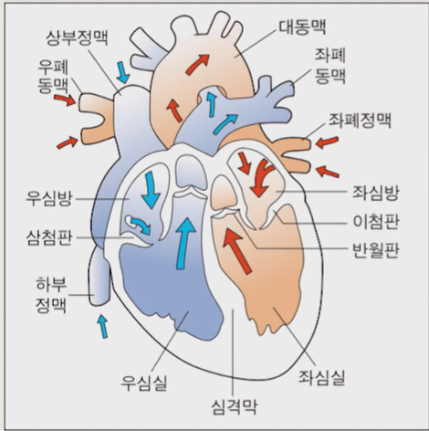
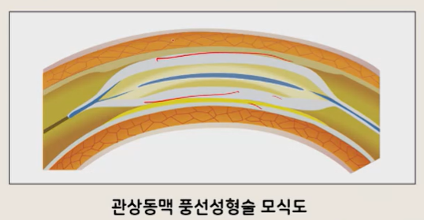
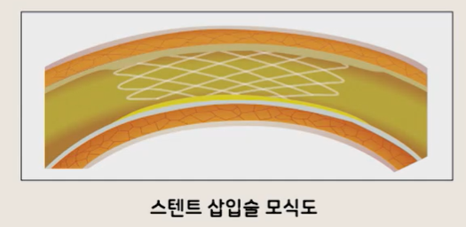
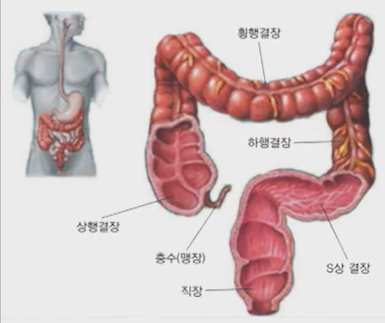

# 생활과 건강

## 02. 신체건강 문제와 관리(1)

- 간호학과 정성희 교수님

---

## 1) 심뇌혈관계 건강문제

### 심장

- 
- 일생동안 쉬지 않고 스스로 움직이는 근육성 펌프
- 혈액이 들어오는 2개의 방과 혈액을 내보내는 2개의 심실로 되어 있음

### 혈액의 흐름

- **좌심실**에서 나온 동맥혈액은 **동맥**, **세동맥**, **모세혈관**을 통하여 전신에 산소와 영양소를 공급하고,
  조직에서 생기는 이산화탄소와 노폐물을 걷어 가지고 모세혈관, **정맥**을 타고 **우심방**으로 돌아옴
- 순환은 출생 때부터 사망할 때까지 계속됨

### 혈액 순환

- 

#### 혈액의 순환과정

심장의 좌심실 → 대동맥 → 동맥 → 세동맥 → 모세혈관 → 세정맥 → 정맥 → 대정맥 → 우심방 → 우심실 → 폐동맥 → 폐 → 폐정맥 → 좌심방 → 좌심실

##### 정리

- 시작: **심장의 좌심실**
- 전신 순환 후 심장(우심방·우심실)으로 돌아감
- 폐를 거쳐 산소교환 후 좌심방으로 돌아옴
- 다시 **좌심실**로 들어가 순환 반복

---

### 고혈압

- 혈액을 순환시키는 원동력으로서, 심장에서 박출된 혈액이 동맥혈관 벽에 닿았을 때 형성되는 압력을 말함
- **수축기 혈압**: 심장이 수축할 때 혈액이 혈관벽에 부딪치는 힘
- **이완기(확장기) 혈압**: 심장이 다시 혈액을 채우기 위해 확장할 때 형성되는 압력
- **수축기 혈압 / 이완기 혈압**의 순서로 표기
    - 예: `120/80mmHg`와 같이 쓰고, **"120에 80"**이라고 읽음

### 고혈압의 진단기준

- 혈압은 기분상태, 신체적 건강상태, 날씨 등 여러 요인에 의해 수시로 수치가 변함
- 충분한 휴식을 취한 상태에서 최소 2회 이상 측정하여 평균혈압을 구하는 방식이 권장됨

|   혈압 분류    | 수축기 혈압(mmHg) | 기준  | 이완기 혈압(mmHg) |
|:----------:|:------------:|:---:|:------------:|
|   정상혈압*    |     <120     | 그리고 |     <80      |
|    주의혈압    |   120~129    | 그리고 |     <80      |
|  고혈압 전 단계  |   130~139    | 또는  |    80~89     |
|   고혈압 1기   |   140~159    | 또는  |    90~99     |
|   고혈압 2기   |     ≥160     | 또는  |     ≥100     |
| 수축기 단독 고혈압 |     ≥140     | 그리고 |     <90      |

- \* 심뇌혈관질환의 발생 위험이 가장 낮은 최적혈압
- 출처: 대한고혈압학회(2023)

### 고혈압 정리

#### 원인

- **본태성 고혈압**
    - 전체 고혈압 환자의 90~95% 차지
    - 원인: 아직 밝혀지지 않음
    - 유발요인: 유전, 스트레스, 식염 섭취량, 비만, 직업 등
- **속발성 고혈압**
    - 타 질병에 의해 2차적으로 발생한 고혈압
    - 동맥경화증, 신장질환 등에 의해 발생

#### 증상

- 초기 증상이 없음: '침묵의 살인자'
- 이후 두통(후두부), 현기증, 허약 등이 나타남
- 고혈압은 혈압상승 그 자체보다는 합병증으로 인한 사망률이 높으므로 유의해야 함
- 합병증: 뇌졸중, 협심증, 심근경색증, 심부전, 신부전, 안구내 출혈로 인한 시력소실 등

#### 예방

- 정기검진을 통해 조기 발견하는 것이 최선의 방법
- 고혈압 유발요인을 피하는 것이 좋음
    - 정기적으로 혈압검사
    - 처방 받은 혈압약의 규칙적 복용
    - 올바른 식습관
    - 규칙적인 운동
    - 체중 조절
    - 술과 담배 제한
    - 카페인 섭취 제한
    - 스트레스 관리 등

---

### 허혈성 심장질환

#### 개요

- 관상동맥 내벽에 콜레스테롤이나 지방이 축적되어 혈관벽이 두꺼워지고 딱딱해지면(동맥경화증) 혈관 내공이 좁아지고 심하면 완전히 막히는 현상이 일어남
- 이로 인해 심장근육이 혈액을 충분히 공급받지 못하면 협심증이나 심근경색증이 나타나는데, 이와 같이 심장에 혈류가 부족하여 발생하는 질병을 허혈성 심장병 또는 관상동맥질환이라고 함
- ※ 관상동맥: 심장근육에 혈액을 공급하는 혈관
- 
- 

#### (협심증, 심근경색증 매우 중요! 시험 필수)

##### 협심증

| 병명  | 상태 및 증상                                                                                                                                                               |
|-----|-----------------------------------------------------------------------------------------------------------------------------------------------------------------------|
| 협심증 | - 심근에 일시적으로 혈액공급이 부족한 상태 - 갑작스럽게 흉골 밑에 조이는 듯한 심한 통증을 느끼며, 통증은 왼쪽 어깨와 팔 또는 턱으로 퍼짐 - 통증은 보통 30초~30분 정도 지속 - 활동량의 증가, 추운 기후에 노출, 과식, 스트레스, 흡연 중 산소요구가 증가될 때 악화됨 |

##### 심근 경색증

| 병명     | 상태 및 증상                                                                                                                                                      |
|--------|--------------------------------------------------------------------------------------------------------------------------------------------------------------|
| 심근 경색증 | - 관상동맥이 막혀 혈액공급이 차단되어 심근이 괴사를 일으킨 상태 - 흉통: 협심증보다 강도가 심하고, 지속시간이 김 - 운동과 무관하게 발생할 때가 많음 - 심근괴사로 심장리듬의 장애나 부정맥, 심박출량 감소로 인한 쇼크가 나타남 - 사망위험률이 매우 높음 |

#### 위험 요인

- **고혈압**
    - 수축기 혈압 160mmHg, 이완기 혈압 95mmHg 이상일 경우에는 허혈성 심질환의 위험이 5배 이상 높음
- **연령**
    - 20~30대에 허혈성 심질환이 발병하기 시작하며,
    - 관상동맥질환으로 인한 사망자의 85%는 65세 이상임
- **성별**
    - 여성 < 남성
    - 갱년기 이후 여성에게 허혈성 심질환의 위험도가 증가
    - (∵에스트로겐 분비감소)
- **흡연**
    - 비흡연자 < 흡연자의 심장마비 확률은 2배 이상 높음
- **혈액 내 지방**
    - 콜레스테롤 240mg 이상일 경우 심장마비 위험성 2배 증가
- **비만**
    - 비만은 혈압상승, 고지혈증, 신체활동의 감소 등을 초래
- **기타**
    - 선천적 요인, 종족(아프리카계 미국인), 생활양식 등

#### 예방 관리

- 허혈성 심장질환의 위험인자 관리 및 생활양식 개선
- 통증관리: 협심증(니트로글리세린 복용), 심근경색증(모르핀 투여)
- 적극적 관리방법
    - 관상동맥 풍선성형술
    - 스텐트 삽입술
    - 관상동맥 우회로술

##### 관상동맥 풍선성형술

- 혈관의 좁아진 부위에 풍선이 달린 가느다란 카테터를 넣은 후 풍선을 부풀림으로써 좁아진 혈관을 넓혀 주어 피가 잘 통하도록 하는 것
- 

##### 스텐트 삽입술

- 가느다란 철망(스텐트)을 씌운 풍선으로 좁아진 부위를 눌러 주어 병변 부위를 다시 좁아지지 않도록 지지해 주는 방법
- 

##### 관상동맥 우회로술

- 좁아진 혈관 때문에 혈액공급을 받지 못하는 부위에 피가 흘러갈 수 있도록 하기 위해 신체의 다른 부위에서 혈관을 떼어다가 관상동맥에 이어주는 수술로 일종의 샛길을 만들어 주는 방법

---

## 2) 소화기계 건강문제

### 소화기계 해부생리

#### 소화과정

- 음식물섭취 → 분해(소화) → 혈액 속으로 이동(흡수) → 흡수된 영양소는 각 조직의 세포로 이동하여 에너지 공급
- 이러한 물리적·화학적 과정을 소화과정이라고 하며, 이에 관여하는 인체의 구조물들을 통틀어 소화기계라고 함
- 소화기계: 소화관(digestive tube)과 소화선(digestive gland)로 구분
- 소화관: 구강에서 시작하여 인두, 식도, 위, 소장, 대장, 직장, 항문에 이르는 약 9m의 긴 근육성 관을 말함
- 소화선: 소화흡수를 돕기 위해 필요한 물질을 생산하여 소화관으로 공급해 주는 침샘, 간, 담낭, 췌장 등을 말함

#### 소화기계의 구조

- 

#### 입

- 소화과정은 입에서 시작됨
    - 음식물을 씹어 잘게 부숨
    - 침 속의 소화효소가 탄수화물의 일부를 분해
    - 혀와 인두근육이 침 섞인 음식물을 식도를 통해 위로 보냄
- 저작작용
    - 음식물을 잘게 쪼개 음식의 표면적을 증가시킴으로써 음식의 단면과 소화액을 많이 접촉시켜 음식의 소화를 도움
- 침의 작용
    - 탄수화물을 분해함
    - 음식물을 적셔서 부드럽게 하여 삼키기 쉽게 만듦
    - 입 안을 축축하게 유지시켜 말하기를 원활하게 하고, 항균작용을 함

#### 위

- 음식물의 저장고 역할
- 위의 용적: 금식상태에서 50mL 정도, 음식 섭취 후에 1.5~2.5L 이상으로 증가되는 신축성을 보임
- 위의 소화과정
    - 공복 시에는 위가 서로 맞붙어 있음
    - → 음식이 들어오면 연동운동을 함
    - → 위 내 내용물이 액상의 미즙 상태가 됨
    - → 소화된 미즙 상태의 음식물은 소량씩 십이지장으로 이동됨
- 위의 내용물은 일반적으로 3~4시간이면 소장으로 이동
- 내용물에 따른 위 내 저장시간의 차이
    - 물은 한 컵을 마시면 10분 정도 후에 소장으로 이동되지만, 지방질이 많은 음식은 위의 연동운동을 저해하여 위에 오래 머무름
- 

#### 소장

- 직경 2~3cm, 길이 6~7m의 가늘고 긴 관
- 십이지장, 공장, 회장의 세 부분으로 나눔
- 기능
    - 위에서 내려온 음식물(미즙)을 담즙, 췌장액, 장액과 혼합한 후 소장 점막과 충분히 접촉시켜 영양분을 흡수하고 나머지 내용물을 대장으로 보냄
- 

#### 대장

- 약 1.5m 길이에 지름이 약 7.5cm인 굵은 관
- 맹장, 상행결장, 횡행결장, 하행결장, S상 결장, 직장으로 구성
- 기능: 위와 소장을 거쳐 온 내용물들로부터 수분과 전해질을 흡수 → 대변형성, 배출
- 

#### 간

- 오른쪽 늑골 바로 밑에 위치함. 내장에서 가장 큰 기관임
- 

#### 간의 기능 (별표! 중요!)

- 포도당 대사 작용
    - 혈액에서 과다한 포도당을 제거하여 글리코겐 상태로 합성 → 간에서 저장
    - 저혈당 시 글리코겐을 포도당으로 전환하여 혈액으로 방출
- 담즙 생산·분비
    - 지방의 소화와 흡수를 촉진함
    - 간에서 분비된 담즙 → 담낭에 일시 저장
    - → 지방의 소화과정을 돕기 위해 장으로 유입
- 해독작용
    - 여러 화학물질(약물, 알코올, 각종 독성물질)을 불활성화시킴
- 비타민 A, B, D와 B복합체 및 철분, 구리 등을 저장
- 간에 있는 포식세포인 쿠퍼세포(Kupffer cell)는 혈액을 통해 간으로 들어오는 박테리아 등의 특정물질 제거
- 대부분의 혈장단백질과 혈액응고인자를 합성

---

### 소화기계 건강문제

## 위염

### 원인

- 위염: 위장의 흔한 문제, 급성위염과 만성위염으로 분류
- 급성위염
    - 부주의한 식사에 의한 경우가 가장 흔함(자극성 음식, 식중독, 과도한 알코올 등)
    - 비스테로이드성 소염제(아스피린과) 과다복용
    - 과도한 스트레스 등
- 만성위염
    - 주 원인은 헬리코박터균(Helicobacter pylori)에 의한 감염
    - 헬리코박터균 감염은 만성 위축성위염을 초래
        - → 위암으로 진전하는 소인이 됨

### 증상

- 위점막 부종, 충혈, 출혈
- 급성위염: 복부 불편감, 식욕부진, 오심, 구토, 두통 등의 증상이 나타남
- 만성위염: 특별한 증상이 없는 경우가 많음

### 예방관리

- 원인제거 및 충분한 휴식과 스트레스 관리
- 자극적 음식, 알코올 섭취, 흡연을 삼가 함
- 음식을 안전하게 취급하고 위생적으로 준비
- 헬리코박터 파일로리균 감염 시 항생제 투여

---

## 소화성 궤양

### 원인

- 위산 분비가 많은 것이 특징, 위치에 따라 위궤양과 십이지장궤양으로 분류
- 위보다 십이지장에 더 잘 생김
- 헬리코박터 파일로리균 감염
    - 최근 연구를 통해 위궤양 환자의 70% 이상, 십이지장궤양 환자의 90% 이상에서 헬리코박터 파일로리균이 발견
    - 음식을 통한 헬리코박터 파일로리균 감염이 궤양 발생과 관계가 있음을 알 수 있음
- 비스테로이드성 소염제, 카페인, 흡연, 알코올은 위산의 분비를 증가시켜 궤양 형성을 촉진

### 증상

- 소화성 궤양 환자의 대부분이 증상을 느끼지 못함
    - (그러나, 증상이 나타날 경우에는 몇 달씩 지속)
- 주 증상은 가슴이 타는 듯한 통증(속쓰림)
    - 이 때 음식을 섭취하면 음식이 산을 중화하여 통증이 완화되는 특징이 있음
- 그 외 구토, 변비, 설사, 혹은 출혈

### 예방관리

- 헬리코박터 파일로리균 감염을 확인하여 치료하는 것이 가장 중요함
    - 항생제 치료 시 재발률이 10% 정도, 미치료 시 재발률이 약 95% 정도
- 치료방법
    - 약물요법(항생제, 제산제, 점막 방어제)
    - 생활습관의 변화 (자극성 음식, 술, 담배, 커피 제한)
    - 수술적 중재: 약물에 반응하지 않거나 천공 혹은 생명을 위협할 정도의 출혈이 있는 경우

---

## 위암

### 원인

- 위암: 우리나라에서 발생빈도가 높은 암
- 최근에는 40세 이하의 젊은 연령층에서도 발생빈도가 증가
- 만성위염, 위궤양, 헬리코박터 파일로리균 감염 등이 위암 발생률을 높이며, 유전적 요인도 관련
- 식생활과 밀접한 관련(훈제식품, 짠 음식, 불에 탄 음식 등이 위암의 위험을 증가)
- 

### 증상

- 초기에는 증상이 거의 나타나지 않으므로 발병 초기에 진단받는 경우가 흔하지 않음
- 소화불량, 조기 포만감, 식후 복부팽만, 오심과 구토, 식욕부진, 경미한 불편감, 체중감소
- 위암의 진전에 따라 빈혈과 대변에 잠혈이 발생
- 치료가 이루어지지 않을 경우 극심한 쇠약상태(악액질)가 되면서 암덩이가 만져짐

### 예방관리

- 원인이 되는 음식을 피하고 유발요인을 조기에 차단하는 노력이 필요
- 훈제 음식, 절인 음식 등을 피하고, 비타민 C가 풍부한 야채와 과일을 충분히 섭취
- 조기진단을 위한 정기적인 내시경 검사
- 수술요법, 방사선요법, 항암요법을 병행

---

## 간염

### 개요

- 간염: 간 조직에 염증이 생겨 간세포가 파괴되는 질환을 총칭함
- 바이러스, 알코올, 약물 등에 의해 유발
- 간염바이러스의 유형에는 A형, B형, C형 바이러스 등이 있음
- 우리나라에 가장 흔한 바이러스는 B형이며 그 다음이 C형
- 치료가 안 될 경우 만성간염, 간경화 및 간암으로 진행

### 원인

- B형 간염
    - 비경구적으로 전파
    - B형 간염 바이러스 보균자나 급성 질환자와의 성관계 및 구강접촉을 통해 혈액이나 체액(타액, 소변, 정액, 질 분비물, 모유 등)으로 전염
    - 수직감염: 모체의 혈액이나 분비물에 존재하는 바이러스가 출산을 통해 자녀에게 전염
    - 수혈, 오염된 주사바늘, 문신 등
- C형 간염
    - 주로 수혈을 통해 감염, 감염된 상대와의 성관계 등
- A형 간염
    - 분변-구강경로 감염, 오염된 물이나 음식물을 통한 집단 발병

### 증상

- 급성간염
    - 초기: 체온상승, 오한, 식욕부진, 우상복부 압통, 두통, 관절통 등
    - 후기: 황달과 짙은 색의 소변이 나타남
    - 일반적으로 2~3주에 걸쳐 이와 같은 증상들이 사라짐
- 만성간염
    - 증상이 6개월 이상 지속 또는 간 기능 검사상 이상소견이 계속되는 경우
    - 간 조직 검사를 통해 비활동성 간염과 활동성 간염으로 구분
    - 비활동성 간염: 비교적 가볍고 대부분 회복
    - 활동성 간염: 간세포의 파괴가 지속 → 약 40%가 간경변증으로 진행
    - 증상: 급성기 증상 및 코피, 잇몸 출혈, 미열, 황달 등

### 예방관리

- B형 간염 예방접종
    - B형 간염백신: 총 3회 근육 주사함, 2회와 3회는 첫 번째 투여 후 1개월과 6개월(또는 2개월)에 투여
- B형과 C형 간염 환자에게 사용했던 바늘에 찔리지 않도록 주의
- 환자가 쓰는 칫솔이나 면도기 등은 타인과 공유하지 않도록 따로 관리
- 알코올 섭취 제한, 약물남용을 막기 위해 홍보와 교육
- 지나친 과로와 스트레스를 피하고 정기적인 검진
- 간에 손상을 주는 약물 피하고, 고단백·고칼로리 식이

---

## 간경화증

### 원인

- 간경화증
- 정상 간 조직이 섬유조직으로 대체 → 섬유조직의 증식과 결절로 간의 구조와 기능을 상실하게 되는 만성질환
- 원인: 알코올이 주 원인이며, 간염바이러스, 약물, 독성 화학물질, 영양부족 등

### 증상

- 초기
    - 증상이 뚜렷이 나타나지 않아 만성간염의 증상과 별 차이를 보이지 않음
- 진행 시
    - 간 비대, 복수, 문맥성 고혈압, 비장의 크기 증가, 손바닥 홍반, 복부 통증, 거미 혈관종, 간성혼수 및 정신적·인지적 기능의 황폐화가 초래됨

### 예방관리

- 간염예방접종
- 간경화는 정상의 간처럼 회복시키는 것은 불가능함(진행성, 퇴행성 질환)
- 정상 간세포의 파괴를 막고 기능을 회복시켜줌
- 합병증(복수, 간성 혼수, 정맥류 출혈)을 예방
- 합병증 발생 시 적극적인 치료
- 간 기능 회복을 위해서는 안정 및 영양공급이 중요하며, 필요 시 간 기능 향상을 위한 스테로이드 제제를 투여하기도 함

---

## 간암

### 원인

- 간암: 원발성 간암과 전이성 간암으로 분류
- 전이성 간암이 원발성 간암보다 훨씬 많음
    - (∵ 간은 대부분의 암에서 전이되기 쉬운 부위)
- B형, C형 간염바이러스나 곰팡이 독소인 아플라톡신이라는 발암물질에 의해 생길 수 있음
- 어떤 원인이든지 일단 간경변증이 되면 간암이 생기기 쉬움

### 증상

- 초기의 특징적 증상
    - 오른쪽 늑골 아랫부분이나 명치 부근의 지속적인 둔통과 간의 비대
- 식욕부진, 체중감소, 체력저하, 발열, 빈혈, 무력감 등의 비특이적 증상도 나타남
- 말기
    - 위장관 출혈, 복수, 간성 혼수 등

### 예방관리

- 가장 효과적 예방: B형, C형 바이러스성 간염을 예방하는 것
- 정기적인 간초음파검사, CT, MRI, 혈청 알파태아단백(AFP)검사를 통한 간암의 조기발견
- 조기에 발견된 경우 간 절제술이 가장 효과적이지만, 진단환자의 20% 정도만 수술적 치료가 가능함
- 간동맥 화학색전술, 알코올 주입법, 고주파치료 등이 시행되며, 환자의 여건에 따라 간이식 고려함