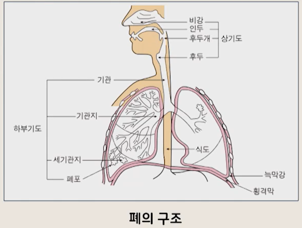
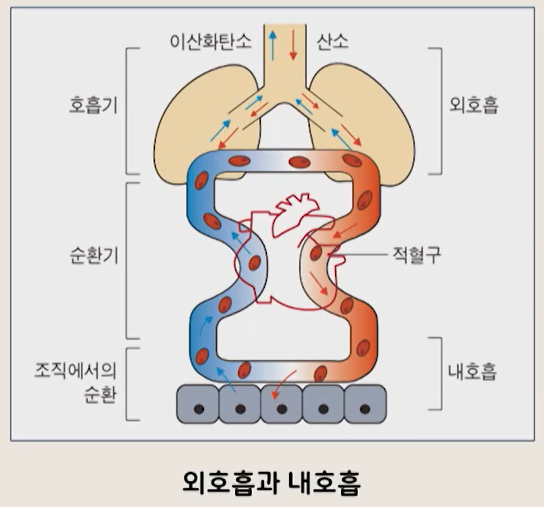

# 생활과 건강

## 03. 신체건강 문제와 관리(2)

- 간호학과 정성희 교수님

---

## 1) 호흡기계 해부생리

- 호흡기계 해부생리

- 폐의 구조
    - 호흡기계는 상기도와 하부기도로 구성
        - 상기도 : 비강, 인두, 후두
        - 하부기도 : 기관, 기관지, 세기관지, 폐포
    - 폐 : 좌, 우에 1개씩 위치
        - 오른쪽 폐 : 3개의 엽(lobe)
        - 왼쪽 폐 : 2개의 엽
    - 각 폐는 늑막이라는 두 겹의 막으로 싸여 보호됨
    - 
- 호흡(respiration)
    - 인체가 산소를 흡입한 후 세포로 운반하여 세포의 대사작용에 산소를 소비하고,
      대사과정에서 생성된 이산화탄소를 체외로 배출하는 과정
    - 체내로 들어온 산소 -> 비강통로(콧구멍)
        - -> 이물질 제거(filtering), 가습(humidifying), 가온(warming)
        - -> 인두 -> 후두 -> 기관 및 좌우 기관지
        - -> 폐포 (허파꽈리) -> 산소와 이산화탄소의 교환

- 호흡과정
    - 외호흡(허파호흡)
        - : 외부에서 들어온 공기와 폐포의 모세혈관 사이에서 일어나는 가스교환
    - 내호흡(조직호흡)
        - : 혈액과 조직세포 사이에서 일어나는 가스교환
    - 세포의 대사 작용
        - 세포의 생존 및 항상성 유지를 위해 계속적으로 산소가 소모되고 이산화탄소가 생성됨
    - 

---

## 2) 호흡기계 건강문제

