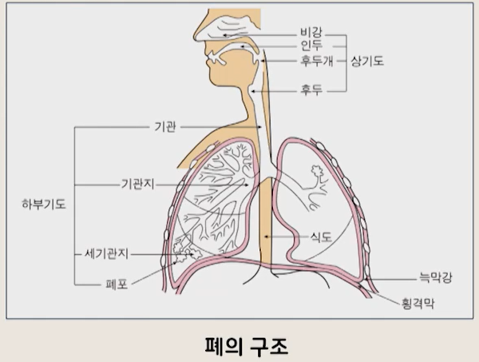
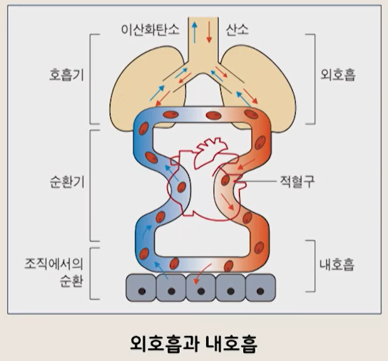

# 생활과 건강

## 03. 신체건강 문제와 관리 (2)

- 간호학과 정성희 교수님

---

## 1. 호흡기계 해부생리

### 1) 폐의 구조

- 호흡기계는 상기도와 하부기도로 구성됨
    - 상기도: 비강, 인두, 후두
    - 하부기도: 기관, 기관지, 세기관지, 폐포
- 폐는 좌·우에 1개씩 위치
    - 오른쪽 폐: 3개의 엽(lobe)
    - 왼쪽 폐: 2개의 엽
- 각 폐는 늑막이라는 두 겹의 막으로 싸여 보호됨

- 

### 2) 호흡(respiration)

- 인체가 산소를 흡입한 후 세포로 운반하여 세포의 대사작용에 산소를 소비하고,
  대사과정에서 생성된 이산화탄소를 체외로 배출하는 과정
- 체내로 들어온 산소의 이동 경로
    - 비강통로(콧구멍)
        - 이물질 제거(filtering)
        - 가습(humidifying)
        - 가온(warming)
    - 인두 → 후두 → 기관 및 좌우 기관지
    - 폐포(허파꽈리) → 산소와 이산화탄소의 교환

### 3) 호흡과정

- **외호흡(허파호흡)**
    - 외부에서 들어온 공기와 폐포의 모세혈관 사이에서 일어나는 가스교환
- **내호흡(조직호흡)**
    - 혈액과 조직세포 사이에서 일어나는 가스교환
- **세포의 대사 작용**
    - 세포의 생존 및 항상성 유지를 위해 계속적으로 산소가 소모되고 이산화탄소가 생성됨

- 

---

## 2. 호흡기계 건강문제

## 2-1. 급성 후두염

### 정의

- 급성으로 후두와 그 주변 조직에 염증이 생긴 상태

### 원인

- 대부분 바이러스성 감염에 의해 발생
    - (인두염, 후두염, 기관지염 = 감기)
- 말(발성)을 과다하게 하거나 대기오염물질에 노출되는 것도 발병 요인이 됨

### 증상

- 염증의 정도에 따라 증상이 다르게 나타날 수 있음
- 일반적으로 발열, 근육통, 전신 쇠약감 등의 전신증상이 동반될 수 있음
- 후두에 이물감이나 통증이 있어 음식물을 삼키기 어렵거나 발성이 힘들 수 있음
- 목소리의 변화가 나타나기도 함
- 찬공기나 찬음료로 인한 인후의 간지러움을 호소하는 경우도 있음
- 급성 후두염을 방치할 경우 인두, 편도, 비강, 기관지 등의 주변 조직으로 염증이 진행될 수 있음

### 예방·관리

- 대부분 자연 치유됨
- 충분한 휴식과 수분 섭취
- 필요 시 구강 내 가글액 사용 및 진통제 투여
- 염증 지속 또는 세균 감염에 의한 경우 항생제 투여
- 기타 증상에 따라 해열제, 국소소염제 및 기타 약제를 적절히 사용
- 쉰 목소리가 지나치게 오래 지속되거나 후두염이 5일 이상 지속되면 병원 방문 권장

---

## 2-2. 폐렴

### 원인

- 세균, 마이코박테리아, 바이러스, 곰팡이 등 다양한 미생물에 의해 발생하는 폐의 염증
- 화학물질이나 방사선 치료 등에 의해 비감염성 폐렴이 발생할 수도 있음

### 증상

- 원인균과 기존에 갖고 있는 질병에 따라 다양한 증상이 나타남
- **폐렴구균에 의한 폐렴**
    - 고열, 오한, 기침 시 극심한 흉통 및 호흡부전 증상
- 상기도 감염 증상
    - 두통, 미열, 근육통, 관절통, 피로감 등 비특이적 증상을 보이기도 함
- 고름처럼 보이는 끈적한 객담(가래)이나 간혹 피가 묻어나오기도 함
- 소화기 증상
    - 오심, 구토, 설사 증상도 발생 가능
- 폐의 광범위한 염증 발생 시 폐의 1차 기능인 산소 교환에 심각한 장애가 생기면 호흡부전으로 사망에 이를 수 있음

### 예방

- **폐렴구균에 의한 폐렴**
    - 예방백신 접종을 통해 예방효과를 기대할 수 있음
    - 건강한 사람이 폐렴구균 예방백신을 접종한 경우 65~85% 정도의 예방효과 기대
    - 65세 이상 노인, 만성질환자, 감염 위험이 높은 면역손상 환자 등 고위험군에게 폐렴구균 예방백신 접종 권장

### 관리

- **원인균 진단**
    - 흉부 X선 촬영, 객담배양 검사, 혈액배양 검사, 소변항원 검사 등
- **원인균에 따른 치료 및 항생제 요법**
    - 치료를 위해 원인균에 따른 항생제 투여
    - 최근에는 항생제 내성균으로 인해 혼합 처방 방법 등을 사용
    - 항생제의 부적절한 사용을 최소화하려는 의료진의 노력이 필요

---

## 2-3. 결핵

### 개요

- 결핵: 결핵균에 의한 전염성 질환
- 1882년 독일의 세균학자 로버트 코흐(Robert Koch)가 결핵의 병원체인 결핵균(*mycobacterium tuberculosis*)을 발견하고, 같은 해 3월 학회 발표를 통해 세상에 알려짐
- 결핵은 기원전 7천 년경 석기시대 화석에서 흔적이 발견된 이래 인류 역사상 가장 많은 생명을 앗아간 감염 질환 중 하나
- 1940년대 후반 항결핵제가 개발되며 약 30년간 결핵 발병률이 감소하는 추세를 보였으나, WHO는 2005년 결핵 사망자 수를 160만 명으로 발표한 바 있음
- 2019년에도 에이즈와 함께 전 세계에서 가장 위험한 감염병으로 언급됨

### 국내 현황 (강의 자료 기준)

- **결핵환자 신고현황(질병관리본부, 2018)**
    - 2018년 우리나라 결핵 신환자 수: 전년 대비 28,161명 → 26,433명으로 감소
    - 2011년 최고치(39,557명) 이후 7년 연속 감소 추세이나, OECD 회원국 중 결핵 발생률이 가장 높게 나타남
- **국가결핵관리사업 추진**
    - 2013년 `제1기 결핵관리 종합계획('13~'17)` 수립

### 결핵예방관리 강화대책 (2018~2022)

- 비전: **"결핵 없는 사회, 건강한 국가"**
- 목표: **2030년까지 결핵퇴치(10만 명당 10명 수준)**
- 4대 추진전략
    - 결핵예방 및 조기발견
    - 환자치료 및 접촉자 관리
    - 결핵연구개발 확대 및 필수재 관리
    - 결핵퇴치 대응체계 강화
- 위 전략을 기반으로 15개 중점 과제 추진

> 출처: 2020 국가결핵관리지침, 질병관리본부

### 우리나라 연령 및 성별에 따른 결핵 사망자 현황 (2017, 단위: 명)

| 구분 |     계 | 10대미만 | 10대 | 20대 | 30대 | 40대 | 50대 | 60대 | 70대 | 80대 이상 | 미상 |
|----|------:|------:|----:|----:|----:|----:|----:|----:|----:|-------:|---:|
| 계  | 1,816 |     0 |   0 |   6 |  12 |  68 | 146 | 172 | 436 |    976 |  0 |
| 남자 | 1,107 |     0 |   0 |   5 |  10 |  64 | 130 | 141 | 313 |    444 |  0 |
| 여자 |   709 |     0 |   0 |   1 |   2 |   4 |  16 |  31 | 123 |    532 |  0 |

> [2018년 결핵환자 신고현황(질병관리본부)]

- 2017년 기준 국내 결핵 사망자 1,816명 중 남성은 1,107명으로 여성 709명보다 약 1.56배 많음
- 전체 결핵 사망자 중 70대(436명, 24.0%)와 80대 이상(976명, 53.7%)의 비중이 높음

### 원인 (중요)

- 결핵은 결핵균에 의한 전염성 질환
- 결핵환자로부터 나온 미세한 침방울 혹은 비말핵에 의해 직접 감염됨
- **비말핵(droplet nuclei)**
    - 직경 10마이크로미터 이하의 액체입자(침)에 들어 있는 병원체가 입 밖으로 나온 후 수분이 증발하면서 공기 중에 떠다니는 형태
- **결핵균에 노출되었다고 해서 모두 결핵에 걸리는 것은 아님**
    - 균에 노출된 사람 중 약 1/3 정도가 감염
    - 감염된 사람의 약 10% 정도가 결핵환자가 됨

### 활동성 결핵 발생 위험요인 (원인 관련)

- 1년 이내 최근 감염
- 흉부 X선상 섬유화된 병변 존재
- 에이즈
- 만성 신부전 및 투석
- 당뇨
- 면역 억제제 투여
- 특정 장기이식 시기
- 영양실조 및 심한 저체중 등
- 우리나라는 체계화된 결핵관리를 위해 2000년 8월 이후 결핵정보 감시체계가 출범함
- 발병 환자의 연령 평균은 40대 이상이며, 남자에서 결핵 발병률이 다소 높은 편임

### 증상

- 천천히 발병하므로 많이 진전될 때까지 증상이 없는 경우도 있음
- 초기에는 마른기침이 나타나고, 점차 누런 점액성분의 가래가 섞인 기침으로 진행됨
    - **2주간 지속되면 결핵 의심**
- 그 외 호흡곤란, 객혈, 늑막통이 있을 수 있음
- 피로를 자주 경험하며, 오후 미열, 식은땀(야간 발한), 체중감소, 권태감, 소화불량, 쇠약감 등이 동반될 수 있음

### 예방·관리

#### 1) 결핵이 의심될 경우(진단)

- 병력조사
- 신체검진
- 투베르쿨린 피부반응 검사(Tuberculin Skin Test)
- 흉부 X선 촬영
- 객담 도말 검사 및 배양 검사
- 위 검사들을 통해 결핵균 감염 여부를 확인

#### 2) 결핵 예방: BCG 접종

- BCG는 사람에게 병을 일으키지 않으면서 결핵에 대한 면역을 갖게 하는 백신
- BCG 접종 효과
    - 발병률이 1/5로 감소
    - 효과가 10년 이상 지속됨

#### 3) 결핵 치료(약물치료)

- 결핵균을 박멸하고 재발을 막기 위해서는 장기간 약물치료가 필수적
- 약물 내성이 문제가 되므로 결핵치료 시
    - 대개 3~4가지 항결핵제 약물을 함께 처방
    - 환자는 6~12개월 동안 약물을 꾸준히 복용해야 함
- 결핵은 **약물치료만으로 완치 가능**
- 약물을 처방대로 복용하지 않으면 내성이 생겨 치료가 어려워질 수 있으므로, 약물 관련 문제가 발생하면 반드시 의료진과 상담
- 증상이 일시적으로 호전되었다고 임의로 약물복용을 중단하면 치료가 어려워지거나 재발 위험이 커질 수 있음
- 규칙적인 약물복용과 함께 기도 청결, 적절한 활동, 영양관리, 심리적 부담 관리 등 환자관리가 세심히 이루어져야 함

### 결핵환자 유의사항

#### 1) 마스크 착용(전파 방지)

- 폐결핵은 호흡기 전염병이므로 주위 사람에게 결핵균을 전염시킬 수 있음
- 치료 시작 전 증상이 있거나, 치료 시작 후 결핵균 검사에서 음성이 될 때까지 마스크 착용 권장
- 가정에서도 반드시 마스크를 착용하고, 창문을 열어 자주 환기하며, 공공장소 외출을 자제함

#### 2) 금연과 절주

- 흡연은 폐의 면역기능을 억제하여 결핵 발병을 쉽게 할 뿐 아니라 결핵치료에도 장애가 됨
- 결핵약 부작용으로 간독성이 발생할 경우, 음주는 간기능을 악화시키고 여러 약물대사에 악영향을 미쳐 치명적인 간염으로 진행될 수 있음

#### 3) 균형 잡힌 영양 섭취

- 개소주, 건강보조제 등이 결핵치료에 효과가 있다는 증거는 없음
- 치료 중에는 안전성이 검증되지 않은 다른 약제/건강보조식품보다는 규칙적인 식사를 통해 영양을 섭취하는 것이 바람직함
- 다만 영양실조가 심하거나 임산부, 당뇨환자의 경우 주치의와 상의하여 비타민제(처방)나 종합비타민제를 처방받는 것이 안전함

---