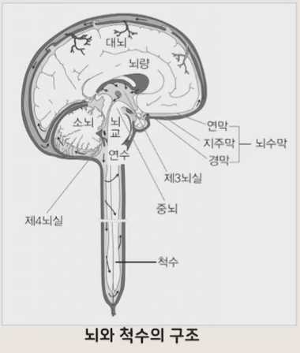
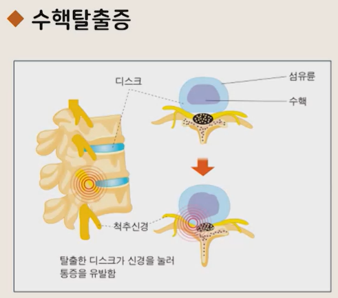
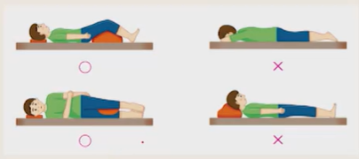
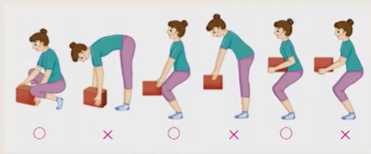

# 생활과 건강

## 04. 신체건강 문제와 관리 (3)

- 간호학과 정성희 교수님

---

## 1. 신경계 해부생리

### 1-1. 신경계 개요

- 인체에서 가장 복잡한 구조를 지닌 체계
- 주로 조절계 및 통신계의 기능 수행
- 체내 및 체외에서 일어나는 변화(자극)를 모니터링하여 정보를 수집함

#### 통합(Integration)

- 체내에 투입된 감각정보를 처리·해석하여, 매순간 무엇을 해야 할지 결정하는 처리 과정

#### 운동반응(Motor response)

- 투입된 정보에 대해 인체가 근육과 선(gland)을 활성화시키는 반응
- 예) 운전할 때
    - 빨간 신호등을 본다. (감각 투입)
    - `"빨간 신호등은 멈춤을 의미한다"`라는 정보를 통합한다.
    - 발로 브레이크를 밟는다. (운동반응)
- 위와 같은 일련의 기능이 신경계를 통해 일어남

### 1-2. 신경계의 분류

- 크게 **중추신경계(CNS)** 와 **말초신경계(PNS)** 로 분류

#### 중추신경계

- **뇌**
    - 대뇌, 뇌간(중뇌, 뇌교, 연수), 소뇌
    - 인체 신경조직의 약 98%가 중추신경계에 포함됨
    - 전신 혈액량의 약 20%가 뇌로 흐름
- **척수**
    - 위치에 따라 경수, 흉수, 요수, 천수의 4개 영역으로 나뉨

#### 말초신경계

- **뇌신경**: 뇌와 뇌간에서 나오는 12쌍의 신경
- **척수신경**: 31쌍의 신경이 척수에 연결되어 있으며 운동신경과 감각신경을 포함

#### 자율신경계

- 내장기능, 심장근육의 변화 등 **불수의적 활동**을 조정하는 말초신경계의 일부

---

## 2. 신경계 건강문제

### 2-1. 신경계 건강문제 개요

- 인지, 감각, 신경근육계 기능을 변화시키는 문제
- 일반인들이 흔히 겪거나 주위에서 흔히 볼 수 있는 건강문제
    - 두통
    - 수핵탈출증(일명 디스크)
    - 뇌졸중

---

## 2-2. 두통

### 국제두통학회(IHS) 두통 분류 (제3판)

- 출처: 대한두통학회, 2018

#### 1군. 원발 두통

1. 편두통
2. 긴장성 두통
3. 삼차자율신경두통
4. 기타 원발 두통

> - 크게 원인 질환 없이 나타남
> - 진단과 치료에 다소 어려움이 있음

#### 2군. 이차 두통

5. 두부 및 목의 외상 및 손상에 기인한 두통
6. 두개 그리고/또는 경부의 혈관질환에 기인한 두통
7. 비혈관성 두개 내 질환에 기인한 두통
8. 물질 또는 물질 금단에 기인한 두통
9. 감염에 기인한 두통
10. 항상성 질환에 기인한 두통
11. 두개골, 목, 눈, 귀, 코, 부비동, 치아, 입, 기타 얼굴 및 경부 구조물의 질환에 기인한 두통 또는 얼굴통증
12. 정신과 질환에 기인한 두통

> - 신체·심리적 요인의 복합적 작용으로 나타남

#### 3군. 통증성 두개신경병증, 기타 얼굴통증 그리고 기타 두통

13. 뇌신경의 통증성 병변과 기타 얼굴통증
14. 기타 두통질환

### 긴장성 두통 vs 편두통 (시험 필수)

#### 원인·증상 비교

| 구분 | 긴장성 두통                                                                                        | 편두통                                                                                                                                                                                                                                       |
|----|-----------------------------------------------------------------------------------------------|-------------------------------------------------------------------------------------------------------------------------------------------------------------------------------------------------------------------------------------------|
| 원인 | - 특별한 원인이 없음 - 대부분 과도한 스트레스 - 피로에 의한 근육수축                                               | - 신경전달물질인 **세로토닌의 대사이상**으로 혈중 세로토닌 증가 → 뇌혈관 확장 - 성인에게 **주기적**으로 나타나는 심한 두통(약 **4~72시간** 지속) - 원인이 뚜렷이 밝혀지지 않음 - 대개 사춘기에 시작 - 남성보다 여성에게 흔함 - 가족력이 강한 편 - 스트레스, 우울, 수면부족, 월경주기에 유발 가능 - 치즈/가공식품/경구피임약 등이 악화 요인이 될 수 있음 |
| 증상 | - 머리 뒷부분/목 뒤쪽에서 끈으로 조이는 느낌(압박감) - 눈썹 위 머리 부분을 띠처럼 둘러싸 누르는 느낌 - 대개 경미하고 **양측성**, 전조증상 없음 | - 반복되는 만성 양상, **한쪽 관자놀이**가 심하게 쑤시는 통증 - 앞머리/눈 주위/머리 뒤 통증도 가능 - 대개 **한쪽**에 나타남 (항상 같은 쪽만 지속되면 병원 방문 권장)                                                                                                                              |

### 예방관리

- 두통 유발요인을 피함
- 예방적 혹은 치료적으로 약물 사용(의사와 상담 후 복용)
- 생활양식 변화
    - 규칙적 수면
    - 스트레스 관리
    - 적절한 운동/식사
- 긴장성 두통의 경우, 불편감이 있는 부위에 마사지나 찜질이 도움될 수 있음

---

## 2-3. 수핵탈출증(디스크)

### 정의 및 기초 개념

- ‘추간판 파열’ 혹은 ‘디스크’
    - 추간판의 **수핵**이 **섬유륜**을 뚫고 나와 발생

#### 추간판 (intervertebral disc)

- 추체를 연결하는 구조로, **수핵**과 이를 둘러싼 **섬유륜**으로 이루어짐
- 척추에 가해지는 충격을 흡수(쿠션 역할)하고, 척추 운동을 가능하게 하는 구조
- 수핵: 반젤라틴성 물질

### 원인

- **척추의 퇴행성 변화**
    - 다른 근골격계 질환과 달리 10대 후반~20대 초반부터 나타날 수 있음
- **발생 부위 특성**
    - 척추 어느 부위에서나 발생할 수 있으나, **허리와 목 부위에서 가장 흔함**
- **척추 부상**
    - 허리에 갑자기 압력이 가해지는 중노동
    - 강한 재채기
    - 복부·등 근육 약화 등으로 위험 증가

### 증상

- **요추부 추간판 탈출증의 대표 증상**
    - 요통 + 다리가 아프고 저린 **방사통**
- 탈출된 추간판이 신경근을 자극하여, 신경근 분포 부위(다리)에 감각 이상 초래
- 돌출된 수핵이 크고 중앙에 위치하면 대소변 기능/성기능 장애 및 하지 마비가 올 수 있음

### 예방관리

#### 생활습관 관리

- 평소 올바른 생활습관 및 자세 유지
- 체중조절(허리에 가해지는 부담 감소)
- 허리·복부 근육 강화 운동을 규칙적으로 시행
- 금연
    - 니코틴 및 흡연 시 발생하는 독성물질은 추간판의 영양소 흡수를 방해하여 추간판을 건조하고 약하게 만듦

#### 자세 관리

- **바른 자세 유지**
- **잘 때**
    - 타월을 말아 등 뒤에 대거나, 무릎 사이에 베개를 두어 등이 바닥에 밀착되도록 함
- **물건을 들 때**
    - 허리를 이용하지 말고 무릎을 구부리거나 쪼그려 앉아 다리를 이용해 들어올림

- (그림) 누워 있을 경우/잠잘 때 바른 자세  
  

- (그림) 물건을 들 때의 바른 자세  
  

### 치료 및 수술

#### 비수술적 치료

- 침상안정 필요
- 소염진통제 등의 약물치료 시행
- 물리치료/재활치료
    - 골반견인, 열치료, 초음파 치료, 피하신경 전기자극 등
    - 마사지, 코르셋/보조기 착용
    - 경막 외 부신피질호르몬 주사
    - 복근 강화운동
    - 올바른 허리 사용법 교육

#### 수술적 치료

- 다음 요소를 고려하여 수술 시행
    - 신경학적 장애의 정도
    - 지속적 통증 여부
    - 재발 횟수
    - 환자의 개인적 특성 등
- 기존에는 절개 중심 수술이 많았으나, 최근에는 수술현미경/내시경/레이저 등을 이용한 **최소침습적 방법**으로 수핵 절제 시행

---

## 2-4. 뇌졸중

### 개요

- 뇌혈관장애
    - 뇌에 정상적인 혈액공급이 이루어지지 않아 중추신경계 기능에 이상이 오는 현상
- ‘중풍’이라고 불리는 뇌혈관질환
- 뇌에 혈액을 공급하는 혈관이 **막히거나(허혈)** **터져서(출혈)** 뇌가 손상되며 신경학적 변화가 발생
- 크게 **뇌출혈**과 **뇌경색**으로 분류

### 우리나라 현황 (강의자료 기준)

- 최근 몇 년간 암이 사망원인 1위를 차지했지만, **단일 장기 질환으로는 뇌졸중이 사망원인 1위**
- 인구 고령화 추세를 감안하면 2030년에는 현재의 약 3배 발생 예정
- 대한뇌졸중학회 ‘대한민국 뇌졸중 역학보고서 2018’
    - 국내 유병률 약 1.71%
    - 연간 약 10만 5,000명의 새로운 뇌졸중 환자 발생
    - 뇌졸중 사망률: 10만 명당 약 30명 (남성 37명, 여성 24명, 2015년 연령표준화)

### 원인

#### 발생 기전

- 뇌혈관 출혈(출혈성 뇌졸중) 또는 혈전/색전에 의한 혈관 폐색(허혈성 뇌졸중)으로 발생
- **뇌출혈**
    - 약 80%는 고혈압에 의해 발생
    - 작은 혈관/약한 혈관 부위가 높은 혈압으로 터져 뇌 속에 혈액이 고이며 뇌손상 발생
- **뇌경색**
    - 동맥경화로 혈관이 좁아지고 혈전이 생겨 뇌혈류를 막음
    - 또는 심장 등 다른 부위에서 생성된 혈전이 이동하여 뇌혈관을 막아 발생

#### 위험요인

- 고혈압, 당뇨, 고지혈증, 심장질환, 비만, 흡연, 과도한 음주, 심한 스트레스 등
- 연령 증가 시 발병률 증가 (55세부터는 매 10년마다 약 2배씩 증가)
- 여성은 남성보다 약 30% 높은 발생률을 보이기도 함 (강의자료 기준 표현)

### 증상

#### 1) 운동장애

##### 반신마비(편마비) / 반신부전마비(편측부전마비)

- **반신마비(편마비)**: 몸의 반쪽(오른쪽 또는 왼쪽)이 완전히 마비된 상태
- **반신부전마비(편측부전마비)**: 몸의 반쪽 근력이 약화된 상태
- 가장 중요한 뇌졸중 증상 중 하나

##### 왜 반대쪽 마비가 오는가? (신경 교차)

- 운동신경은 대뇌에서 내려오다가 **연수에서 좌우가 교차**
- 따라서 한쪽 뇌에 이상이 생기면 **반대쪽 얼굴·팔·다리**에 마비가 발생
- 예) 오른쪽 대뇌반구 혈관이 막히면 왼쪽 팔다리에 마비 발생
- 안면신경 마비 시
    - 마비된 부위 근육의 긴장성이 떨어져 입이 반대편으로 끌려갈 수 있음
    - 마비된 쪽 눈이 잘 안 감길 수 있음

##### 운동실조증

- 팔다리 힘은 정상이더라도 비틀거리는 불안정한 걸음걸이
- 한쪽으로 자꾸 쓰러지려는 경향
- 미세한 손동작(예: 단추 채우기)이 서툴어짐

##### 발음장애(구음장애)

- 말하고 이해하는 능력 자체는 비교적 유지될 수 있음
- 입술/혀 움직임이 정확하지 않아 정확한 발음을 하기 어려움

#### 2) 연하곤란(삼킴곤란)

- 음식이나 물을 삼키기 힘들어짐
- 사례(사레)가 자주 들며 음식물이 기도로 넘어가면 **흡인성 폐렴** 유발 가능

#### 3) 감각장애

- 감각이상 및 감각손실
- 예) 오른쪽 뇌에 이상이 있으면 왼쪽 얼굴·몸통·팔다리 감각 이상 발생 가능
- 남의 살 같거나 저린 느낌
- 촉각/통각이 둔해질 수 있음

#### 4) 언어장애(실어증)

- **운동성 실어증**: 발성기관 문제는 없으나 말을 잘 못함
- **감각성 실어증**: 말은 유창하나 이해를 못하여 지시사항을 따르지 못함
- **전 실어증**: 말도 못하고 알아듣지도 못함

#### 5) 인지장애

- 대뇌 전두엽 손상 시 학습능력/기억력 등의 지적능력 장애 초래
- 기억력 상실 또는 집중력 저하
- 추상적 추론과정의 장애, 판단장애 등

#### 6) 시야장애

##### 복시

- 한 물체가 2개로 겹쳐 보이는 현상
- 눈을 움직이는 신경 이상으로 양쪽 눈의 축이 어긋나 발생

##### 동측성 반맹증

- 양쪽 눈의 좌측 또는 우측 시력이 상실되어 정상 시야의 절반만 보이는 상태
- 시야장애가 있는 쪽으로 고개를 돌리지 않으면 좌우를 모두 보기 어려움

#### 7) 정서장애

- 자기통제력 상실이 쉽고 정서적으로 불안정해짐
- 스트레스 대처능력 저하, 불안, 소외감, 위축, 적개심 등을 보일 수 있음
- 특히 우측 뇌손상 환자의 약 70%가 우울을 경험하는 것으로 알려짐 (강의자료 기준)

#### 8) 기타 일반적 증상

- 뇌혈관질환 발생 시 뇌압상승으로 심한 두통, 반복적 구토가 초기증상으로 나타난 뒤 의식상태 변화가 올 수 있음
- 심한 경우 혼수상태 가능 (주로 뇌경색보다 뇌출혈에서 더 흔함)
- 소뇌/뇌간 혈액공급 부족 시 어지럼증 발생
- 발작, 발열, 심전도 변화 등

### 예방관리

- **위험요인을 줄이는 것이 가장 바람직**
- **고혈압 예방**
    - 금연
    - 규칙적 운동
    - 적절한 체중 유지
    - 짜게 먹지 않기
    - 과일·야채 충분히 섭취
- **금연**
    - 니코틴은 혈압을 증가시키고, 일산화탄소는 뇌로 가는 혈액의 산소량을 감소시켜 혈전 발생률을 높임
- 관상동맥질환/판막질환이 있는 경우 의사와 상담 후 혈전예방약(예: 아스피린) 복용 고려

### 응급 대처 (중요)

- 뇌졸중은 **초기에 발견하여 치료하는 것이 중요**
- 다음과 같은 증상이 나타나면 **즉시 119에 전화하여 도움 요청**
    - 한쪽 얼굴·팔·다리의 갑작스런 감각 이상 또는 허약감
    - 갑작스런 혼돈, 말하기/이해 능력 감소
    - 한쪽 눈 또는 양쪽 눈의 갑작스런 시력 상실
    - 갑자기 이상하게 걷거나 어지럼증
    - 균형/조정 감각 상실
    - 원인을 알 수 없는 갑작스런 심한 두통
