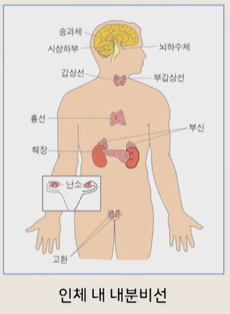
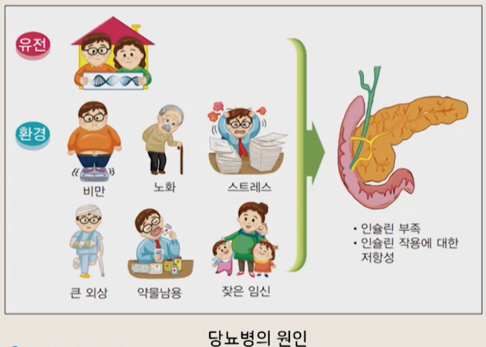
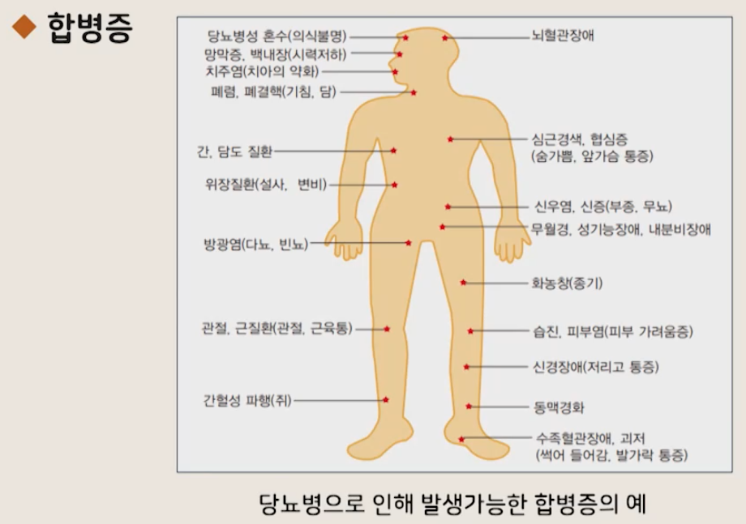
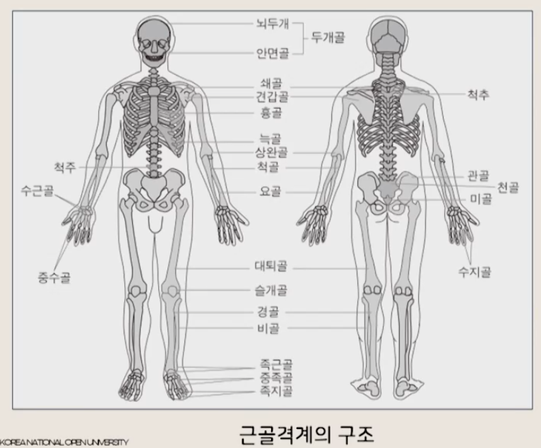
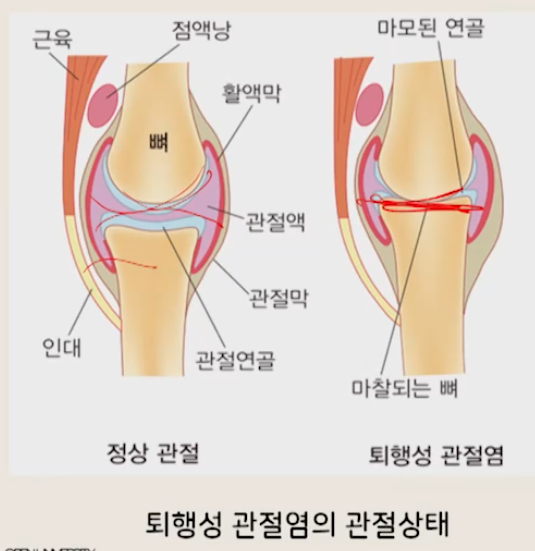
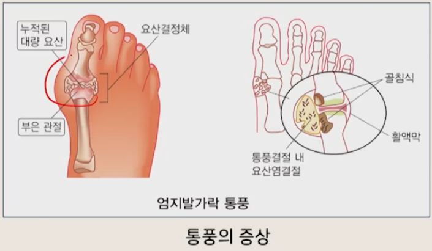

# 생활과 건강

## 05. 신체건강 문제와 관리 (4)

- 간호학과 정성희 교수님

---

# 1. 내분비계 건강문제

## 1) 내분비계 해부생리

### (1) 내분비계

- 인체 내의 각종 기능을 조절하고 통합하는 물질인 **호르몬을 혈액 내로 직접 분비하는 조직**

### (2) 내분비선

- 뇌하수체, 갑상선, 부갑상선, 췌장, 부신, 난소, 고환 등이 포함됨
- 뇌에 위치한 시상하부·뇌하수체는 **신경계와 내분비계를 밀접하게 연결**시킴

> 그림: 인체 내 내분비선
> - 

### (3) 호르몬

- 내분비선에서 **혈액 내로 분비**
- 혈류를 따라 각 조직으로 운반
- **표적기관의 기능과 대사 조절**

### (4) 호르몬의 생리적 특성

- 소량으로도 강력한 효과를 냄
- 기능은 서서히 진행됨
- 과소/과다 분비 시 기능 항진 또는 기능저하 → 특이 증상 발생
- 연결도관이 없고 혈액공급이 풍부 → 혈류를 따라 **직접 표적기관에 작용**
- 주성분은 단백질, 배뇨 시 배설
- 동일 종류의 호르몬은 동일 효력 발휘

---

## 2) 내분비계 건강문제 - 당뇨병

### (1) 정의

- 가장 흔한 내분비계 질환
- 인슐린 결핍에 의해 혈당 상승 + 지방·단백질 대사 이상을 동반하는 **당질 대사장애**

### (2) 진행 과정(흐름)

1) 인슐린 부족/기능저하
    - 인슐린: 포도당을 세포로 운반
2) 혈중 포도당 농도 상승
3) 신장에서 포도당 재흡수 불가 → 당이 소변으로 배설

### (3) 당뇨병 판정기준 (대한당뇨병학회, 2020)

#### ① 혈당검사

- 공복 시 혈장 1 dL에 포함된 당 수치 + 당 투여 후 2시간 후 당수치로 진단
- 공복상태: 최소 8시간 동안 음식 섭취 X

| 구분        |       정상치 | 당뇨 기준치 |
|-----------|----------:|-------:|
| 공복 혈당     | 70~110 이하 | 126 이상 |
| 식후 2시간 혈당 |    140 미만 | 200 이상 |

#### ② 표준 포도당 부하검사

- 아침 공복 시 혈액 채취
- 포도당 75 g 경구 투여 후 1시간, 2시간 혈당 측정

#### ③ 당화혈색소

- 지난 2~3개월 혈당 평균을 보는 검사
- 6.5% 이상이면 당뇨병 진단

### (4) 유형과 원인

- 원인은 아직 완전히 밝혀지지 않음
- 제1형 당뇨병 / 제2형 당뇨병 / 기타(임신 당뇨병 등)

> 그림: 당뇨병 유형
> - 

### (5) 제1형 당뇨병

- 전체 당뇨 환자의 10% 이내
- 30세 이전 발병 특징 → ‘소아당뇨’라고도 함
- 유전적·환경적 원인 → **췌장 베타세포 파괴**로 발생

### (6) 제2형 당뇨병

- 다른 질환에 의해 이차적으로 생기는 경우
- 주원인: **인슐린 저항성**
    - 인슐린 기능 저하 → 세포가 포도당을 효과적으로 연소하지 못함
- 40세 이상 성인 및 비만인 경우 주로 발생

### (7) 증상

#### ① 3대 증상

- 다음: 잦은 갈증 → 물을 많이 마심
- 다뇨: 소변을 자주 봄
- 다식: 대사 이상 → 공복감 증가 → 음식 섭취 증가

#### ② 기타

- 전신피로·쇠약, 반복되는 종기, 상처치유장애
- 피부건조, 시력장애, 식곤증
- 체중감소, 손발 감각 변화 등

### (8) 합병증

#### ① 급성

- 단기간 혈당수치가 정상 범위를 벗어나며 발생
- 저혈당 / 당뇨병성 혼수 / 감염

#### ② 만성

- 대혈관 합병증
- 당뇨병성 망막증 / 신증 / 신경병증
- 발의 괴저
- 어지럼증, 설사 및 변비, 배뇨장애, 성기능 장애 등

> 그림: 합병증
> - 

### (9) 급성합병증(핵심)

#### ① 저혈당

- 인슐린/먹는 당뇨약을 과다 사용
- 식사를 평소보다 적게 함
- 운동을 평소보다 과하게 함
- 특히 당뇨 노인환자는 세심한 주의 필요

#### ② 당뇨병성 혼수

- 인슐린 부족 → 포도당이 세포 내로 이동 못함 → 혈관에 축적 → 고혈당
- 고혈당 지속 → 지방 분해 → 케톤체 생성 → 당뇨성 케톤산증
- 산증(pH 저하) 심해지면 의식 소실 → 응급처치 필요한 위험 상황

### (10) 만성합병증(핵심)

- 대혈관 합병증: 동맥 경화 → 협심증·심근경색·뇌졸중 + 고혈압
- 망막증: 망막 손상 → 심하면 실명
- 신증: 사구체 손상 → 단백뇨 → 진행 시 신기능 상실
- 신경병증: 발 감각 둔화/저림/통증
- 발 괴저: 혈액공급 감소 → 냉기/감각이상/간헐적 파행/감염/상처치유 지연/발궤양

### (11) 예방

- 가족력/위험인자 높은 사람: 발생요인 회피로 제2형 예방 가능
- 전신비만보다 **복부비만**이 위험 ↑ → 식이+운동 병행해 체중 감소
- 주 3~5회, 1회 30~60분 유산소운동 권장
- 스트레스 관리(취미활동 권장)

### (12) 관리

#### ① 목표

- 혈당을 정상에 가깝게 조절 → 합병증 예방 + 정상 생활 유지

#### ② 기본

- 식이요법 + 운동요법
- 조절 불가 시 먹는 당뇨약/인슐린 치료

#### ③ 유형별 기본관리

- 제1형: 건강한 식습관 / 신체활동 / 혈당검사 / 인슐린 주사 및 펌프
- 제2형: 건강한 식습관 / 신체활동 / 혈당검사 / 체중감소
- 결론: **매일 적당한 혈당 수준 유지**

---

## 3) 내분비계 건강문제 - 비만

### (1) 정의

- 과도한 열량 섭취 + 잉여 열량 저장 → **체지방이 과다 축적된 상태**
- 서구사회 30~40% 비만, 우리나라도 비만율 상승 추세
- 가장 큰 문제: 비만으로 인한 합병증

### (2) 합병증

- 고혈압, 당뇨병, 고지질혈증, 동맥경화증, 심장비대
- 지방간, 담석증, 퇴행성 관절염, 통풍
- 월경불순/무배란 월경 등 내분비장애

### (3) 비만도 판정

- 체지방량으로 판단 / 체중-신장지수로 판단
- 일반적으로 **체중-신장지수(BMI)**를 사용

#### BMI 계산

- BMI(kg/㎡) = 체중(kg) / {신장(m) × 신장(m)}
- (메모) 시험에 계산 나올 수도!

#### BMI 판정기준

| BMI         | 비만도    |
|-------------|--------|
| 18.5 미만     | 저체중    |
| 18.5 ~ 22.9 | 정상     |
| 23 ~ 24.9   | 과체중    |
| 25 ~ 29.9   | 1단계 비만 |
| 30 이상       | 2단계 비만 |

#### 예시

- 키 170cm(1.7m), 체중 80kg
- 80 / (1.7 × 1.7) = 27.68 → 1단계 비만

### (4) 복부비만(허리둘레)

- 복부비만은 심혈관 질환, 제2형 당뇨병, 고지질혈증, 인슐린 저항성과 관련
- 허리둘레는 신장과 무관하게 복부비만을 잘 반영 + 내장지방과 상관 높음
- WHO 방법: 최하위 늑골 하부 ↔ 골반 장골능 상부의 중간부위에서 측정
- 한국 기준(허리둘레)
    - 남자 90cm 이상
    - 여자 85cm 이상

### (5) 비만관리

- 체중감량 효과는 최소 2~3개월 필요
- 요요 방지: 목표체중 도달 후에도 5년 이상 유지 필요 → 장기 관리 필요
- 체중감량 속도는 계단식 → 실망하지 말고 꾸준히

#### 식사요법

- 체중 감량의 가장 기본
- 원칙: 섭취 제한 + 칼로리 소비 증가
- 채소/해조류/과일: 저열량 + 섬유소·수분 많아 체중감소 식이로 유용
- 식습관 변화
    - 천천히 먹기
    - 더 먹고 싶다고 느낄 때 식사 종료
    - 스트레스·우울은 음식 외 방법으로 해소

---

# 2. 근골격계 건강문제

## 1) 근골격계 해부생리

### (1) 근골격계

- 몸을 움직이고 자세변화를 가능하게 하며 신체의 다른 조직을 지지함
- 뼈, 근육, 연골, 인대, 관절로 구성

### (2) 뼈의 기능

- 몸의 크기·모양을 정해주는 역학적 구조 역할
- 뇌·심장·폐 보호
- 내부에 조혈기관 보유
- 무기질 저장 → 무기질 항상성 유지에 중요

> 그림: 근골격계(뼈)
> - 

### (3) 골격근

- 뼈와 연결된 근육
- 몸의 움직임, 열 발생, 몸의 지지, 자세 유지 기능 수행

---

## 2) 근골격계 건강문제 - 골다공증

### (1) 정의

- 골소실이 골형성보다 증가 → 골량 감소
- 뼈에 구멍이 생기고 쉽게 골절을 일으키는 질환

### (2) 원인

- 퇴행성 골소실: 40세 전후 시작(폐경 후/노인성 골다공증 포함)
- 폐경 → 에스트로겐 감소 → 골소실 속도 급격히 증가
- 남성은 급격한 호르몬 변화가 없고 최대골량이 높아 발생률 낮음
- 기타: 저체중, 흡연, 과음, 운동부족, 칼슘·비타민D 섭취부족 등

#### 에스트로겐 감소와 골소실(기전)

- 에스트로겐: 골흡수 자극물질 생산 억제 / 골형성 자극물질 생산 증가
- 감소 시 골흡수량이 골형성보다 증가 → 골소실 속도 급격히 빨라짐

### (3) 증상/진단

- 골절 전까지 증상이 없는 경우가 많음
- 증상: 키 감소, 척추 국소 압통, 복부돌출 등
- 진단: 골밀도 측정기 이용

### (4) 예방

- 최대골량 증가 + 골소실 시작 지연 + 골소실 속도 감소가 핵심
- 어린이·청소년: 고칼슘 섭취 + 꾸준한 운동 중요
    - 이 시기 다이어트로 뼈 손상 시 회복 어려움
- 칼슘 권장(성인): 700mg(20~49세) → 1,000~1,500mg(폐경 후)
- 금연, 절주, 규칙적 운동(걷기)
- 노인: 비타민D 생성 위해 일광욕, 실내활동 위주면 경구 비타민D 복용

### (5) 관리(치료)

- 에스트로겐, 칼시토닌, 알란드로네이트, 비타민D 투여 + 칼슘 섭취 증가
- 칼시토닌: 갑상선호르몬 일종, 골소실 감소
- 알란드로네이트: 골소실 감소 + 골량 증가 + 골절위험 감소

> 그림: 치료 관련
> - 

---

## 3) 근골격계 건강문제 - 퇴행성 관절염

### (1) 정의

- 관절을 보호하는 연골이 서서히 손상/퇴행성 변화
- 관절 주위 뼈·인대 손상 → 염증·통증 발생
- 염증성 관절 질환 중 가장 많이 발생

### (2) 원인

#### ① 일차성

- 원인 불명확
- 나이, 성별, 유전, 비만, 특정 관절 부위 등이 영향

#### ② 이차성

- 외상, 세균성 감염, 기형 등이 주 원인
- 세균성 관절염으로 연골 파괴, 반복 외상 후 발생 등이 대표적

### (3) 증상(초기)

- 관절염이 생긴 부위의 **국소적 통증**
- 대개 전신 증상 없음(류마티스 관절염과 차이)
- 관절 운동범위 감소, 종창(부종), 관절 주위 압통
- 관절면 불규칙 → 운동 시 마찰음 가능
- 서서히 진행, 좋아졌다가 나빠지는 간헐적 경과 가능

### (4) 진단

- 병력 + 검사소견(관절 변화) + 특징적 소견 종합
- 관절경/수술로 퇴행성 변화를 직접 확인 → 확진 가능

### (5) 관리

- 퇴행성 변화 자체를 완전히 정지시키는 확실한 방법은 아직 없음

#### 궁극적 목적

- 질병 이해 → 정신적 안정
- 통증 감소
- 관절 기능 최대 유지 + 변형 방지

#### 변형이 이미 발생한 경우

- 수술 교정 + 재활치료로 손상 진행 예방
- 통증 없는 운동범위 증가 → 일상생활 도움

---

## 4) 근골격계 건강문제 - 통풍

### (1) 정의

- 관절염의 일종, 바람만 스쳐도 아플 정도로 통증이 심함
- 원인은 명확하지 않음
- 남자가 여자보다 약 20배 발병률이 높음

### (2) 발생 과정(기전)

- 퓨린 신진대사 장애 + 배설장애
    - → 요산 과잉 공급
    - → 혈중 요산농도 상승

### (3) 특징

- 요산나트륨이 관절/관절 주위/연조직에 축적
- 격심한 발작성 통증 유발

### (4) 증상

- 관절 주위에 쌓인 요산나트륨 → 관절이 붉게 부어오르고 통증
- 치료 지연 시 피하조직에 딱딱한 혹 발생
- 심장·신장 등 기관에도 영향, 다른 성인병 동반 가능

> 그림: 통풍
> - 

### (5) 예방과 관리

- 고요산혈증 치료 목표
    - 요산 생성 억제
    - 요산 공급 제한
    - 신장에서 요산 배설 증가

#### 약물요법

- 콜키신 투여(통증 완화 + 요산 배설 작용)
- 요산 배설 도움: 물을 많이 마시는 것도 효과

#### 식이요법

- 퓨린이 적은 음식 섭취
- 음주 줄이기