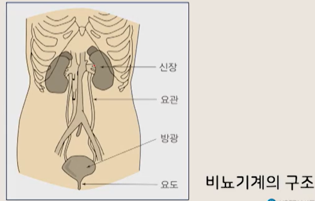
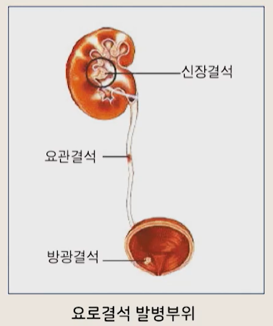
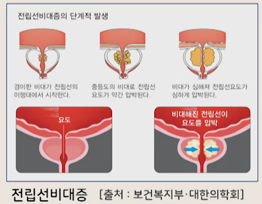
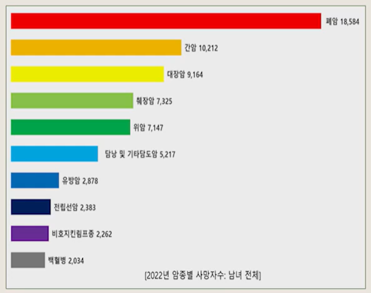

# 생활과 건강

## 06. 신체건강 문제와 관리 (5)

- 간호학과 정성희 교수님

---

# 1. 비뇨생식기계 건강문제

## 1) 비뇨기계 해부생리

### (1) 신장

- 후복벽의 복막 뒤에 좌우 1개씩 위치, 강낭콩 모양과 유사한 기관
- 신장의 기능 단위: **네프론**
    - 한쪽 신장에는 **100만~125만 개**의 네프론이 있음

### (2) 신장의 기능 (중요)

- 몸 속의 물의 양과 이온 농도를 조절한다.
- 독성 물질을 체외로 배출한다.
- 여러 호르몬의 작용으로 세포 밖 수분의 양과 혈압을 조절한다.
- 적혈구 생성에 관여한다. (조혈기능)
- 뼈를 만드는 내분비 기능을 한다.
- 여러 호르몬 대사에 관여한다.
    - (인슐린, 글루카곤, 부갑상선 호르몬, 칼시토닌 등)

### (3) 요관·방광·요도

#### 요관

- 신장에서 생성된 소변은 **요관**을 통해 방광으로 운반됨

#### 방광

- 주머니 모양의 근육성 기관으로, 소변을 저장했다가 주기적으로 체외로 배출
- 요의: 성인의 경우 방광에 소변이 **250~450cc** 찼을 때 느낌

#### 요도

- 짧고 근육으로 된 관
- 수의적으로 외괄약근을 이완시키면 배뇨가 이루어짐

---

## 2) 비뇨생식기계 건강문제: 요로결석

- 

### (1) 요로결석 정의

- 신장·요관·방광·요도 등 요로에 결석이 생겨 **배뇨 장애**가 초래되고,
  그 결과 **격심한 통증**, **요로 감염**, **신부전** 등이 나타나는 질환

### (2) 원인

- 수분 섭취 감소: 요석결정이 소변에 머무르는 시간이 길어져 요석 형성이 증가
- 유전적 요인으로도 발생 가능
- **남성이 여성보다 3배 이상** 발생 위험이 높고, **20~40대**에서 잘 발생
- 온도·계절이 중요한 요인
    - 여름: 땀 증가 → 소변 농축 → 결석 생성 용이
    - 햇볕 노출 ↑ → 비타민 D 형성 ↑ → 결석 위험 증가 보고도 있음

### (3) 증상

- 갑작스럽고 극심한 옆구리 통증(응급치료가 필요한 경우 많음)
- 수십 분~수 시간 지속 → 사라졌다가 다시 나타나는 **간헐적 통증** 흔함
- 남성: 하복부·고환·음낭으로, 여성: 음부까지 통증이 뻗을 수 있음
- 심한 경우 오심·구토·복부팽만 + **혈뇨** 동반 가능

### (4) 진단 및 예방

#### 진단

- 임상 증상 + 요 검사로 진단, 방사선검사로 최종 확진

#### 예방

- **다량의 수분 섭취**가 가장 중요
- 재발이 빈번하면 예방 목적의 약물치료 고려

### (5) 관리

#### 대기요법

- 자연 배출을 기다리는 방법
- 크기가 작고 하부 요관에 위치한 경우 자연 배출 기대 가능

#### 체외충격파쇄석술

- 수술 없이 체외에서 충격파로 결석을 분쇄 → 자연 배출 유도
- 분쇄된 요석은 대개 2주 이내 배출
- 3개월 후 성공 여부 판정
- 결석이 크거나 단단하면 반복 시행 가능

#### 요관경하배석술

- 요관으로 내시경을 통과시켜 결석을 분쇄/제거하는 시술
- 신장 내 결석이 크거나, 체외충격파쇄석술에 반응하지 않거나, 큰 결석이 남아 있으면
    - 신쇄석술 시행 가능
    - 복강경/개복수술을 하는 경우도 있음

---

## 3) 비뇨생식기계 건강문제: 전립선비대증

- 

### (1) 정의

- 전립선이 비대해져 전립선을 통과하는 요도를 압박 → 소변이 시원하게 나오지 않고 **소변 속도가 감소**하는 상태

### (2) 원인

- 명확하지 않으나 복합적 요인에 기인
- 고환의 노화, 유전적 요인, 가족력 등

### (3) 증상

- 빈뇨
- 지연뇨
- 복압배뇨(아랫배에 힘을 주어야 소변 가능)
- 세뇨/약뇨(소변줄기가 가늘어짐)
- 단축뇨(소변이 중간에 끊김)
- 잔뇨감(보고 나서도 개운하지 않고 또 보고 싶음)

### (4) 진단

- 소변속도 검사
- 전립선 특이항원(PSA) 검사
- 초음파 검사 등

### (5) 예방 및 관리

- 일차적으로 **약물요법** 시행
- 약제 발달로 수술 빈도 감소
- 반복적 요로감염·혈뇨·요폐, 방광 내 결석, 약물치료 무효 시 수술 고려
- 예방법: 규칙적 생활 + 충분한 휴식 + **너무 오래 앉아 있는 것 피하기**

---

# 2. 암 환자 건강문제

## 1) 암의 개념과 현황

### (1) 종양

- 양성종양: 성장속도 느림, 전이 없음 → 생명에 큰 위험은 적음
- 악성종양(암): 유전적 변이로 비정상 변화 → 성장조절 신호와 무관하게 과다 증식

### (2) 암의 특징

- 침윤: 주변 조직 파괴, 기능장애 유발
- 전이: 혈액·림프로 이동 → 다른 조직에 정착 후 증식 → 생명을 위협

### (3) 국가암정보센터(2021) 요약

- 2021년 남녀 전체: 갑상선암 최다, 이후 대장암·폐암·위암·유방암·전립선암·간암 순
- 남자: 폐암·위암·대장암·전립선암·간암 순
- 여자: 유방암·갑상선암·대장암·폐암·위암 순

### (4) 연령표준화발생률(ASR) 추이(국가암정보센터, 2024)

- 유방암·전립선암: 1999년 이후 지속 증가(유방암은 증가가 다소 완화)
- 위암·폐암·간암: 최근 감소 추세

### (5) 사망 관련(슬라이드 수치 요약)

- 암(C00~C97) 사망: 83,378명(전체 사망자의 22.4%)
- 암 사망 상위: 폐암(18,584명, 22.3%) → 간암(12.2%) → 대장암(11.0%) → 췌장암(8.8%) → 위암(8.6%)

- 

---

## 2) 발병기전 및 발암요인

### (1) 발암 과정 3단계

1. 암유발 개시: 발암원이 DNA 공격 → 돌연변이 유발(비가역)
2. 암유발 촉진: 암촉진 인자가 세포분열 촉진
3. 암진행: 양성→악성 전환, 암유전자/암억제 유전자 돌연변이 증가, 염색체 이상 뚜렷

### (2) 발암요인 예시

- 감염: B형 간염 바이러스, 헬리코박터 파일로리균
- 발암성 화학물질: 석면, 벤젠, 타르, 니켈, 비소, 담배 연기 등
- 물리적 요인: 만성 자극, 염증, 자외선, X선, 전리방사선 등
- 생활·호르몬 관련
    - 발암물질 장기 섭취 시 위험 증가(지방/알코올/염장·훈제/탄 음식/고칼로리 음식 피하기, 채소·과일 섭취)
    - 호르몬 불균형/호르몬요법 시 암 유발 가능(유방암·전립선암·자궁암·간세포암 등)

---

## 3) 증상

- 대부분 초기 특이증상이 거의 없어 조기발견이 어려움
- 초기: 발생 부위의 **국소 증상**
- 진행/전이: 체중감소, 쇠약감, 피로감, 무력감 등 **전신증상**

---

## 4) 예방

### (1) WHO 관점

- 1/3 예방 가능
- 1/3 조기진단 시 완치 가능
- 나머지 1/3도 적절한 치료로 완화 가능

### (2) 국제암연구소 보고(통계청, 2018 언급)

- 암 사망의 30%: 흡연
- 30%: 식이요인
- 18%: 만성감염
- 그 외 직업·유전·음주·생식/호르몬·방사선·환경오염 등도 각각 1~5% 기여

➡️ 핵심: 생활습관 개선 + 발암물질 노출 회피 + 조기검진

### (3) 국민 암예방 10대 수칙(국가암정보센터)

1. 금연 + 간접흡연 피하기
2. 채소·과일 충분히, 균형 잡힌 식사
3. 짜게 먹지 않기, 탄 음식 피하기
4. 술은 하루 2잔 이내
5. 주 5회 이상, 하루 30분 이상 운동
6. 건강 체중 유지
7. B형 간염 예방접종
8. 안전한 성생활(성매개감염 예방)
9. 작업장 안전보건 수칙 준수(발암물질 노출 예방)
10. 암 조기검진 지침에 따라 검진 받기

### (4) 1차 예방/조기검진 원칙

- 교육·규제 등으로 발암물질 노출을 줄이는 것은 **1차 예방**
- 이미 시작된 경우: 조기발견·조기진단으로 적기 치료
- 무증상이라도 고위험 연령/요인 있으면 정기검진
- 이상소견 시 병원 방문

### (5) 7대 암 검진 권고안(국가암정보센터, 2016)

- 기존 5대 암(위·대장·간·유방·자궁경부암) 권고안 개정
- 사망률이 높은 폐암, 발생률이 높은 갑상선암 권고안 추가

| 암종  | 검진대상과 연령                                | 검진주기 | 일차 권고 검진방법          | 선택 검진방법 |
|-----|-----------------------------------------|-----:|---------------------|---------|
| 위암  | 40~74세                                  |   2년 | 위내시경                | 위장조영촬영  |
| 간암  | 40세 이상 B·C형 간염 바이러스 보유자 / 연령 무관 간경화 진단자 |  6개월 | 간 초음파 + 혈청 알파태아단백검사 | -       |
| 대장암 | 45~80세                                  | 1~2년 | 분변잠혈검사              | 대장내시경   |
| 유방암 | 40~69세 여성                               |   2년 | 유방촬영술               | -       |

---

## 5) 관리(치료)

### (1) 암의 3대 치료

- 수술, 항암화학요법, 방사선요법
- 환자 상태·종양 형태/크기·진행 정도를 고려하고
  치료 목표(완전치유 vs 생존기간 연장)에 따라 방법 선택

### (2) 수술

- 암 치료의 기본 방법으로 가장 이상적인 방법

### (3) 방사선요법

- 암환자의 절반 이상에 적용
- 방사선을 투여해 암세포를 파괴
- 암 종류에 따라 효과 차이 → 치료 시 고려 필요
- 악성통증 완화 목적(완화치료)으로도 적용 가능

### (4) 기타 및 통계

- 면역요법 이용, 최근 유전자 치료도 시도
- 보완대체요법은 과학적 근거 부족 시 위험할 수 있어 주의
- 암 치료 후 5년 이내 재발 없으면 치유로 볼 수 있음(통계청, 2017)
- 2012~2016년 암 발생자의 5년 생존율: 70.6% → 증가 추세
