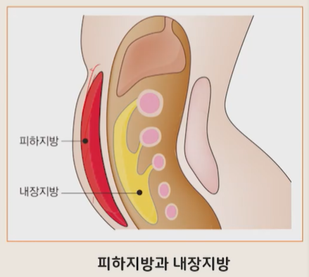

# 생활과 건강

## 07. 건강한 생활습관 (1)

- 간호학과 정성희 교수님

---

# 1. 생활습관병의 개요

## 1. 생활습관병의 개요

### 생활습관병

- 산업화·기계화로 삶이 풍요롭게 변화되면서 영양과잉이 보편화됨
- 동물성 식품 위주의 식생활 변화 초래
- 비만, 만성질환(암, 당뇨, 순환기질환 등) 수 증가 등의 질병양상 변화

- 여기서 ‘만성’이라는 용어는 급성과 대비되는 것으로 시간적 요소를 내포하는 특성을 가짐
- 만성 질환:
    - 30일 이상의 중환자 관리를 받거나
    - 3개월 이상 병원이나 요양기관에서 의학적 관리 혹은 재활교육을 필요로 하는
    - 지속적인 질환이나 영구적인 장애상태

## 1. 생활습관병의 개요

### 국가별 만성질환 명칭

- 암, 당뇨와 같이 흔히 만성질환이라 부르는 질병에 대한 명칭은 국가마다 다양하게 사용됨
- 미국
    - 만성퇴행성 질환(chronic degenerative disease)
    - 만성질환(chronic disease)
- 영국
    - 생활습관 관련병(life-style related disease)

## 1. 생활습관병의 개요

### 대한민국

- 만성질환의 대부분이 성인에서 발생하므로 ‘성인병’이라고 함

#### 성인병

- 일본에서 시작된 용어로, 심장병, 당뇨병, 고혈압, 뇌졸중 등이 40대부터 발생률이 급격히 높아진다는 뜻에서 사용되었으며, 나이가 들면 누구라도 걸리는 병이라는 인식이 지배적이었음
- 그러나 성인병의 증상이 젊은 층과 어린이에게도 발병하고,
  대부분의 성인병이 흡연, 음주, 과식, 운동부족 등 잘못된 생활습관의 반복으로 발생한다는 것이 밝혀지면서
- 대한내과학회는 2003년부터 ‘성인병’을 ‘생활습관병’으로 개칭함

## 1. 생활습관병의 개요

### 생활습관병

- 잘못된 생활관습에서 비롯된 병
- 불균형한 식생활, 운동 부족 등의 활동량 감소, 과로, 스트레스와 같은 잘못된 생활방식을 오래 유지하는 동안 건강의 균형이 무너지면서 생기는 생활습관과 관련된 만성질환을 의미
- ‘생활습관병’이라는 용어가 현대 질병의 대명사로 떠오르고 있음
    - 20세기 중반 이후 전염병 등 급성질환이 감소하고
    - 만성질환과 퇴행성 질환이 주류를 이루고 있기 때문

## 1. 생활습관병의 개요

### 생활습관병의 특징

- 대부분 여러 요인이 복합적으로 관여하여 합병증을 수반
- 서서히 발병하고 대부분 자각증상이 없어 위험한 질병
- 어려서부터 시작하고 평소 생활습관과 관련성이 크다는 점에서 예방이 가능
- 조기에 발견하여 치료하면 그 피해를 최소로 줄일 수 있음

# 2. 대사증후군

## 1. 대사증후군

### 대사증후군의 개념

- 개인은 각자의 직업, 성격, 환경 등에 따라 운동, 양, 흡연, 음주, 수면, 휴식, 스트레스, 대인관계의 형태가 각기 달라 자신만의 생활양식을 가지고 살아 감
- 생활습관 요인을 건강하게 유지하지 못하면
    - 체중증가로 인한 비만(특히 복부비만), 혈압 상승, 혈당 증가, 혈액 내 중성지방 증가, 고밀도콜레스테롤(HDL) 저하 등이 함께 나타나는 경우가 있음
- 뇌심혈관질환과 당뇨병의 위험을 높이는 비만, 고혈압, 고지질혈증, 심혈관계 죽상경화증 등의 여러 가지 질환이 한 개인에게서 한꺼번에 나타나는 것을 대사증후군이라 함

## 1. 대사증후군

### 대사증후군의 개념

- 1988년 미국 내분비내과 의사 G. 리븐이 심혈관질환을 유발하는 여러 위험인자들은 함께 존재한다는 것을 발견해 ‘X 증후군’으로 명명
- 이후 1998년 세계보건기구(WHO)가 이를 ‘대사증후군’으로 이름 붙임
- 전 세계적으로 선진국과 개발도상국 국민의 1/4 정도가 대사증후군을 가지고 있음
- 대사증후군이 있는 경우에는 심뇌혈관질환의 위험이 2배 이상 높고,
  당뇨병의 발병 위험도 4~6배 이상 높으며,
  유방암, 대장암 등 다양한 암 발생의 위험도 높아짐
- 대사증후군만 치료하는 단일 치료법은 없기 때문에
  유발요인들에 대한 개별적인 치료를 해야 하며,
  체중감량과 식습관 및 생활습관의 변화가 치료에 중요함

## 1. 대사증후군

### 대사증후군의 진단기준

- 출처: 국민건강보험공단(2017)

| 위험요인           | 기준                                                       |
|----------------|----------------------------------------------------------|
| 복부비만           | 남자 90cm 이상, 여자 85cm 이상 또는 BMI 25 이상                      |
| 높은 혈압          | 수축기 혈압 130mmHg 이상 또는 이완기 혈압 85mmHg 이상, 또는 고혈압 약을 복용하는 경우 |
| 높은 혈당          | 공복혈당 100mg/dL 이상, 또는 당뇨병 약이나 인슐린 주사 치료를 받는 경우            |
| 높은 중성지방혈증      | 중성지방 150mg/dL 이상                                         |
| 낮은 HDL 콜레스테롤혈증 | 남자 40mg/dL 이하, 여자 50mg/dL 이하, 또는 고지질혈증 약을 복용하는 경우        |

- 다섯 가지 위험요인 중 세 가지 이상에 해당하는 경우 대사증후군으로 진단

## 1. 대사증후군

### 발병원인

- 대사증후군의 발병원인은 명확히 알려지지 않았음
- 일반적으로 인슐린 저항성(insulin resistance)이 근본적인 원인으로 작용한다고 추정
- 인슐린 저항성이 생기는 이유로 가장 흔한 것
    - 과음, 과식, 운동부족에 따른 복부비만과 지방간, 스트레스, 노화, 유전적 이유 등

#### 인슐린 저항성

- 인슐린에 대한 반응이 정상적인 기준보다 감소된 것

#### 인슐린

- 세포가 포도당을 에너지원으로 쓸 수 있게 세포의 문을 열어 주는 역할

## 1. 대사증후군

### 발병원인

#### 발병 기전

- 인슐린 저항성 증가
    - 포도당이 세포로 들어가지 못하고, 적절하게 사용되지 않는 현상 발생

- 고인슐린혈증 유발
    - 신체는 역설적으로 포도당을 더 만들어 내기 위해 인슐린을 더 분비시켜 고인슐린혈증 유발

- 각종 건강문제 유발
    - 혈중 염분, 수분 증가로 인한 혈압 상승
    - 지방의 체내 축적 유도로 비만 발생률 증가
    - 혈중 중성지방 증가 및 HDL 감소로 이상지질혈증 유발

## 1. 대사증후군

### 발병원인

- 이 밖에 유전적 요인이나 저체중 출산 등도 인슐린 저항성의 원인으로 제시되고 있음
- 따라서 대사증후군은 ‘인슐린 저항성’을 개선해야 근본적인 치료가 가능

#### 인슐린 저항성을 개선하기 위한 중요사항

- 고칼로리 음식의 섭취 제한
- 꾸준한 운동을 통해 건강한 생활습관 실천

## 1. 대사증후군

### 위험요인

#### 1. 복부비만

- 복부에 지방이 과도하게 축적된 상태를 일컫는 용어
- 비만의 기준은 국가나 민족에 따라 약간씩 다름
    - 우리나라: 허리둘레 남자 90cm 이상, 여자 85cm 이상인 경우를 복부비만으로 분류
- 복부비만이 심해지면
    - 대사증후군: 4.2배 증가
    - 고혈압과 고지질혈증: 2배 증가
    - 당뇨: 2.1배 증가

## 1. 대사증후군

### 위험요인

#### 1. 복부비만

- 출처: 대한비만학회, 국민건강보험(2019). 2019 비만 팩트시트
- 최근 10년간 복부비만 유병률은 증가하였으며, 남자에게서 크게 증가

## 1. 대사증후군

### 위험요인

#### 1. 복부비만

- 복부의 지방
    - 분포하는 위치에 따라 내장지방과 피하지방으로 구분
- 장기 주변에 지방이 끼면 장기가 압박을 받아 활동이 위축되어 장기의 기능이 떨어짐
- 체내 장기를 둘러싸고 있는 부위에 축적된 내장지방
- 

## 1. 대사증후군

### 위험요인

#### 1. 복부비만

- 내장지방:
    - 혈액 속으로 지방을 흘려 보내 심뇌혈관질환의 위험을 높이고,
    - 내장지방세포에서 지방산이 과다하게 유리되어 혈중 유리지방산이 증가하면서 인슐린 저항성을 증가시킴
- 연령 증가에 따라 내장지방이 증가하기 쉽고,
  과식이나 운동부족도 내장지방 축적의 주요 원인으로 작용
- 특히 여성은 폐경기 이후에 복부비만이 현저히 나타남

## 1. 대사증후군

### 위험요인

#### 1. 복부비만

- 허리둘레는 측정방법이 간단하여 복부비만 진단에 널리 이용
- 올바른 허리둘레 측정법(WHO 기준)
    1. 양 발 간격을 25~30cm 정도 벌리고 서서 체중을 균등히 분배시킴
    2. 숨을 편안히 내쉰 상태에서 측정
    3. 측정 위치: 갈비뼈 가장 아래와 골반의 가장 윗부분(장골능)의 중간부위
    4. 측정 시에는 너무 조이거나 느슨하지 않도록 하여 0.1cm까지 측정

## 1. 대사증후군

### 위험요인

#### 2. 고혈압

##### 일차성 고혈압

- 전체 고혈압의 90% 정도를 차지
- 그 원인이 명확히 밝혀지지는 않았으나 비만, 짜게 먹기, 흡연, 과음, 스트레스, 가족력 등이 관련된 것으로 알려져 있음

##### 이차성 고혈압

- 신장의 이상, 내분비질환 등의 다른 질병에 의해 이차적으로 발생하는 경우
- 전체 고혈압 환자의 10% 정도

## 1. 대사증후군

### 위험요인

#### 2. 고혈압

##### 고혈압 전 단계(pre-hypertension)

- 수축기 혈압이 130~139mmHg이거나 이완기 혈압이 80~89mmHg인 경우를 고혈압 전 단계로 분류하여 고혈압으로의 진행을 막기 위한 노력을 기울이고 있음
- 수축기 혈압이 130mmHg 이상이거나 이완기 혈압이 85mmHg 이상일 때, 혹은 혈압약 복용 여부
    - 대사증후군의 진단기준이 되고 있음
- 고혈압은 인슐린 저항성과 관련이 있으므로,
  운동량을 늘리거나 체중을 조절하면 혈압을 낮출 수 있음

## 1. 대사증후군

### 위험요인

#### 3. 당뇨병

- 우리 몸을 움직이는 데 쓰이는 주요 에너지원인 포도당이 세포에서 이용되려면 췌장의 베타세포에서 분비되는 인슐린이 필요

## 1. 대사증후군

### 위험요인

#### 3. 당뇨병

- 췌장에서 인슐린을 너무 소량 분비하거나 전혀 만들어 내지 못하면
    - 혈액 속에 당이 과다해져서 당뇨병이 생기게 됨
- 비만의 경우
    - 인슐린이 정상적으로 분비되더라도 인슐린에 대한 체내의 저항성이 높아짐
    - 이로 인해 인슐린이 세포에서 잘 쓰이지 못함에 따라 혈당이 높아지는 경우도 있음

## 1. 대사증후군

### 위험요인

#### 3. 당뇨병

- 가정에서 간이 혈당 측정기 이용 시 주의사항
    - 손가락 끝에서 혈액이 충분히 나오지 않는다고 억지로 짜내면 조직액이 섞여 나와 정확한 혈당 수치를 반영할 수 없으므로 주의
- 당뇨병은 평소에 혈당 수치를 적정 수준으로 유지하여 뒤따르는 합병증을 최소화하는 것이 매우 중요
- 어느 한 시점에서 측정한 혈당 수치와 더불어 장기간의 혈당조절 상태를 파악하는 것이 필요

## 1. 대사증후군

### 위험요인

#### 3. 당뇨병

##### 당뇨병 전 단계

- 당뇨병 전 단계에 있는 경우는 잠재적 환자군으로서 혈관계 합병증이 발생할 위험이 매우 높은 상태이므로 예방적 차원에서 집중적인 관리 필요
- 혈당 수치에 관한 대사증후군의 진단기준
    - 공복혈당이 100mg/dL 이상이거나
    - 현재 당뇨로 인한 치료를 받고 있는 경우로 하고 있음

## 1. 대사증후군

### 위험요인

#### 4. 이상지질혈증

- 동맥경화 발생과 밀접하게 관련된 중성지방, 저밀도지단백 콜레스테롤(LDL 콜레스테롤), 고밀도지단백 콜레스테롤(HDL 콜레스테롤)의 수치가 적정 수준을 벗어나는 경우를 뜻함
- 인체 내에 존재하는 지질(lipid)의 종류는 다양
- 그 중 임상적으로 중요한 의미가 있는 것
    - 콜레스테롤, 중성지방, 인지질, 유리지방산 등
- 이들의 혈중 분포에 이상이 생길 경우에는 혈관상태가 악화되어 동맥경화를 비롯한 심뇌혈관질환의 위험이 높아짐

## 1. 대사증후군

### 위험요인

#### 4. 이상지질혈증

- 콜레스테롤: 우리 몸에 해롭다? 동맥경화를 일으키는 주요인이다?
- 하지만 콜레스테롤은 인체 구성의 기본단위인 세포막과 지단백의 구성성분일 뿐만 아니라 호르몬과 담즙산의 원료
    - 우리 몸을 유지하는 데 필수적인 요소

- 콜레스테롤의 종류
    - LDL 콜레스테롤: 동맥경화의 위험을 증가시킴
    - HDL 콜레스테롤: 말초혈관의 콜레스테롤을 제거

## 1. 대사증후군

### 위험요인

#### 4. 이상지질혈증

- 고콜레스테롤혈증 관리의 목표
    - LDL 콜레스테롤 수치 ↓
    - HDL 콜레스테롤 수치 ↑

- 대사증후군 진단기준
    - HDL 콜레스테롤: 남성은 40mg/dL 미만, 여성은 50mg/dL 미만
    - 혈액 내 중성지방 수치: 150mg/dL 이상이거나 이미 치료제를 복용하고 있는 경우

## 1. 대사증후군

### 위험요인

#### 4. 이상지질혈증

##### 중성지방

- 죽상경화증을 유발하거나 LDL 콜레스테롤의 증가에 영향을 미치기도 함
- 중년기 이후 고지질혈증으로 인해 약물치료를 받는 경우를 흔히 볼 수 있음
- 감자, 고구마, 옥수수와 같은 고탄수화물 식품을 간식으로 즐김
- 칼국수, 수제비 등을 즐기는 우리나라의 식생활 문화
    - 한국인의 중성지방혈증과 관련되므로 식습관에 대한 점검이 필요

## 1. 대사증후군

### 문제점

- 대사증후군은 신체적·심리사회적 측면에서 다양한 문제를 동반
- 우선 복부비만의 경우에는 심혈관계 질환, 호흡기계 질환, 내분비계 이상 및 당뇨, 암 등을 동반하기 쉬움
    - 전반적인 건강상태와 아주 밀접한 관련
- 복부비만 자체가 스트레스 원으로 작용하여 우울감, 고립감 등을 유발
    - 긍정적인 자아상 형성에 저해요인
    - 원만한 대인관계를 형성하는 데 장애요인이 되기도 함

## 1. 대사증후군

### 문제점

- 인구의 고령화와 만성질환의 증가
    - 대사증후군의 유병률의 빠른 증가: 평균수명 연장에 비해 건강수명 증가가 따라가지 못하여 사회적 부담이 증가하고 있음
- 대사증후군
    - 생활습관이나 식습관 등에 의해 오랜 기간을 거쳐 발생:
      고혈압, 당뇨병, 관상동맥질환 등에 따른 많은 합병증을 유발하고 장기간의 치료가 필요하여 의료비 상승의 부담
    - 삶의 질 저하를 초래하기 때문에 건강한 생활습관을 형성하여 예방하는 것이 가장 효율적인 방법임

