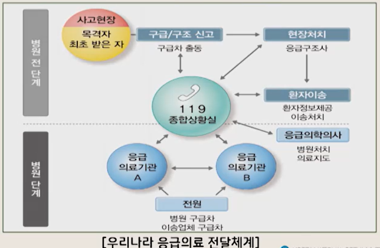
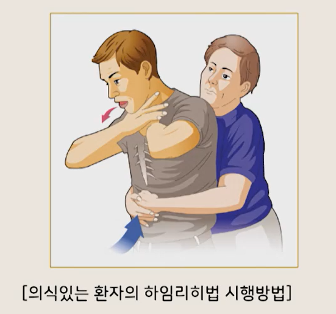
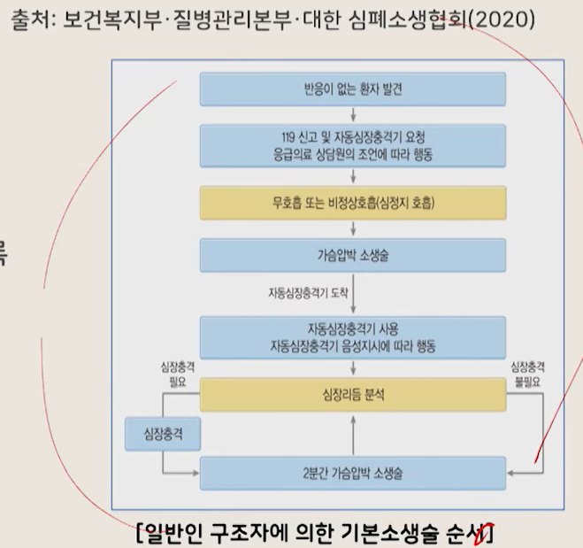

# 생활과 건강

## 12. 응급처치 (1)

- 간호학과 정성희 교수님

---

# (1) 응급의료체계의 이해

## 1. 응급의료체계의 개념

### 응급의료체계란?

- 불의의 사고나 질병 발생 시 신속한 응급처치 및 병원진료를 통해 응급환자의 신체나 생명에 대한 중대한 위험을 예방 또는 감소시키기 위한 것
    - 한 나라의 의료수준 전체를 가늠하는 지표
- 응급의료서비스 제공에 필요한 인력, 장비, 자원 등 모든 요소를 효율적으로 운영하기 위한 체계
- 응급환자가 발생했을 때 현장에서 적절한 처치를 시행한 후, 신속하고 안전하게 병원으로 이송하는 것
- 따라서 짧은 시간 내 최상의 응급의료서비스를 제공하기 위해서는 현장 출동, 처치팀(119 구급대), 병원 응급의료팀 간의 유기적인 협력체계 구축이 필수적

## 2. 우리나라 응급의료 전달체계 및 구성요소

- 우리나라는 1980년대에 비로소 공공의 개념으로 응급환자 후송을 시작
- 우리나라의 응급의료 전달체계는 응급의료서비스가 제공되는 장소에 따라 크게 구분
    - 병원 전 단계(pre-hospital phase)
    - 병원 단계(in-hospital phase)

- 출처: 중앙응급의료센터

### 1) 병원 전 단계

#### ① 환자 발생의 신고와 구급차 출동

- 응급환자를 처음 발견한 일반인과 신고 접수자, 최초 응급처치 수행자의 역할이 매우 중요

#### ② 구급차가 현장에 도착하기 전까지 전화상담원에 의해 이루어지는 응급처치요령의 지도

- 응급상황 발생 위치, 사고의 종류, 환자의 수, 환자의 상태, 환자에게 시행한 처치의 내용 등을 알림

#### ③ 구급대(응급구조사, 구급대원)에 의한 현장 응급처치

- 초기 몇 분 내에 제세동(defibrillation)과 전문심장소생술이 시행되도록 응급의료체계와 연결되는 것이 매우 중요

#### ④ 정보 · 통신체계를 이용한 구급차-병원 간의 정보교환

- 이송병원 결정
- 현장에서 병원까지 이송 중에 이루어지는 처치

### 2) 병원 단계

#### ① 현장처치의 검토 및 연속적인 응급처치

#### ② 진단을 위한 적절한 검사

#### ③ 입원 치료(중환자실, 일반병실) 혹은 응급수술 결정

#### ④ 환자의 응급처치에 필수적인 의료진이나 시설, 장비가 준비된 전문응급센터(외상, 화상, 독극물, 심혈관센터 등)나 응급의료기관으로 전원 여부 결정과 전원병원 결정

### 3. 응급의료 관련 법규

#### 「응급의료에 관한 법률」

##### 목적

- 국민이 응급상황에서 신속하고 적절한 응급의료를 받을 수 있도록 응급의료에 관한 국민의 권리와 의무, 국가 · 지방자치단체의 책임, 응급의료 제공자의 책임과 권리를 정하고, 응급의료자원의 효율적 관리에 필요한
  사항을 규정함으로써 응급환자의 생명과 건강을 보호하고 국민의료를 적정하게 함

##### 주요 입법 내용

- 응급의료체계의 확립
- 의료기관의 응급진료체계 정비
- 응급구조사의 법제화
- 비의료인에 대한 응급처치 교육의 의무화
- 재난 시 응급의료의 동원 구체화
- 응급환자의 신속한 이송을 유도하는 내용 등이 포함

---

# (2) 기도폐쇄

## 1. 기도폐쇄의 개념

### 기도폐쇄

- 기도가 부분 혹은 전체적으로 폐쇄되는 것
- 기도
    - 공기가 인후두부, 기관, 기관지 등의 통로를 거쳐 폐에 도달하는 통로
- 호흡과 관련된 응급상황 중에서 가장 흔한 증상
- 혀(tongue)
    - 인체에서 기도 폐쇄를 가장 흔히 유발
    - 혀가 뒤로 말려 들어가 숨을 쉬는 길인 기도와 목 안을 막기 때문
- 이렇게 혀가 말려 들어가 기도를 완전히 막거나 목에 음식물이나 이물질이 걸려 완전기도폐쇄가 되면 혈액으로 산소공급이 중단되어 대부분 1분 이내에 의식을 잃게 되며, 4분 이후부터는 뇌에 산소가 공급되지 않아
  뇌손상이 시작되고, 7분이 지나면 사망에 이를 수도 있음

## 2. 기도폐쇄의 원인

- 기도폐쇄는 누구에게나 발생할 수 있는 응급상황

### 성인

- 주로 음식물에 의해 발생

### 소아

- 생후 6개월~3세 사이가 흔함
- 땅콩, 장난감, 동전 등이 기도로 넘어가 기도를 막을 수 있음

### 기타 원인

- 외상이나 사고를 당한 경우에는 입안이 손상되어 부러진 치아나 출혈 등에 의해 기도가 막히기도 함
- 의식이 없는 환자는 혀가 뒤로 말려 들어가거나 구토물에 의해 막히는 경우가 있음
- 음식물을 충분히 씹지 않고 삼키는 경우, 음식물을 급하게 먹는 경우에도 기도폐쇄가 될 수 있음

## 3. 기도폐쇄의 증상

- 기도폐쇄가 발생하면 환자는 활력이 감소되고, 안절부절못하며 호흡과 맥박이 빨라짐
- 누우면 숨쉬기가 더욱 힘들기 때문에 앉아 있으려고 하거나 호흡 시 가슴 주변의 호흡보조근을 사용하므로 매우 힘들어 보임
- 혈액 중에 산소가 점점 부족해지면서 졸음, 혼돈, 혼미 등 의식수준의 변화가 나타나며 피부색이 창백하거나 검푸른 빛으로 변함

## 4. 기도폐쇄의 처치

### 기본 원칙

- 기도폐쇄 응급처치는 기도의 일부분이 막히는 경우와 기도가 완전히 막히는 경우로 나누어 볼 수 있음
- 각 상황에 적절한 응급처치를 시행해야 함
- 이물질이 기도에 걸려 고통을 호소하거나 의식이 없는 경우, 당황해서 급하게 등을 두드리거나 인공호흡을 실시하거나 물을 먹여서는 안 됨
    - 이물질이 더 깊이 들어갈 수도 있기 때문

### 의식 상태에 따른 처치

- 의식이 없는 환자는 심폐소생술을 시행
- 반면 호흡상태가 정상이고 의식이 있는 경우
    - 힘 있게 기침을 해서 이물을 뱉어 내도록 유도
    - 환자가 자발적으로 기침을 하여 이물을 빼내려고 할 때 중단시키거나 방해해서는 안 됨
- 지속적으로 기침을 해도 이물질이 배출되지 않을 때에는 즉시 119에 구조를 요청한 후 전문구조요원이 도착할 때까지 하임리히법(Heimlich maneuver)을 이용해 응급처치를 함
- 어린이의 경우도 성인과 동일한 방법으로 시행

### 하임리히법(복부 밀쳐 올리기)

- 폐에 있는 공기를 강제로 밀어내어 기도의 이물질이 밀려 나오게 하는 방법
- 배꼽과 명치의 중앙지점을 정확하고 빠르게 밀어 올려 쳐야 순간적으로 공기가 밀려나오면서 이물이 배출됨
    - 천천히 누를 경우 순간적인 공기 배출이 안 되어 이물질이 나오지 않으므로 주의
- 음식 조각이나 다른 사물에 의해 기도가 폐쇄되었을 때 시행할 수 있는 응급처치
- 성인과 어린이 모두에게 비교적 안전하게 시행할 수 있음
- 단, 1세 미만의 유아는 간의 크기가 상대적으로 커서 장기 손상의 위험이 높으므로 전문가가 아닌 일반인이 시행하는 것은 추천되지 않음

#### 하임리히법의 시행 방법

1. 환자의 뒤에 서서 환자의 허리를 팔로 감싸고 한쪽 다리를 환자의 다리 사이에 지지한다.
2. 구조자는 한 손을 주먹 쥐고 주먹 쥔 손의 엄지를 배꼽과 명치 부위의 중간에 놓는다.
3. 다른 한 손으로 주먹 쥔 손을 감싸고 빠르게 위로 쳐 올린다.
4. 이물질이 밖으로 나올 때까지 계속 시행한다.

#### 의식이 없는 완전기도폐쇄 환자의 변형된 하임리히법

1. 환자를 바닥에 반듯하게 눕힌다.
2. 구조자는 환자의 허벅지 쪽에 무릎을 꿇고 앉는다.
3. 한 손의 손꿈치를 환자의 배꼽과 명치 사이에 놓고 다른 한 손을 그 위에 겹쳐 놓는다.

- 이때 손꿈치 부위가 좌우 어느 쪽으로도 치우치지 않도록 유의한다.

4. 쳐 올리기를 4~5회 실시한 후 입안의 이물질을 꺼낸다.

### 영아 기도폐쇄 처치

- 1세 이하 영아 또는 2세라도 체중이 10kg 이하인 경우에는 등 두드리기법을 이용

#### 영아의 등 두드리기를 시행할 때 주의점

- 아이를 받치지 않은 채 다리를 거꾸로 들고 등을 두드리면 아이의 대퇴부와 고관절이 탈구를 일으킬 위험이 있으므로 조심해야 함

#### 영아의 등 두드리기법 시행방법

1. 주변에 119 신고를 요청한다.
2. 영아의 머리를 가슴보다 낮게 하여 영아를 자신의 팔 위에 엎어서 올려놓고 손으로 머리와 경부가 고정되도록 잡는다.
3. 영아를 안은 처치자의 팔은 허벅지 위에 단단히 고정한다.
4. 손바닥으로 영아의 어깻죽지 사이(견갑골 사이)를 5회 두드린다.

---

# (3) 심폐소생술

## 1. 심폐소생술의 필요성

### 심정지

- 심장기능이 멈춘 상태에서 심장박동이 없고 심장에서 더 이상 혈액을 신체장기로 박출하지 못하는 상태

### 심폐소생술(cardio-pulmonary resuscitation, CPR)의 구분

- 기본소생술(basic life support, BLS)
    - 1차 소생술
- 전문소생술(advanced cardiac life support, ACLS)
    - 2차 소생술

### 기본소생술

- 심정지가 의심되는 사람을 발견한 목격자(구조자)가 해야 하는 일련의 구조과정
- 기본소생술에는 심정지의 확인, 구조요청, 심폐소생술, 자동심장충격기 사용이 포함

### 전문소생술

- 심정지의 예방 및 치료부터 심정지 후 치료에 이르기까지 생존사슬을 이어주는 심정지 환자 치료의 중요과정
- 심정지를 치료하려면 전문소생술의 처치가 기본소생술의 토대 위에서 진행되어야 함
- 즉 심정지의 신속한 인지와 응급의료체계의 활성화, 신속한 심폐소생술, 신속한 제세동 및 약물치료를 통한 자발순환회복, 전문기도 처치와 생리학적 모니터링이 심정지의 치료과정에 수반되어야 함

#### 전문소생술이 필요한 모든 환자

- 가능한 한 빨리 병원으로 후송하여 의료장비를 이용한 전문소생술을 받도록 연결되어야 함

### 기본소생술에서 가장 중요한 점

- 환자의 뇌 손상 최소화
    - 심정지 발생 후 4~5분이 경과하기 전에 소생술을 실시해야 함
- 심정지 후 약 4~5분까지는 조직 손상이 없는 시기이지만, 4~5분부터 10분 정도까지 에너지가 급격히 고갈되고 산소부족으로 인한 뇌조직 손상이 시작되기 때문에 심폐소생술(특히 가슴압박)을 하여 조직으로 산소
  공급을 유지해 주는 것이 무엇보다 중요
- 심정지는 사회적으로 주요한 공공의료의 이슈

### 일반인 심폐소생술의 중요성

- 심정지는 발견한 사람이 즉시 심폐소생술을 하지 않을 경우 환자의 소생 가능성은 거의 없음
    - 따라서 일반인 대상 교육과 훈련이 절대적으로 필요
- 심정지 이외에도 심폐소생술이 필요한 응급상황
    - 전기감전
    - 익수
    - 약물중독
    - 기도폐쇄
    - 중증의 저체온 상태 등
- 기본소생술은 응급상황에서 매우 중요한 의미를 가짐
- 신속하고 효과적인 심폐소생술
    - 많은 인명 구조 가능
- 기도 유지만으로도 위기상황을 넘기는 경우가 많음

## 2. 생존사슬(chain of survival)

- 심정지 환자의 생존율을 증가시키기 위해 반드시 필요한 일련의 단계

### 생존사슬의 단계

1. 심정지의 예방과 조기발견
2. 신속한 신고
3. 신속한 심폐소생술
4. 신속한 제세동
5. 효과적 전문소생술 심정지 후 치료

- 출처: 보건복지부 · 질병관리본부 · 대한심폐소생협회(2020)

### 생존사슬의 의미

- 모든 국민이 심정지의 위험성을 인식하고 심정지를 예방하도록 노력해야 함
- 의료인이 아니더라도 심정지가 발생한 사람을 발견하면
    - 빨리 119에 신고한 후
    - 즉시 심폐소생술을 시작
    - 자동심장충격기가 있으면 즉시 사용해야 함

## 3. 심폐소생술의 절차와 방법

### 쓰러진 사람을 발견한 경우

- 반응이 없으면 심정지 상황으로 간주
- 즉시 119에 도움을 요청
- 주변 사람에게 자동심장충격기를 가져오도록 한 후 즉시 심폐소생술을 시작해야 함
- '기본소생술 가이드라인' 기준에 근거한 기본소생술 시행

### 1) 환자의 반응 확인

- 쓰러진 사람에게 접근하기 전에 우선 현장의 안전을 확인하고 쓰러진 사람의 반응을 확인해야 함
- 쓰러져 있는 사람의 어깨를 두드리면서 "괜찮으세요?"라고 소리쳐서 반응을 확인
- 반응이 없다면 심정지일 가능성이 높음

### 2) 119 신고

#### 심정지 환자를 목격한 경우

- 주변에 큰 소리로 구조를 요청하여 다른 사람에게 119에 신고하게 하는 등의 도움을 받음

#### 주변에 아무도 없는 경우

- 직접 119에 신고

#### 자동심장충격기가 있는 경우

- 만약 신고자가 자동심장충격기 사용교육을 받은 구조자이고, 주변에 자동심장충격기가 있다면 즉시 가져와서 사용할 것

#### 두 명 이상의 구조자가 있는 경우

- 한 명은 심폐소생술을 시작
- 다른 한 명은 신고를 하고 자동심장충격기를 가져오도록 함

#### 119에 신고할 때 알려야 할 내용

- 환자 발생 장소
- 발생 상황
- 환자의 상태
- 현장에서 시행한 응급처치에 대하여 설명해야 함

#### 통화 시 유의점

- 응급의료전화 상담원이 전화로 알려주는 사항을 효율적으로 시행하기 위해서는 스피커 통화를 시행하는 것이 바람직함
- 응급의료전화 상담원이 더 이상 지시사항이 없어 끊으라고 할 때까지 통화상태를 유지

### 3) 호흡확인

- 쓰러진 사람의 얼굴과 가슴을 10초 정도 관찰하여 호흡이 있는지 확인
- 의식이 없는 사람이 호흡이 없거나 호흡이 비정상적이면 심정지가 발생한 것으로 판단
- 일반인은 호흡상태를 정확히 평가하기 어렵기 때문에 호흡확인과정에서 119 응급의료전화 상담원의 도움이 필요할 수 있음

### 4) 가슴압박

- 가슴의 중앙에 있는 가슴뼈 부위를 반복적으로 압박하면 혈액을 순환시킬 수 있음
- 쓰러진 사람이 심정지 상태라고 판단되면 즉시 가슴압박을 시작
- 환자를 평평하고 단단한 바닥에 등을 대고 눕히거나 환자의 등에 단단한 판을 깔아줌
- 구조자는 환자의 가슴 옆에 무릎을 꿇은 자세를 취함
- 구조자는 한쪽 손바닥을 가슴뼈의 압박 위치에 대고 그 위에 다른 손바닥을 평행하게 겹쳐 두 손으로 압박함
- 손가락은 펴거나 깍지를 껴서 손가락 끝이 가슴에 닿지 않도록 함
- 팔꿈치를 펴서 팔이 바닥에 수직을 이룬 상태에서 체중을 이용하여 압박함
- 가슴뼈(흉골)의 아래쪽 절반 부위를 강하게 규칙적으로, 빠르게 압박해야 함
- 쓰러진 사람이 성인이면 압박 깊이는 약 5cm(소아는 4~5cm), 가슴압박의 속도는 100~120회/분을 유지
- 가슴을 압박했다가 이완시킬 때에는 혈류가 심장으로 충분히 채워지도록 충분히 이완시킴
- 가슴압박과 인공호흡을 모두 하는 경우
    - 가슴압박을 30회 한 후 인공호흡을 2회 연속하는 과정을 반복
- 다른 구조자가 있는 경우
    - 2분마다 가슴압박(또는 가슴압박과 인공호흡)을 교대

## 4. 가슴압박소생술(compression-only CPR 또는 hands-only CPR)

- 인공호흡 방법을 모르거나 인공호흡을 꺼리는 일반인 구조자가 수행하는 기본소생술
- 심폐소생술(가슴압박과 인공호흡을 함께 하는 방법)과 달리 인공호흡은 하지 않고 가슴압박만 시행
- 인공호흡을 할 수 있는 구조자는 인공호흡이 포함된 심폐소생술을 시행

## 5. 인공호흡

### (2) 입-입 인공호흡

- 입-입 인공호흡을 하기 위해 구조자는 먼저 환자의 기도를 개방하고, 환자의 코를 막은 다음 구조자의 입을 환자의 입에 밀착시킨다.
- 구조자는 평상시 호흡과 같은 양을 들이쉰 후에 환자의 입을 통하여 1초간 숨을 불어넣는다.
- 불어넣을 때에는 눈으로 환자의 가슴이 부풀어 오르는지 확인한다.
- 첫 번째 인공호흡을 시도했을 때 환자의 가슴이 부풀어 오르지 않으면 머리 기울임-턱 들어올리기를 다시 정확하게 한 다음 두 번째 인공호흡을 시행한다.

## 6. 자동심장충격기(automated external defibrillator, AED)

- 환자의 피부에 부착된 전극을 통하여 전기충격을 심장에 보내 심방이나 심실의 세동(비정상적으로 빠르게 떨려 심장기능을 정상적으로 하지 못하는 상태)을 제거하는 제세동기를 자동화하여 만든 의료기기
- 환자의 심장박동을 자동으로 측정할 수 있고, 환자에게 제세동이 필요한 상황을 확인하는 것이 가능하며, 이를 음성, 문자, 점멸 등의 방법을 통해 사용자에게 안내할 수 있는 의료기기
- 심정지가 의심되는 사람을 구조하는 과정에서 자동심장충격기가 준비되면 즉시 사용
- 자동심장충격기 사용 방법은 제조회사에 따라 약간의 차이가 있으나 기본적인 사용 원칙은 같음

## 7. 선의의 응급의료에 대한 면책(선한 사마리아인 조항)

- 「응급의료에 관한 법률」에 선의의 응급의료에 대한 면책조항이 있음
- 제5조 2항(선의의 응급의료에 대한 면책)

- "생명이 위급한 응급환자에게 해당하는 응급의료 또는 응급처치를 제공하여 발생한 재산상 손해와 사상에 대하여 고의 또는 중대한 과실이 없는 경우 그 행위자는 민사책임과 상해에 대한 형사책임을 지지 아니하며 사망에
  대한 형사책임은 감면한다"라고 규정함으로써, 선의의 구조자를 보호할 수 있는 법적 근거를 제공
