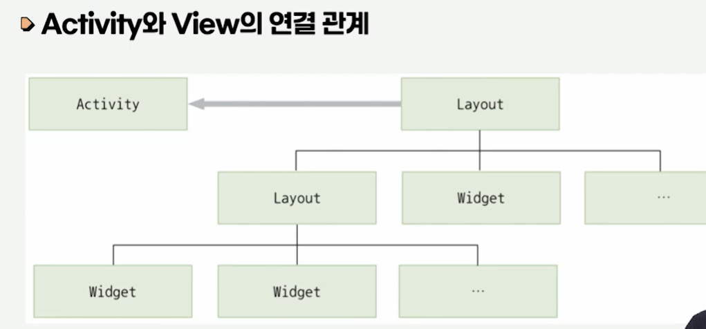
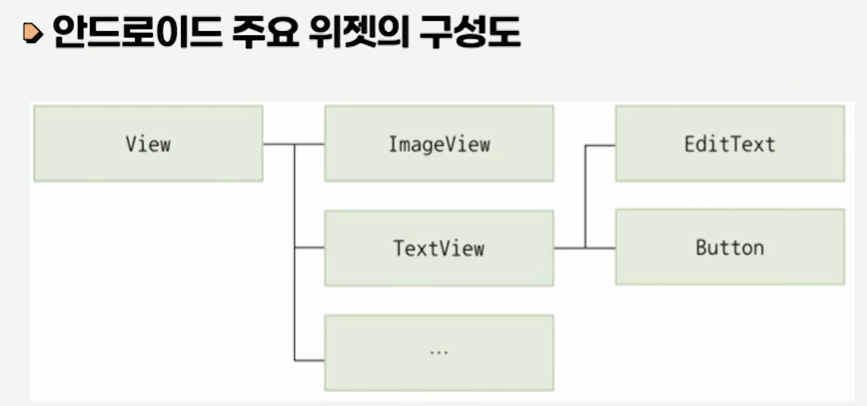
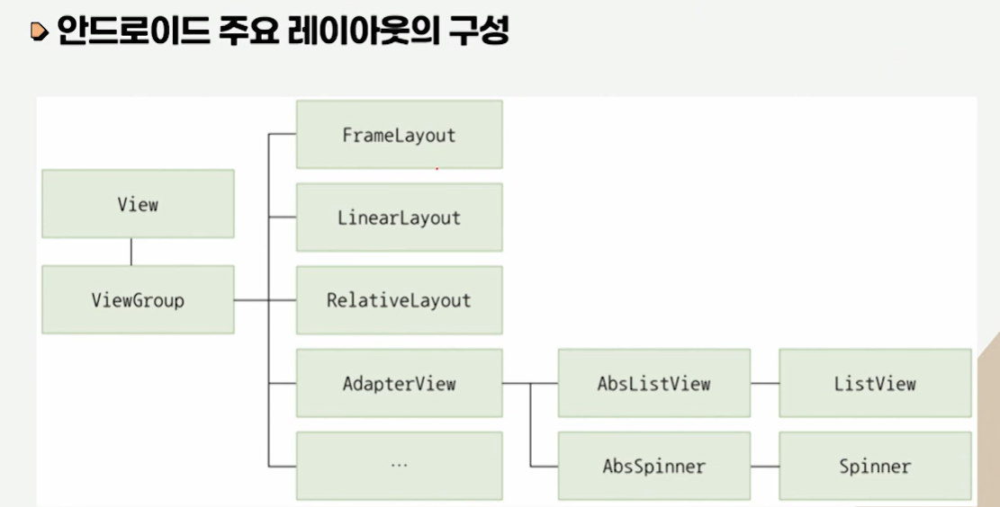

# 모바일앱프로그래밍

## 02. View

- 컴퓨터과학과 정광식 교수님

---

## (1) View 소개

### 1. Activity와 View의 관계

#### Activity 개요

- `Activity`는 안드로이드 앱의 **각 화면(Screen)** 을 구성하는 단위임
- `Activity` 자체는 독립적으로 화면에 보이지 않음
- `Activity`가 포함하는 `View`들이 사용자에게 보이는 실제 UI를 구현함  
  (XML 구조의 코드: 데이터 부분 - 1강 참조)
- 안드로이드 앱은 여러 개의 `View`가 모여 하나의 `Activity` 화면을 구성함

#### Activity와 안드로이드 앱

- 여러 개의 `Activity`가 모여 하나의 안드로이드 앱을 구성함
- `View`를 구현하는 Java 클래스는 다양한 속성(attribute)과 메서드(method)를 가짐
- 하지만 실제 화면 구성은 개발 편의를 위해 보통 XML로 정의함

#### 실행 흐름 메모

- `MainActivity.java` 시작
- `setContentView(...)`로 레이아웃 지정
- `R.layout.xxx`를 통해 XML 레이아웃(`activity_main.xml` 등) 연결

---

### 2. View의 종류

#### 2-1. 위젯(Widget)과 레이아웃(Layout) _1

- `View`는 크게 **위젯(Widget)** 과 **레이아웃(Layout)** 으로 구분됨
- **위젯**은 사용자와 상호작용을 위한 인터페이스 역할을 하는 구성요소임
- **레이아웃**은 위젯을 화면에 정렬하고 배치하는 역할을 하는 구성요소임
- 위젯은 레이아웃에 포함되고,
  레이아웃은 다른 레이아웃의 하위 구성요소로 포함될 수 있음

#### 2-2. 위젯(Widget)과 레이아웃(Layout) _2

- 하나의 화면을 구성하는 `View`들은 **트리 구조** 형태로 연결됨
- 하나 이상의 `Activity`가 최상위 레이아웃을 참조하여 화면을 그림
- 다만 위젯과 레이아웃의 구분이 항상 명확하지는 않으며,
  레이아웃이면서 위젯의 특징을 가지는 경우도 있음 (`ListView`, `Spinner` 등)

#### 2-3. 위젯

- 스마트폰 화면에서 사용자 인터페이스를 구성하는 위젯은 `View` 클래스로부터 파생되며, 간단히 `View`라고 부르기도 함
- `TextView`, `EditText`, `Button`, `RadioButton` 등이 대표적인 위젯이며, 스스로 화면에 특정 내용을 출력할 수 있음
- 사용자와 직접 상호작용하고, 그 결과를 Java 코드에 전달하여 다른 UI에 반영할 수 있음

#### 2-4. 레이아웃

- `View`를 담는 쟁반 역할을 하는 레이아웃은 `ViewGroup` 클래스로 구현됨
- 위젯과 레이아웃은 레이아웃에 담겨 출력될 수 있음
- 대부분의 `ViewGroup` 파생 클래스는 화면에 직접 보이지 않으면서, 여러 `View`를 유기적으로 묶고 배치하는 역할을 수행함

#### 2-5. 레이아웃 예

- 특정 `ViewGroup` 클래스는 화면에 리소스를 출력하면서 위젯 역할도 수행함
    - 대표 예: 하위 `View`들을 순차적으로 배치하는 `ListView`, `Spinner`
- `ListView`는 단순 위젯보다 기능이 많아 사용 방법과 절차가 상대적으로 복잡함

---

## (2) View 속성 1

### 1. id 속성

#### 1-1. 개요

- `id` 속성은 `View`의 이름(식별자)을 정의하는 속성임
- Java 코드나 XML 문서에서 `View`를 참조할 때 ID 속성값을 사용하므로,
  `View`의 유형과 목적을 나타내는 **직관적인 이름**을 붙이는 것이 좋음
- 직관적인 ID 사용은 Java 코드의 이해도와 가독성을 높이고,
  앱 규모가 커질수록 복잡해지는 소스 코드를 구조적으로 관리하는 데 도움을 줌

#### 1-2. 예제 (id, layout_width, layout_height 속성을 가진 버튼)

- 프로그램 2.1: `activity_main.xml`

~~~xml
<?xml version="1.0" encoding="utf-8"?>
<LinearLayout xmlns:android="http://schemas.android.com/apk/res/android"
              android:layout_width="match_parent"
              android:layout_height="match_parent"
              android:orientation="vertical"
              android:gravity="center">

    <Button
            android:id="@+id/button"
            android:layout_width="wrap_content"
            android:layout_height="wrap_content"
            android:text="New Button"/>
</LinearLayout>
~~~

#### 1-3. `"@+id/ID"` 구성 요소

- `@` : `R.java`(또는 `R` 클래스)와 연계되어 리소스를 등록/참조할 때 사용
- `+` : ID를 **새로 정의**할 때 사용 (처음 정의할 때만 사용)
- `id/` : 안드로이드 ID 리소스 타입 표기
- `ID` : 실제 식별자 이름(고유값이어야 함)

#### 1-4. 사용 예시

- 버튼에 `"button"`이라는 id를 부여할 때

> `android:id="@+id/button"`

- 이미 정의된 `"textView"` id를 참조할 때 (`@+id`가 아니라 `@id` 사용)

> `android:layout_below="@id/textView"`

- `"button"`, `"textView"`처럼 **유형/역할이 드러나는 이름**을 쓰는 것이 좋음

---

### 2. background 속성

#### 2-1. 개요

- `background` 속성은 `View`의 배경을 정의하는 속성임
- 이미지로 채우거나, 색상/도형 등 다양한 리소스를 배경으로 지정할 수 있음
- 별도 지정이 없으면 `View`가 제공하는 기본 배경이 사용됨

~~~android xml
<Button
    ...
    android:background="@mipmap/ic_launcher"
    ... />
~~~

#### 2-2. 화면에 버튼을 출력하는 예제 설명

- `background` 속성에 `ic_launcher` 이미지를 사용한 예시
- 지정하면 버튼의 기본 회색 배경 대신, 지정한 이미지가 버튼 배경으로 표시됨

#### 2-3. 색상을 채워 넣는 방법

- `background` 속성에 이미지 대신 **색상 코드**를 지정할 수도 있음
- 색상 코드는 `#` 기호로 시작함
- 안드로이드에서 자주 사용하는 색상 코드 형식
    - `#RGB`
    - `#ARGB`
    - `#RRGGBB`
    - `#AARRGGBB`

#### 2-4. 색상을 지정하는 예제

- `#` 뒤에 16진수로 각 색 구성요소의 강도를 지정함
- 구성요소 의미
    - `A` : Alpha(투명도)
    - `R` : Red(빨강)
    - `G` : Green(초록)
    - `B` : Blue(파랑)

~~~android xml
<Button
    ...
    android:background="#ffff1326"
    ... />
~~~

- 위 예시는 `#AARRGGBB` 형식의 색상값을 `background`에 적용한 것임

---

### 3. rotation 속성

#### 3-1. 개요

- `rotation` 속성은 `View`의 회전 각도를 설정하는 속성임
- 속성값으로 `"1.2"`와 같은 실수값을 입력할 수 있음
- Java 코드에서 `setRotation(float)` 메서드로 변경 가능
- (강의 기준) `0.0 ~ 360.0` 범위의 각도 정보를 입력받음
- 유사한 속성으로 `rotationX`, `rotationY`가 있음
    - `rotationX` : 수평축 기준 기울기
    - `rotationY` : 수직축 기준 기울기

#### 3-2. rotation 속성을 적용한 예제

- `ImageView` 2개를 배치하고, 두 번째 `ImageView`에 `android:rotation="45"` 적용
- 파일: `activity_main.xml`

~~~xml
<?xml version="1.0" encoding="utf-8"?>
<LinearLayout
        xmlns:android="http://schemas.android.com/apk/res/android"
        android:layout_width="match_parent"
        android:layout_height="match_parent"
        android:orientation="vertical"
        android:gravity="center">

    <ImageView
            android:id="@+id/imageView1"
            android:layout_width="wrap_content"
            android:layout_height="wrap_content"
            android:src="@mipmap/ic_launcher"
            android:layout_margin="30dp"/>

    <ImageView
            android:id="@+id/imageView2"
            android:layout_width="wrap_content"
            android:layout_height="wrap_content"
            android:src="@mipmap/ic_launcher"
            android:layout_margin="30dp"
            android:rotation="45"/>
</LinearLayout>
~~~

#### 3-3. 핵심 포인트

- `android:rotation="45"` → 뷰를 45도 회전
- `rotation` 값은 각도(도 단위)로 지정됨

---

## (3) View 속성 2

### 1. padding 속성

#### 1-1. 개요

- `padding` 속성은 **View 내부의 콘텐츠와 View 경계 사이의 간격(안쪽 여백)** 을 지정하는 속성임
- `TextView`의 경우, `TextView`의 영역과 텍스트 사이에 `padding` 값만큼 여백이 들어감
- 정리: `padding = 뷰 내부 여백 (콘텐츠와 테두리 사이 간격)`

#### 1-2. 속성

- `padding` 속성은 한글 워드프로세서에서 **표의 안쪽 여백**이라고 생각하면 이해하기 쉬움
- `padding`에 값을 하나 지정하면 **네 방향(상/하/좌/우)에 동일한 여백**이 적용됨
- 방향별로 개별 지정하려면 다음 속성을 사용함
    - `paddingLeft`
    - `paddingRight`
    - `paddingTop`
    - `paddingBottom`

> 참고: 최신 안드로이드에서는 좌/우 대신 `paddingStart`, `paddingEnd` 사용도 자주 권장됨

#### 1-3. padding 속성을 적용한 예제 설명

- `imageView`와 이미지 콘텐츠 사이에 `50dp`만큼의 여백을 지정한 예시

##### 예제 코드 (발췌)

~~~xml

<ImageView
        android:id="@+id/imageView"
        android:layout_width="match_parent"
        android:layout_height="match_parent"
        android:src="@mipmap/ic_launcher"
        android:padding="50dp"/>
~~~

---

### 2. visibility 속성

#### 2-1. 개요

- `visibility` 속성은 화면에서 `View`의 표시 여부를 지정하는 속성임
- 기본적으로 `View`는 보이는 상태로 배치되지만,
  `visibility`를 사용하면 `Activity` 내 `View`의 표시 여부를 동적으로 변경할 수 있음
- 실행 중 조건/이벤트에 따라 `View`를 보이게 하거나 숨길 수 있음

#### 2-2. visibility 속성 종류

- `invisible` : 화면에 보이지 않지만 **자리(공간)는 차지함**
- `gone` : 화면에도 보이지 않고 **자리도 차지하지 않음**

| 속성값         | 설명                               |
|-------------|----------------------------------|
| `visible`   | `View`가 보이는 상태                   |
| `invisible` | `View`가 숨겨진 상태이지만 자리(공간)는 차지함    |
| `gone`      | `View`가 숨겨진 상태이며 자리(공간)도 차지하지 않음 |

---

### 3. focusable 속성

#### 3-1. 개요

- `focusable` 속성은 `View`가 포커스를 받을 수 있는지 여부를 지정하는 속성임
- 안드로이드에서 포커스는 `Activity` 내 여러 `View` 중 현재 선택된 `View`를 구분하고,
  상세 기능을 활성화하는 데 사용됨
- `View` 클래스 자체는 기본적으로 포커스를 받지 못하도록 `false`인 경우가 많음

#### 3-2. 속성값

- 일반적인 `View`에서 사용자 입력(상호작용)을 받으려면 `focusable="true"` 설정이 필요할 수 있음
- 반대로 `EditText`, `Button`처럼 상호작용이 기본 기능인 위젯은 기본값이 `true`인 경우가 많음

#### 3-3. EditText에 focusable 속성을 적용한 예제

- 프로그램 2.5: `activity_main.xml`

~~~xml
<?xml version="1.0" encoding="utf-8"?>
<LinearLayout
        xmlns:android="http://schemas.android.com/apk/res/android"
        android:layout_width="match_parent"
        android:layout_height="match_parent"
        android:orientation="vertical"
        android:gravity="center">

    <EditText
            android:id="@+id/editText1"
            android:layout_width="wrap_content"
            android:layout_height="wrap_content"
            android:text="focus success"
            android:focusable="true"/>

    <EditText
            android:id="@+id/editText2"
            android:layout_width="wrap_content"
            android:layout_height="wrap_content"
            android:text="focus fail"
            android:focusable="false"/>
</LinearLayout>
~~~

---

### 4. alpha 속성

#### 4-1. 개요

- `alpha` 속성은 `View`의 투명도를 지정하는 속성임
- `alpha` 값은 `0.0 ~ 1.0` 사이의 실수값
    - `1.0`에 가까울수록 선명(불투명)
    - `0.0`에 가까울수록 투명
- Java 코드에서 `setAlpha(float)` 메서드로 수정 가능

#### 4-2. alpha 속성을 적용한 예제

~~~xml

<ImageView
        android:id="@+id/imageView1"
        android:layout_width="wrap_content"
        android:layout_height="wrap_content"
        android:src="@mipmap/ic_launcher"
        android:layout_margin="30dp"/>

<ImageView
android:id="@+id/imageView2"
android:layout_width="wrap_content"
android:layout_height="wrap_content"
android:src="@mipmap/ic_launcher"
android:layout_margin="30dp"
android:alpha="0.5"/>
~~~

- 두 번째 `ImageView`에 `android:alpha="0.5"`를 적용한 예제

#### 4-3. alpha 속성을 적용한 예제 설명

- `LinearLayout` 내에 `ImageView` 2개를 정의하고,
  두 번째 `ImageView`에 `alpha="0.5"`를 설정함
- 결과적으로 두 번째 `ImageView`는 **50% 투명하게 출력됨**

---

## 정리하기

1. **Activity**: 안드로이드 앱의 화면을 구성하는 컴포넌트이며 여러 개의 `View`로 구성됨
2. **View**: 안드로이드 UI를 구성하는 핵심 객체로, 화면에 자신의 모양을 그리고 사용자 입력을 받음
3. **위젯**: 사용자 인터페이스를 구성하며 스스로 화면에 내용을 출력할 수 있는 구성요소
4. **View의 속성**: `id`, `background`, `rotation`, `padding`, `visibility`, `focusable`, `alpha`
5. **padding**: `View` 내부 콘텐츠와 경계 사이의 간격(안쪽 여백)을 지정하는 속성