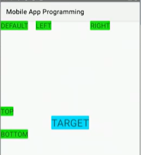
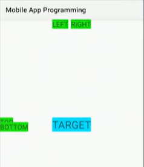
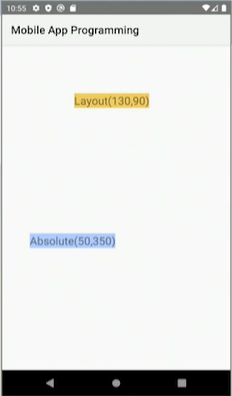
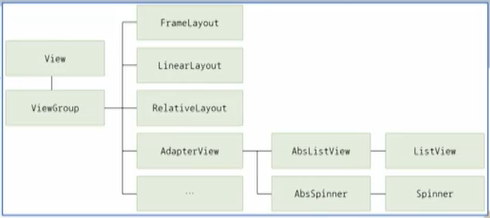

# 모바일앱프로그래밍

## 06. 레이아웃 2

- 컴퓨터과학과 정광식 교수님

---

# (1) RelativeLayout

## 1. RelativeLayout 개요

### RelativeLayout

- ViewGroup에서 View들 사이의 상대적인 관계를 이용하여 View의 위치를 지정하고 배치하는 레이아웃임
- 특정 View와 다른 View 사이의 관계를 지정하려면, 먼저 속성에 다른 '누구'를 지칭하기 위한 식별자가 필요하며 그 '누구'(View)의 ID는 미리 `R.java` 파일에 등록되어 있어야 함
- View의 기본 위치는 부모 레이아웃 공간의 좌측 상단으로 결정됨

## 2. 기준 View와 상대적인 위치

### RelativeLayout의 속성 1

- **기준이 되는 View와의 상대적인 위치를 정의하는 속성값**

| 속성값                  | 설명                    |
|----------------------|-----------------------|
| `layout_above`       | 지정된 View의 위에 배치한다.    |
| `layout_below`       | 지정된 View의 아래에 배치한다.   |
| `layout_toLeftOf`    | 지정된 View의 왼쪽에 배치한다.   |
| `layout_toRightOf`   | 지정된 View의 오른쪽에 배치한다.  |
| `layout_alignLeft`   | 지정된 View와 왼쪽 변을 맞춘다.  |
| `layout_alignTop`    | 지정된 View와 위쪽 변을 맞춘다.  |
| `layout_alignRight`  | 지정된 View와 오른쪽 변을 맞춘다. |
| `layout_alignBottom` | 지정된 View와 아래쪽 변을 맞춘다. |

## 3. 부모 View와 상대적인 위치

### RelativeLayout의 속성 2

- **부모 View와의 상대적인 위치를 정의하는 속성값**

| 속성값                               | 설명                                                      |
|-----------------------------------|---------------------------------------------------------|
| `layout_alignParentLeft`          | `true`이면 부모와 왼쪽 변을 맞춘다.                                 |
| `layout_alignParentTop`           | `true`이면 부모와 위쪽 변을 맞춘다.                                 |
| `layout_alignParentRight`         | `true`이면 부모와 오른쪽 변을 맞춘다.                                |
| `layout_alignParentBottom`        | `true`이면 부모와 아래쪽 변을 맞춘다.                                |
| `layout_alignBaseline`            | 지정한 View와 베이스라인을 맞춘다.                                   |
| `layout_alignWithParentIfMissing` | `layout_toLeftOf` 등의 속성에 대해 기준이 발견되지 않으면 부모를 기준으로 사용한다. |

| 속성값                       | 설명                            |
|---------------------------|-------------------------------|
| `layout_centerHorizontal` | `true`이면 부모의 수평 중앙에 배치한다.     |
| `layout_centerVertical`   | `true`이면 부모의 수직 중앙에 배치한다.     |
| `layout_centerInParent`   | `true`이면 부모의 수평, 수직 중앙에 배치한다. |

### RelativeLayout 예제 1

    <TextView
        android:layout_width="wrap_content"
        android:layout_height="wrap_content"
        android:text="DEFAULT"
        android:id="@+id/defaultView"
        android:textSize="20sp"
        android:background="#1DDB16" />

    <TextView
        android:layout_width="wrap_content"
        android:layout_height="wrap_content"
        android:layout_toLeftOf="@id/target"
        android:text="LEFT"
        android:id="@+id/left"
        android:textSize="20sp"
        android:background="#1DDB16" />

    <TextView
        android:layout_width="wrap_content"
        android:layout_height="wrap_content"
        android:layout_toRightOf="@id/target"
        android:text="RIGHT"
        android:id="@+id/right"
        android:textSize="20sp"
        android:background="#1DDB16" />

    <TextView
        android:layout_width="wrap_content"
        android:layout_height="wrap_content"
        android:layout_above="@id/target"
        android:text="TOP"
        android:id="@+id/top"
        android:textSize="20sp"
        android:background="#1DDB16" />

    <TextView
        android:layout_width="wrap_content"
        android:layout_height="wrap_content"
        android:layout_below="@id/target"
        android:text="BOTTOM"
        android:id="@+id/bottom"
        android:textSize="20sp"
        android:background="#1DDB16" />

### RelativeLayout 예제 1 설명

- 〈프로그램 6.1〉의 최상위 `RelativeLayout` 내부에는 다양한 `TextView`가 구성되어 있음
- `TextView`의 위치는 6번 줄에 구성된 첫 번째 `TextView(TARGET)`를 기준으로 구성됨
- `TARGET`은 `layout_centerInParent` 속성을 이용해 부모 View를 기준으로 위아래 모두 가운데 정렬된 형태로 출력됨
- 모든 `TextView`들은 `layout_above`, `layout_below`, `layout_toLeftOf`, `layout_toRightOf` 속성을 이용하여 `TARGET`(ID: `target`)
  외부를 기준으로 정렬되어 출력됨

### RelativeLayout 예제 1 결과 설명

- ID 속성값이 `left`, `right`인 `TextView`는 `TARGET`을 기준으로 왼쪽, 오른쪽에 위치하고, 상하 기준은 없기 때문에 레이아웃 공간의 상단에 위치함
- ID 속성값이 `top`, `bottom`인 `TextView`는 `TARGET`을 기준으로 위, 아래에 위치하게 되며, 좌우 기준이 없어 레이아웃 공간의 왼쪽에 위치함
- ID 속성값이 `defaultView`인 `TextView`는 `RelativeLayout`과 관련된 속성을 넣지 않아 기본 배치가 적용되어 좌측 상단에 위치함

### RelativeLayout 예제 2

    <RelativeLayout
        xmlns:android="http://schemas.android.com/apk/res/android"
        android:layout_width="match_parent"
        android:layout_height="match_parent"
        android:orientation="vertical">

        <TextView
            android:layout_width="wrap_content"
            android:layout_height="wrap_content"
            android:layout_marginRight="10px"
            android:text="TARGET"
            android:layout_centerInParent="true"
            android:id="@+id/target"
            android:textSize="30sp"
            android:background="#00D8FF" />

    <TextView
        android:layout_width="wrap_content"
        android:layout_height="wrap_content"
        android:layout_alignLeft="@id/target"
        android:text="LEFT"
        android:id="@+id/left"
        android:textSize="20sp"
        android:background="#1DDB16" />

    <TextView
        android:layout_width="wrap_content"
        android:layout_height="wrap_content"
        android:layout_alignRight="@id/target"
        android:text="RIGHT"
        android:id="@+id/right"
        android:textSize="20sp"
        android:background="#1DDB16" />

    <TextView
        android:layout_width="wrap_content"
        android:layout_height="wrap_content"
        android:layout_alignTop="@id/target"
        android:text="TOP"
        android:id="@+id/top"
        android:textSize="20sp"
        android:background="#1DDB16" />

    <TextView
        android:layout_width="wrap_content"
        android:layout_height="wrap_content"
        android:layout_alignBottom="@id/target"
        android:text="BOTTOM"
        android:id="@+id/bottom"
        android:textSize="20sp"
        android:background="#1DDB16" />

### RelativeLayout 예제 2 설명

- RelativeLayout 예제 2의 하위 View들은 `layout_alignLeft`, `layout_alignTop`, `layout_alignRight`, `layout_alignBottom` 속성을 통해
  `TARGET` 내부 크기를 기준으로 정렬됨

### RelativeLayout 예제 2 실행 결과

- ID 속성값이 `left`, `right`인 `TextView`는 `TARGET` 안쪽을 기준으로 왼쪽, 오른쪽에 위치함
- ID 속성값이 `top`, `bottom`인 `TextView`는 `TARGET` 안쪽을 기준으로 위, 아래에 위치하고 있음

## 4. RelativeLayout의 제약사항

### 제약 사항

- RelativeLayout에서 어떤 View는 상대적인 위치를 결정하기 위해 다른 View에 종속적일 경우가 발생됨
    - 기준이 되는 다른 View가 먼저 정의되어 있어야 종속되는 View의 위치가 결정될 수 있음
- LinearLayout과는 달리 사용자의 화면에 보이는 View의 순서와 레이아웃 XML 상의 View의 정의 순서가 다를 수 있음
- 화면에 출력되는 순서와 무관하게 View 사이의 종속적인 위치만 고려하여 여러 View끼리의 관계를 정의하다 보면, 대체되는 배치를 찾기 어렵거나 유지 보수에 어려움이 발생할 수 있음
- 레이아웃에서 종속되는 View는 원래 기준이 되는 View가 삭제되거나 위치를 이동하게 되면, 종속되는 View는 원하는 위치를 결정하지 못하게 됨
- 실수로 레이아웃상의 View의 종속관계를 혼동하게 되어 논리적인 모순에 빠지게 되기도 함

---

# (2) AbsoluteLayout

## 1. AbsoluteLayout 개요

### AbsoluteLayout

- 의미상으로는 절대적인 위치 지정이 가능한 레이아웃으로 `RelativeLayout`의 반대 속성을 가지는 레이아웃임
- 이름 그대로 관계나 순서에 상관없이 지정한 절대 좌표에 자식 View를 배치함
- 자식 View의 좌표를 `layout_x`, `layout_y` 속성으로 지정해 놓으면 부모의 좌상단(0,0)을 기준으로 한 좌표에 View가 배치됨

### AbsoluteLayout 예제

    <AbsoluteLayout
        xmlns:android="http://schemas.android.com/apk/res/android"
        android:layout_width="match_parent"
        android:layout_height="match_parent">

        <TextView
            android:layout_width="wrap_content"
            android:layout_height="wrap_content"
            android:layout_x="50dip"
            android:layout_y="350dip"
            android:text="Absolute(50, 350)"
            android:textSize="20sp"
            android:background="#B2CCFF" />

### AbsoluteLayout 예제 핵심 속성 정리

- `android:layout_x="50dip"`
- `android:layout_y="350dip"`
- `android:text="Absolute(50, 350)"`
- `android:layout_x="130dip"`
- `android:layout_y="90dip"`
- `android:text="Layout(130, 90)"`

---

# (3) FrameLayout

## 1. FrameLayout 개요

### FrameLayout

- View를 배치하는 규칙이 따로 없고 모든 자식 View가 `FrameLayout`의 좌측 상단에 나타나는 레이아웃임
- 자식 View가 두 개 이상일 때는 추가된 순서대로 겹쳐서 표시되는 특징을 가지고 있음
- 먼저 XML 코드에 정의된 자식 View가 아래에 위치하고, 나중에 추가된 자식 View가 위쪽에 겹쳐 출력됨
- 즉, XML 코드에 정의한 순서로 아래부터 자식 View가 놓이게 됨
- ViewGroup의 서브클래스로서 레이아웃이므로 실행 중에 자식 View를 관리할 수 있음
- 자식 View 하나만 선택적으로 나타나게 할 수도 있음

## 2. FrameLayout 속성

### FrameLayout 속성

| 속성값                  | 설명                                                                                  |
|----------------------|-------------------------------------------------------------------------------------|
| `foreground`         | 자식의 앞쪽에 살짝 얹는 이미지를 지정함                                                              |
| `foregroundGravity`  | `foreground` 이미지의 위치를 결정함                                                           |
| `measureAllChildren` | 레이아웃 크기 결정을 모든 자식 View의 크기에 맞출지, `visibility` 속성이 `visible`로 설정된 자식 View에만 맞출지를 결정함 |

## 3. FrameLayout 예제 1

### FrameLayout 예제

    <FrameLayout
        xmlns:android="http://schemas.android.com/apk/res/android"
        android:layout_width="match_parent"
        android:layout_height="match_parent">

        <ImageView
            android:id="@+id/img1"
            android:layout_width="wrap_content"
            android:layout_height="wrap_content"
            android:src="@drawable/banana" />

        <ImageView
            android:id="@+id/img2"
            android:layout_width="wrap_content"
            android:layout_height="wrap_content"
            android:src="@drawable/earth" />
    </FrameLayout>

### FrameLayout 예제 설명

- 〈프로그램 6.4〉에서 2개 자식 View의 `visibility` 속성을 따로 지정하지 않았으므로 모두 보이는 상태임
- 자식 View가 좌측 상단에 나타나는 `FrameLayout`의 특징에 따라 두 개의 View가 겹쳐서 보임
- `FrameLayout` 내부의 5번 줄에 바나나를 출력하는 `ImageView`가 구성되어 있음
- 다음으로 10번 줄에 지구를 출력하는 `ImageView`가 구성되어 있음
- `FrameLayout`은 구성되는 순서에 따라 위로 겹쳐지는 형태를 가지기 때문에 지구 이미지가 바나나 이미지를 가리게 되는 결과가 됨

---

## 정리하기

1. **RelativeLayout**
    - 부모와의 관계 또는 View끼리의 관계를 지정함으로써 자식을 배치하는 레이아웃

2. **AbsoluteLayout**
    - 관계나 순서에 상관없이 지정한 절대 좌표에 자식 View를 배치하는 레이아웃

3. **FrameLayout**
    - 자식을 배치하는 규칙이 따로 없고, 모든 자식은 프레임의 좌상단에 나타나며 추가된 순서대로 겹쳐서 표시하는 레이아웃

---

## 연습문제

### Q1. View와 부모 View와의 관계 또는 View끼리의 관계를 지정함으로써 자식 View를 배치하는 레이아웃은 무엇인가?

**정답: ① RelativeLayout**

- `RelativeLayout`은 자식 View를 부모 기준(위/아래/좌/우/가운데) 또는 다른 View 기준(A의 오른쪽, B의 아래 등)으로 배치하며, 관계를 선언해 배치하므로 화면 구성에 직관적일 수 있음

- **안드로이드 예시 문법**
  android:layout_below="@id/target"

- **오답 정리**
    - `AbsoluteLayout`
        - 자식 View를 절대 좌표(x, y)로 배치함
        - 화면 크기, 해상도, 기기별로 깨지기 쉬워 deprecated(사용 비권장) 됨
        - 관계 기반 배치가 아니라 좌표 기반 배치이므로 오답
        - 예:
          android:layout_x="100dip"
          android:layout_y="200dip"

    - `FrameLayout`
        - 자식 View들을 겹쳐 쌓는(stack) 방식
        - 기본적으로 왼쪽 위에 쌓이고, View 간 관계로 배치하는 레이아웃은 아님
        - 예:
          android:foreground="@drawable/sample"

    - `LinearLayout`
        - 자식 View를 한 방향(가로 또는 세로)으로 순서대로 나열함
        - 관계 기반이 아니라 직렬(일렬) 배치이므로 오답
        - 예:
          android:orientation="vertical"

### Q2. 차일드 View를 배치하는 규칙이 따로 없고 모든 차일드 View는 레이아웃의 좌상단에 나타나며 추가된 순서대로 겹쳐서 표시하는 레이아웃은 무엇인가?

**정답: ③ FrameLayout**

- `FrameLayout`은 자식 View들을 겹쳐 쌓는(stack) 방식의 레이아웃임
- 기본적으로 왼쪽 위에 쌓이고, 나중에 추가된 View가 위에 표시됨

- **안드로이드 예시 문법**
  <FrameLayout
  android:layout_width="match_parent"
  android:layout_height="match_parent">

- **오답 정리**
    - `RelativeLayout`
        - 자식 View를 부모 기준 또는 다른 View 기준으로 상대 배치함
        - 예:
          android:layout_toRightOf="@id/target"

    - `AbsoluteLayout`
        - 자식 View를 절대 좌표(x, y)로 배치함
        - 예:
          android:layout_x="50dip"
          android:layout_y="350dip"

    - `LinearLayout`
        - 자식 View를 가로 또는 세로 방향으로 순서대로 나열함
        - 예:
          android:orientation="horizontal"