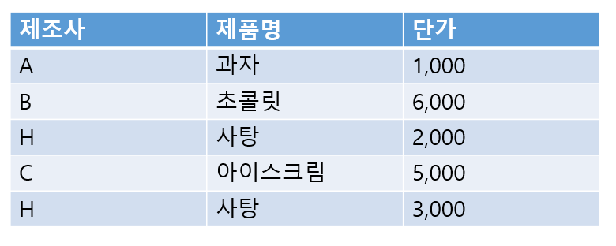
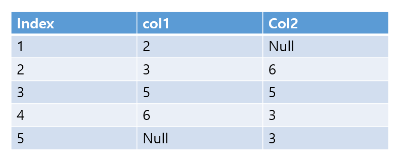

## 2022년 2회 정보처리기사 실기 기출문제

>공부는 박초보님의 티스토리로 공부합니다!  
>[링크는 여기로!](https://chobopark.tistory.com/291)  
>모르는 상태에서 문제를 풀고 틀린 문제 체크하고 다시 푸는 방식으로 공부 예정입니다.

>문제  
>`정답`  
>키워드 형식으로 구성

1. 다음은 관계 데이터 모델에 대한 설명이다. 괄호안에 들어가는 용어를 작성하시오.
  >( )은 /는 관계 데이터의 연산을 표현하는 방법으로, 원하는 정보를 정의할 때는 계산 수식을 사용한다.  
수학의 predicate calculus(술어 계산)에 기반을 두고 있으며, 관계 데이터 모델의 제안자인 codd가 수학에 가까운 기반을 두고 특별히 관계 데이터베이스를 위해 제안하여 탄생하였다.  
( ) /은/는 원하는 정보가 무엇이라는 것만 정의하는 비절차적 특성을 지니며, 튜블 ( )와/과 도메인 ( ) 이/가 있다.
- `관계해석`
- 관계 데이터의 연산을 표현하는 방법 / 데이터베이스 비절차적 특성 / 튜플 관계해석과 도메인 관계해석이 있음

 

2. 다음은 대칭 키 알고리즘에 대한 설명이다. 해당 설명에 맞는 용어를 보기에 골라 작성하시오.

>(1). Xuejia Lai와 James Messey 가 만든 알고리즘으로 PES(Proposed Encryption Standard)에서 IPES(Improved PES)로 변경되었다가, 1991년에 제작된 블록 암호 알고리즘으로 현재 국제 데이터 암호화 알고리즘으로 사용되고 있다. 64비트 블록을 128비트의 key를 이용하여 8개의 라운드로 구성되어 있다.
- `IDEA`
- 1991년 제작된 블록 암호 알고리즘 / 현재 국제 데이터 암호화 알고리즘 / 128비트의 key를 이용하여 8라운드로 구성

 

>(2). 미국의 NSA에서 개발한 Clipper 칩에 내장되는 블록 알고리즘이다. 전화기와 같은 음성을 암호화 하는데 주로 사용되며 64비트 입출력에 80비트의 키 총 32라운드를 가진다.
- `SKIPJACK`
- 미국의 NSA에서 개발 / Clipper 칩에 내장되는 블록 알고리즘 / 전화기와 같은 음성을 암호화에 사용 / 64비트 입출력에 80비트의 키 총 32라운드를 가진다.

 

3. H회사의 전체 제품 단가 보다 큰 제품 출력을 하고자 한다. 괄호안에 들어갈 알맞는 용어를 작성하시오.

>SELECT 제조사, 제품명, 단가  
FROM 제품  
WHERE 단가 > ( ) (SELECT 단가 FROM 제품 WHERE 제조사='H')
- `ALL`
- 해설 요망

 

4. 다음 SQL 결과에 알맞는 답을 작성하시오.

>SELECT count(col2)  
>FROM TABLE  
>WHERE col1 in(2,3) or col2 in(3,5);
- 4
- 해설 요망