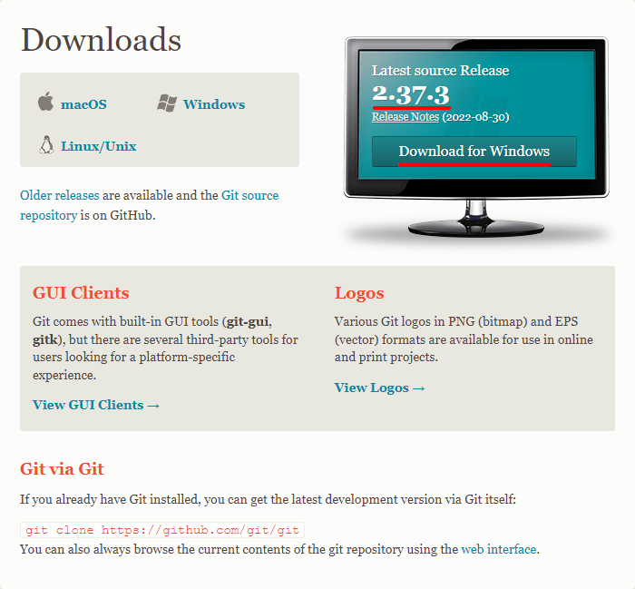

# Git bash 설치하기

- 국비학원 당시 주로 노트북으로 작업하다보니 왠만한 프로그램들은 노트북에 있었습니다. 노트북 사양도 오래되다보니 작업시 답답한 점 때문에 작업 환경을 컴퓨터에서 하고 싶었습니다.
- 기존에 VS code는 설치가 되있었고 터미널에서 연결만하면 되기에 Git bash 설치를 하겠습니다. ~~(eclipse git보다 git bash가 편했던 1인)~~

## 1. Git bash 다운로드 및 설치하기

<hr>



- [git-scm](https://git-scm.com/downloads) 해당 사이트로 들어가서 다운 받습니다. <u>(버전도 참고하기)</u>

<br>

## 2. 버전 확인하기

<hr>


- 설치 후 Git Bash에서 버전이 맞게 설치 되었는지 테스트를합니다.
```
git --version
```

- 협업시 윈도우와 맥에서 엔터 방식 차이로 인한 오류를 방지하기 위하여 아래 명령어도 작성합니다.
- 참고 : [git 에서 CRLF 개행 문자 차이로 인한 문제 해결하기 - lesstif.com](https://www.lesstif.com/gitbook/git-crlf-20776404.html)
```
git config --global core.autocrlf true 
```

## 3. VS code에서 터미널 열기

- VS code 실행 후 ``ctrl + ` ``를 눌러 터미널을 열어줍니다.ㅋㅋ