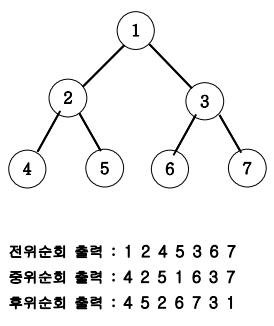

# 07_05. 이진트리 순회(깊이우선탐색)

## 01. 문제

### # 설명

- 아래 그림과 같은 이진트리를 전위순회와 후위순회를 연습해보세요.



### # 이진트리

- 1번은 부모 노드
  - 2번은 왼쪽 자식 노드 / 3번은 오른쪽 자식 노드
- 1번이라는 첫 출발을 루트 노드라고 한다.

- 전위순회
  - `부모` -> 왼쪽 -> 오른쪽
  - 부모 먼저 출력한다.
- 중위순회
  - 왼쪽 -> `부모` -> 오른쪽
  - 부모는 왼쪽 자식이 출력 되고나서 출력한다.
- 후위순회
  - 왼쪽 -> 오른쪽 -> `부모`
  - 부모는 왼쪽 자식 출력 후 오른쪽 자식까지 출력하고서 출력한다.
  - ex). 병합정렬

---

## 02. 풀이

### # 코드

```java
//java
class Node{
    int data;
    //주소 lt, rt
    Node lt, rt;
    public Node(int val){
        data = val;
        lt = rt = null;
    }
}

public class Main07_05 {
    Node root;
    //DFS()의 파라미터는 번지수
    public void DFS(Node root){
        //말단 끝자락 노드
        if(root == null){
            return;
        } else {
            //전위 순회
            //부모 -> 왼쪽 자식 -> 오른쪽 자식
            System.out.print(root.data + " ");
            DFS(root.lt);
            DFS(root.rt);

            //중위 순회
            //왼쪽 자식 -> 부모 -> 오른쪽 자식
            //DFS(root.lt);
            //System.out.print(root.data + " ");
            //DFS(root.rt);

            //후위 순회
            //왼쪽 자식 -> 오른쪽 자식 -> 부모
            //DFS(root.lt);
            //DFS(root.rt);
            //System.out.print(root.data + " ");
        }
    }

    public static void main(String[] args){
        Main07_05 main = new Main07_05();
        main.root = new Node(1);
        main.root.lt = new Node(2);
        main.root.rt = new Node(3);
        main.root.lt.lt = new Node(4);
        main.root.lt.rt = new Node(5);
        main.root.rt.lt = new Node(6);
        main.root.rt.rt = new Node(7);
        main.DFS(main.root);
    }
}
```

---

### 코드의 그림

.png)

---

## 03. 핵심

- 이진트리순회(DFS : Depth-First Search)
- 경우의 수 관련 문제에 활용 된다.
