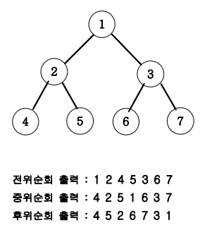

# 07_07. 이진트리 레벨탐색(BFS : Breadth-First Search)

## 01. 문제

### # 설명

- 아래 그림과 같은 이진트리를 전위순회와 후위순회를 연습해보세요.



---

## 02. 풀이

### # 코드

```java
//java
import java.util.LinkedList;
import java.util.Queue;
import java.util.Scanner;

class Nodes{
    int data;
    //주소 lt, rt
    Nodes lt, rt;
    public Nodes(int val){
        data = val;
        lt = rt = null;
    }
}
public class Main07_07 {
    Nodes root;
    public void BFS(Nodes root){
        Queue<Nodes> Q = new LinkedList<>();
        Q.offer(root);
        int L=0;
        //비어 있지 않으면 참!
        //비어 있으면 거짓으로 while문 탈출!
        while (!Q.isEmpty()) {
            int len = Q.size();
            System.out.print(L + " : ");
            for(int i=0; i<len; i++){
                Nodes cur = Q.poll();
                System.out.print(cur.data + " ");
                //말단 노드가 null이 아니라면? -> 해당 lt, rt를 넣기
                if (cur.lt != null) {
                    Q.offer(cur.lt);
                }
                if (cur.rt != null) {
                    Q.offer(cur.rt);
                }
            }
            //다음 레벨
            L++;
            System.out.println();
        }
    }

    public static void main(String[] args){
        Main07_07 main = new Main07_07();
        Scanner sc = new Scanner(System.in);
        main.root = new Nodes(1);
        main.root.lt = new Nodes(2);
        main.root.rt = new Nodes(3);
        main.root.lt.lt = new Nodes(4);
        main.root.lt.rt = new Nodes(5);
        main.root.rt.lt = new Nodes(6);
        main.root.rt.rt = new Nodes(7);
        main.BFS(main.root);
    }
}
```

---

## 03. 핵심

- 루트 노드(1)는 0레벨
- 2, 3은 1레벨
- 4, 5, 6, 7은 2레벨에 해당 된다.
