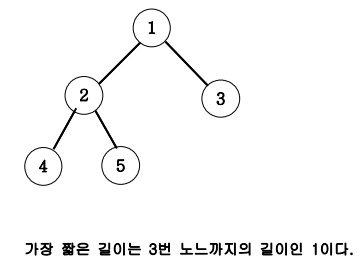

# 07_09. Tree 말단노드까지의 가장 짧은 경로(DFS)

## 01. 문제

### # 설명

- 아래 그림과 같은 이진트리에서 루트 노드 1에서 말단노드까지의 길이 중 가장 짧은 길이를
구하는 프로그램을 작성하세요.
- 각 경로의 길이는 루트노드에서 말단노드까지 가는데 이동하는 횟수를 즉 간선(에지)의 개수를
길이로 하겠습니다.



---

## 02. 풀이

### # 코드

```java
//java
import java.util.Scanner;

class Node9{
    int data;
    Node9 lt, rt;
    public Node9 (int val){
        data = val;
        lt = rt= null;
    }
}

class Main07_09 {
    Node9 root;
    //Node9 root가 말단 노드라면 L을 return하기
    public int DFS(int L, Node9 root){
        //말단 노드인지 확인하기
        if (root.lt == null && root.rt == null) {
            return L;
        } else {
            return Math.min(DFS(L + 1, root.lt), DFS(L + 1, root.rt));
        }
    }

    public static void main(String[] args){
        Main07_09 main = new Main07_09();
        Scanner sc = new Scanner(System.in);
        main.root = new Node9(1);
        main.root.lt = new Node9(2);
        main.root.rt = new Node9(3);
        main.root.lt.lt = new Node9(4);
        main.root.lt.rt = new Node9(5);
        //main.DFS(레벨, 100번지)
        System.out.println(main.DFS(0, main.root));
    }
}
```

---

## 03. 핵심

- D(0레벨, 100번지) 시작
- lt인 D(1,200) -> D(2, 400) 도달 후 lt, rt가 null이기에 int L에 2를 return 시킴
- 다시 D(2, 500) 도달 후 lt, rt가 null이기에 int L에 2를 return하고 D(1, 200)으로 감
- D(0, 100)까지 되돌아간 후 rt인 D(1, 300) 함수를 실행
- D(1, 300) lt, rt가 null이기에 Math.min()의 최소값으로 1이 출력된다.
