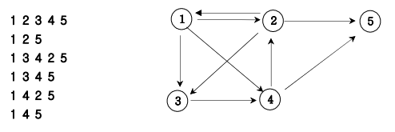

# 07_12. 경로탐색(DFS)

## 01. 문제

### # 설명

- 방향그래프가 주어지면 1번 정점에서 N번 정점으로 가는 모든 경로의 가지 수를 출력하는 프로그램을 작성하세요. 아래 그래프에서 1번 정점에서 5번 정점으로 가는 가지 수는 총  6가지 입니다.



### # 입력

- 첫째 줄에는 정점의 수 N(1<=N<=20)와 간선의 수 M가 주어진다. 그 다음부터 M줄에 걸쳐 연
결정보가 주어진다.

### # 출력

- 총 가지수를 출력한다.

### # 예상 입력 및 출력

- 입력
  - `5 9`
</br>`1 2`
</br>`1 3`
</br>`1 4`
</br>`2 1`
</br>`2 3`
</br>`2 5`
</br>`3 4`
</br>`4 2`
</br>`4 5`

- 출력
  - `6`

---

## 02. 풀이

### # 코드

```java
//java
import java.util.Scanner;

class Main07_12 {
    //main에서 접근하기 위해 전역변수 선언
    static int n, m, answer=0;
    static int[][] graph;
    static int[] ch;

    public void DFS(int v){
        if (v == n) {
            answer++;
        } else {
            for (int i = 1; i <= n; i++) {
                //v에서 i로 갈 수 있는 경로면서
                //ch[i]로 방문하지 않았다면 실행하는 if문
                if (graph[v][i] == 1 && ch[i] == 0) {
                    ch[i] = 1;
                    DFS(i);
                    //DFS(i)를 갔다가 뒤로 오는 시점에서 ch[i]=0으로 초기화
                    ch[i] = 0;
                }
            }
        }
    }

    public static void main(String[] args){
        Main07_12 main = new Main07_12();
        Scanner sc = new Scanner(System.in);
        n = sc.nextInt();
        m = sc.nextInt();

        graph = new int[n+1][n+1];
        ch = new int[n + 1];
        for(int i=0; i<m; i++){
            //a에서 b로 간다는 방향그래프
            //갈 수 있는 경로에 1을 넣어준다.
            int a = sc.nextInt();
            int b = sc.nextInt();
            graph[a][b] = 1;
        }
        //1번 노드=1 / 출발점 1
        ch[1]=1;
        main.DFS(1);
        System.out.println(answer);
    }
}
```

---

## 03. 핵심

- 경로 탐색은 한 번 방문한 노드는 재방문하면 안 된다.
- check배열을 만들어서 방문했던 노드는 1을 입력한다.
- DFS에서 정점까지 간 후 되돌아가면서 check배열의 1을 0으로 바꿔준다.
