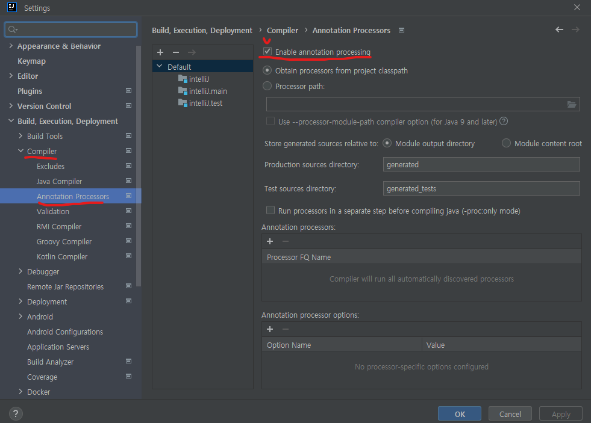

# 스프링부트에서 테스트 코드를 작성하자

## 롬복 소개 및 설치하기

- 자바 개발자들의 필수 라이브러리
- Getter, Setter, 기본생성자, toString 등을 어노테이션으로 자동 생성해 준다.

### # build.gradle에 롬복 추가하기

- build.gradle -> dependencies {}
- `implementation ('org.projectlombok:lombok')` 추가
- Gradle에서 새로고침하여 라이브러리 내려받기
- 플러그인에서 Lombok 검색 후 설치하기
- 마지막으로 `Enable annotation procession` 체크하기

- 참고
  - 롬복은 프로젝트마다 설정해야 한다.
    - build.gradle에 라이브러리를 추가하는 것과 Enable annotation procession를 체크하는 것은 프로젝트마다 진행해야 한다.
  - 플러그인 설치는 한 번만 하면 된다.

### # 단축키

- `ctrl + shift + a` = Action 후 plugin 검색
