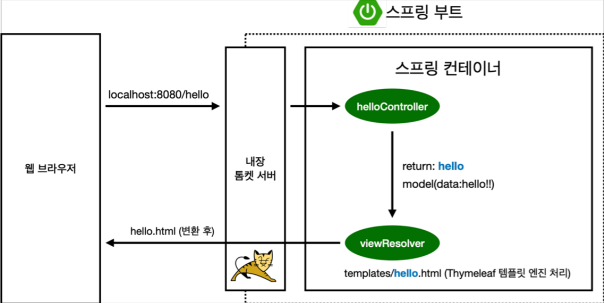

# 스프링 입문 스프링부트

## 프로젝트 환경설정

### View 환경설정

- Project Structure (ctrl + alt + shift + s)
  - project - project SDK에서 설치한 java 버전으로 설정

### Welcome Page 만들기

- resources/static/index.html 경로에 파일 생성
- 정적페이지 생성 (파일만 던져줌)

```html
//html
<!DOCTYPE HTML>
<html>
<head>
    <title>Hello</title>
    <meta http-equiv="Content-Type" content="text/html; charset=UTF-8" />
</head>
<body>
Hello
<a href="/hello">hello</a>
</body>
</html>
```

### thymeleaf 템플릿 엔진

- thymeleaf 템플릿 엔진 정적페이지를 원하는 형태로 바꿀수 있음
- [thymeleaf 사이트](https://www.thymeleaf.org/)
- [스프링 공식 튜토리얼](https://spring.io/guides/gs/serving-web-content/)
- [스프링부트 메뉴얼](https://spring.io/projects/spring-boot#learn)
- 해당 버전을 찾고 ctrl+f 하여 해당 목록 찾기

- hello.hellospring.controller/HelloController 경로에 HelloController 클래스 생성

```java
@Controller
public class HelloController {
  @GetMapping("hello")
  public String hello(Model model) {
  model.addAttribute("data", "hello!!");
  return "hello";
  }
}
```

>- 웹 어플리케이션에서 `/hello`라고 들어오면 `@GetMapping`의 `hello()` 메서드를 호출한다.

- resources/templates/hello.html 생성

```html
<!DOCTYPE HTML>
<html xmlns:th="http://www.thymeleaf.org">
<head>
 <title>Hello</title>
 <meta http-equiv="Content-Type" content="text/html; charset=UTF-8" />
</head>
<body>
<p th:text="'안녕하세요. ' + ${data}" >안녕하세요. 손님</p>
</body>
</html>
```

- `<html xmlns:th="http://www.thymeleaf.org">`로 thymeleaf 문법 사용이 가능해짐
- `<p th:text="'안녕하세요. ' + ${data}" >`의 `${data}`가 위에 `model.addAttribute("data", "hello!!");`의 `hello!!`로 치환된다.

---



- 웹 브라우저에서 localhost:8080/hello를 던지면
- 스프링 부트는 내장하고 있는 톰켓 서버에서 받고
- '/hello'를 인식하고 @GetMapping("hello")와 매칭한 후
- 그 메서드를 실행하는데
- 파라미터인 model을 받아서 "data"인 "hello!!"를 넘겨준다.
- 그 넘겨주는 대상은 return "hello"; 가 된다.
- templates/hello.html을 찾아 Thymeleaf 템플릿 엔진 처리를 한다.

- 컨트롤러에서 리턴 값으로 문자를 반환하면 뷰 리졸버('viewResolver')가 화면을 찾아서 처리한다.
  - 스프링 부트 템플릿엔진 기본 viewName 매핑
  - resources:templates/ +{ViewName}+ .html

>- 참고: spring-boot-devtools 라이브러리를 추가하면, html 파일을 컴파일만 해주면 서버 재시작 없이
View 파일 변경이 가능하다.
>- 인텔리J 컴파일 방법: 메뉴 build Recompile
