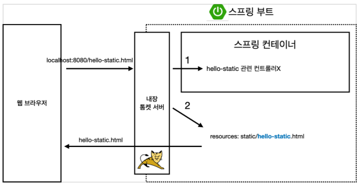

# 스프링 입문 스프링부트

## 스프링 웹 개발 기초

### 정적 컨텐츠

- 파일을 그대로 전달해줌

### # ex

- `resources/static/hello-static.html` 경로에 파일을 만들어보자

```html
<!DOCTYPE HTML>
<html>
<head>
  <title>static content</title>
  <meta http-equiv="Content-Type" content="text/html; charset=UTF-8" />
</head>
<body>
정적 컨텐츠 입니다.
</body>
</html>
```

- 구동시키고 브라우저에서 `http://localhost:8080/hello-static.html` 들어가기.

---



- 큰 그림으로 보기
  - 웹 브라우저에 `localhost:8080/hello-static.html`를 치니까
  - 내장 톰켓 서버가 먼저 요청을 받고 스프링 컨테이너에게 넘겨준다.
    - `hello-static`이 컨트롤러에 있는지 찾는다. (컨트롤러가 우선순위를 갖는다.)
  - 없다면 `resources:static/hello-static.html`을 찾는다.
    - `resources:static/hello-static.html`가 있는 걸 확인했으니 `hello-static.html`을 반환한다.

### MVC와 템플릿 엔진

- 데이터를 변형, 가공 함

### API

- JSON 구조 포멧으로 전해줌

### # 단축키

- `ctrl + f5` = rerun / 서버 재구동
