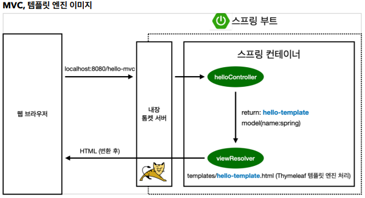

# 스프링 입문 스프링부트

## 스프링 웹 개발 기초

### # MVC와 템플릿 엔진

- 과거에는 MODEL 1방식으로 View에서 다 처리함.

### # View와 Controller

- View
  - view는 화면을 그리는데 집중해야 함
- Controller
  - 비즈니스 로직 관련을 처리하는데 목적을 두어야 함

```java
//java
@GetMapping("hello-mvc")
public String helloMvc(@RequestParam("name") String name, Model model){
  model.addAttribute("name", name);
}
```

- 파라미터에서 넘어온 name을 넘긴다.

- `resources/templates/hello-template.html` 경로에 파일 생성

```html
<html xmlns:th="http://www.thymeleaf.org">
<body>
<p th:text="'hello ' + ${name}">hello! empty</p>
</body>
</html>
```

- `<p th:text="'hello ' + ${name}">hello! empty</p>`
  - 파일만 열어보면 p태그 안의 `hello! empty`가 나온다.
  - 구동을 하게 되면 `"'hello ' + ${name}"`에서 ${name}이 변환 되어 나온다.

---

### 구동하기

- 서버 구동 후 `http://localhost:8080/hello-mvc`로 접속하면 IntelliJ 콘솔에 `Required request parameter 'name'`이라고 찍힌다.

```java
//java
@GetMapping("hello-mvc")
public String helloMvc(@RequestParam(value = "name", required = false) String name, Model model){
    model.addAttribute("name", name);
    return "hello-template";
}
```

- 기존 작성 된 helloMvc 메서드의 파라미터를 수정한다.
  - `value = "name", required = false`
- 그리고 `http://localhost:8080/hello-mvc?name=spring~`이라고 브라우저에 검색하면!
- `hello spring~`이 화면에 출력 될 것이다.

### # 동작 방식

- 브라우저 창에 `hello-mvc?name=spring~`으로 spring~이 넘어가면
- Controller의 helloMvc 메서드 파라미터에서 `name`이 `spring~`으로 바뀐다.
- 그리고 hello-template에 return하면 ${name}이 받아 변환 된다.
  - model의 key 값인 "name" -> html의 ${name}을 찾아서
  - model의 value 값인 name -> spring~으로

---



- 웹 브라우저에 `http://localhost:8080/hello-mvc`를 넘기면
- 스프링 부트를 뛰울 때 같이 뛰우는 내장 톰켓 서버를 거친다.
- 스프링 컨테이너의 `helloController`에서 `hello-mvc`를 발견하고
- return할때 `hello-template`으로 그리고 name은 spring으로 담아서
- `viewResolver`를 통해 화면을 해결해준다. (화면에 연결 개념)
- `templates/hello-template.html`을 찾아 변환한 HTML을 웹 브라우저에 넘겨준다.

### # 단축키

- `ctrl + p` - Parameter Info
