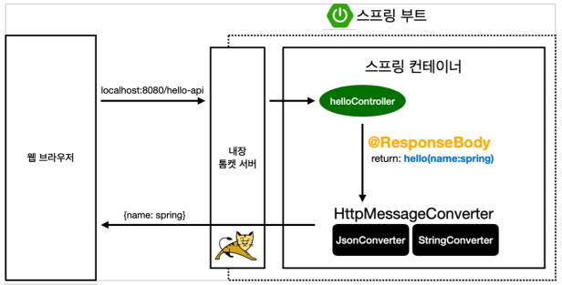

# 스프링 입문 스프링부트

## 스프링 웹 개발 기초

### # API

- HelloController.java에 아래 메서드 작성

```java
//java
@Controller
public class HelloController {
  @GetMapping("hello-string")
  @ResponseBody
  public String helloString(@RequestParam("name") String name) {
  return "hello " + name;
  }
}
```

- `@ResponseBody`
  - HTML Body 부분에 자신이 직접 데이터를 넣어주겠다는 의미
    - @RequestParam에 Spring~!이라고 들어왔다면
    - hello Spring~!으로 나온다.
  - HTML 소스보기로 들어간다면 HTML 내용이 아닌 문자 그대로 나온다.
- @ResponseBody 를 사용하면 뷰 리졸버( viewResolver )를 사용하지 않음
- 대신에 HTTP의 BODY에 문자 내용을 직접 반환(HTML BODY TAG를 말하는 것이 아님)

---

### # @ResponseBody 객체 반환

- helloApi 메서드를 추가하자.

```java
//java
@Controller
public class HelloController {
  @GetMapping("hello-api")
  @ResponseBody
  //아래 부분이 API 방식
  public Hello helloApi(@RequestParam("name") String name) {
    Hello hello = new Hello();
    hello.setName(name);
    return hello;
  }
  static class Hello {
    private String name;
    //getter, setter
    public String getName() {
    return name;
  }
  public void setName(String name) {
    this.name = name;
    }
  }
}
```

- `http://localhost:8080/hello-api?name=spring` 구동하면
  - `{"name":"spring"}` JSON 형식으로 나온다.
- JSON이란 간략히
  - key와 value로 이루어진 값이다.
- `<html>`열고 `</html>`닫는 xml형식은 오래전이다.
- 이제는 JSON을 써야한다.
  - XML보다 최소한의 용량으로 데이터 전송이 가능하기 때문에!

---

### # getter / setter

```java
//java
static class Hello {
  private String name;
  //getter, setter
  public String getName() {
  return name;
}
```

- `private String name;`은 외부에서 꺼낼 수 없다.
- 자바 빈 규약으로써 `멤버변수에 접근 가능한 getter 와 setter 메서드가 존재해야 한다.`
- 프로퍼티 접근 방식이라고도 한다.
- 참고 - [[JAVAEE] 자바빈(JavaBean) 이란? 자바빈 규약에 대해](https://dololak.tistory.com/133)

---



- 웹 브라우저에 `http://localhost:8080/hello-api`를 치면
- 톰켓 내장 서버에서 `hello-api`가 왔다면서 스프링으로 던진다.
- 그 다음 스프링은 `hello-api`가 있는지 확인하는데
- `@ResponseBody`가 붙어있는 것을 보고
- 객체가 오면 JSON 방식으로 데이터를 만들어서
- HTTP 응답에 반환하겠다는 의미다.
  
- `@ResponseBody` 를 사용
  - HTTP의 BODY에 문자 내용을 직접 반환
  - `viewResolver` 대신에 `HttpMessageConverter` 가 동작
  - 기본 문자처리: `StringHttpMessageConverter`
  - 기본 객체처리: `MappingJackson2HttpMessageConverter`
  - byte 처리 등등 기타 여러 `HttpMessageConverter`가 기본으로 등록되어 있음

### # 단축키

- `alt + Insert` = getter/setter/생성자 자동완성 (Generate)
