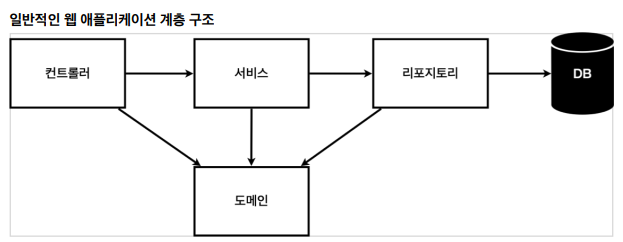

# 스프링 입문 스프링부트

## 회원관리 예제 - 백엔드 개발

### # 비즈니스 요구사항 정리

- 데이터 : 회원 ID, 이름
- 기능 : 회원 등록, 조회
- 아직 데이터 저장소가 선정 되지 않음(가상의 시나리오)

### # 일반적인 웹 애플레케이션 계층 구조

- 컨트롤러: 웹 MVC의 컨트롤러 역할
  - API를 만든다거나
- 서비스: 핵심 비즈니스 로직 구현
  - 회원은 중복가입이 안된다거나
- 리포지토리: 데이터베이스에 접근, 도메인 객체를 DB에 저장하고 관리
- 도메인: 비즈니스 도메인 객체, 예) 회원, 주문, 쿠폰 등등 주로 데이터베이스에 저장하고 관리됨

### # 클래스 의존 관계

.png)

- 아직 데이터 저장소가 선정되지 않아서, 우선 인터페이스로 구현 클래스를 변경할 수 있도록 설계
- 데이터 저장소는 RDB, NoSQL 등등 다양한 저장소를 고민중인 상황으로 가정
- 개발을 진행하기 위해서 초기 개발 단계에서는 구현체로 가벼운 메모리 기반의 데이터 저장소 사용

---

- 비즈니스 요구사항 관련하여 가볍게 볼 수 있었던 점.
