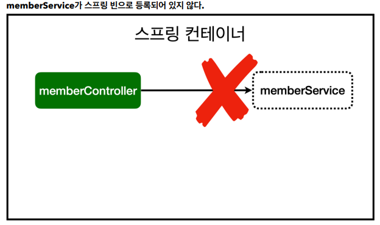

# 스프링 입문 스프링부트

## 스프링 빈과 의존관계

### 컴포넌트 스캔과 자동 의존관계 설정

### # 코드

```java
package hello.hellospring.controller;


import hello.hellospring.service.MemberService;
import org.springframework.beans.factory.annotation.Autowired;
import org.springframework.stereotype.Controller;

//spring 처음 시작할 때
//spring 컨테이너라는 통이 생기고
//@Controller가 있는 메서드가 있다면
//MemberController 객체를 생성하고 통에 넣어둔다
//그리고 spring이 관리를 한다
@Controller
public class MemberController {

    //private final MemberService memberService = new MemberService();
    //MemberService 가져다 쓰기위해 new로 생성
    //하지만 딱히 엄청 많은 다양한 기능이 있는 것도 아니기에
    //공용으로 쓰는 편이 좋다.

    //그래서 spring 컨테이너에 등록을 하는게 좋다.
    //생성자를 통해 호출(@Autowired)
    private final MemberService memberService;

    @Autowired
    public MemberController(MemberService memberService) {
        this.memberService = memberService;
    }
}
```

- `의존성 주입`
  - DI (Dependency Injection)
  - 생성자에 @Autowired 가 있으면 스프링이 연관된 객체를 스프링 컨테이너에서 찾아서 넣어준다.
  - 이렇게 객체 의존관계를 외부에서 넣어주는 것
    - 이전 테스트에서는 개발자가 직접 주입하였고
    - 여기서는 @Autowired에 의해 스프링이 주입해준다.

- 실행 시

>- Consider defining a bean of type 'hello.hellospring.service.MemberService' in your configuration.



- MemberService 클래스 같은 경우 순수한 자바 상태이다.
- Spring이 알 수 있는 방법이 없다.
- 그래서 MemberService 상단에 @Service 어노테이션을 넣어야한다.
- 또한, Repository도 상단에 @Repository를 넣어야한다.
- 정형화 된 패턴이다.
  - 컨트롤러를 통해 외부요청을 받기
  - 서비스에서 비즈니스 로직 만들기
  - 레포지토리에서 데이터를 저장하기

### # 스프링 빈 등록

.png)

- @Autowired 사용 후 스프링 컨테이너에 스프링 빈 등록이 된 이미지이다.
- @Component 어노테이션이 있으면 스프링 빈으로 자동 등록된다.
- @Controller 컨트롤러가 스프링 빈으로 자동 등록된 이유도 컴포넌트 스캔 때문이다.

- @Component를 포함하는 다음 어노테이션도 스프링 빈으로 자동 등록된다.
  - @Controller
  - @Service
  - @Repository

- 기본적으로 `HelloSpringAppilcation` 하위에 속해있는 패키지들을 컴포넌트 스캔 하여 스프링 빈으로 등록한다.
  - 한마디로 `HelloSpringAppilcation`가 있지 않는 다른 폴더(패키지)에 뜬금없이 패키지를 만들어 @Controller를 하여도 기본적으로는 사용을 할 수 없다.
