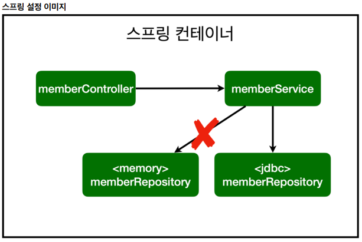

# 스프링 입문 스프링부트

## 스프링 DB 접근 기술

### # 순수JDBC

- build.gradle 파일에 jdbc,h2 관련 라이브러리 추가

```java
implementation 'org.springframework.boot:spring-boot-starter-jdbc'
runtimeOnly 'com.h2database:h2'
```

- `implementation 'org.springframework.boot:spring-boot-starter-jdbc'`
  - java는 기본적으로 db가 붙으려면 jdbc가 있어야 한다.
- `runtimeOnly 'com.h2database:h2'`
  - db에서 제공하는 클라이언트가 필요하다.

### # 스프링 부트 데이터베이스 연결 설정 추가하기

- resources/application.properties

```java
spring.datasource.url=jdbc:h2:tcp://localhost/~/test
spring.datasource.driver-class-name=org.h2.Driver
spring.datasource.username=sa
```

- DB와 연결작업 끝

### # jdbc 클래스 생성

- repository/JdbcMemberRepository 클래스 파일을 생성한다.

```java
package hello.hellospring.repository;
import hello.hellospring.domain.Member;
import org.springframework.jdbc.datasource.DataSourceUtils;
import javax.sql.DataSource;
import java.sql.*;
import java.util.ArrayList;
import java.util.List;
import java.util.Optional;
public class JdbcMemberRepository implements MemberRepository {
    private final DataSource dataSource;
    public JdbcMemberRepository(DataSource dataSource) {
        this.dataSource = dataSource;
    }
    @Override
    public Member save(Member member) {
        String sql = "insert into member(name) values(?)";
        Connection conn = null;
        PreparedStatement pstmt = null;
        ResultSet rs = null;
        try {
            conn = getConnection();
            pstmt = conn.prepareStatement(sql,
                    Statement.RETURN_GENERATED_KEYS);
            pstmt.setString(1, member.getName());
            pstmt.executeUpdate();
            rs = pstmt.getGeneratedKeys();
            if (rs.next()) {
                member.setId(rs.getLong(1));
            } else {
                throw new SQLException("id 조회 실패");
            }
            return member;
        } catch (Exception e) {
            throw new IllegalStateException(e);
        } finally {
            close(conn, pstmt, rs);
        }
    }
    @Override
    public Optional<Member> findById(Long id) {
        String sql = "select * from member where id = ?";
        Connection conn = null;
        PreparedStatement pstmt = null;
        ResultSet rs = null;
        try {
            conn = getConnection();
            pstmt = conn.prepareStatement(sql);
            pstmt.setLong(1, id);
            rs = pstmt.executeQuery();
            if(rs.next()) {
                Member member = new Member();
                member.setId(rs.getLong("id"));
                member.setName(rs.getString("name"));
                return Optional.of(member);
            } else {
                return Optional.empty();
            }
        } catch (Exception e) {
            throw new IllegalStateException(e);
        } finally {
            close(conn, pstmt, rs);
        }
    }
    @Override
    public List<Member> findAll() {
        String sql = "select * from member";
        Connection conn = null;
        PreparedStatement pstmt = null;
        ResultSet rs = null;
        try {
            conn = getConnection();
            pstmt = conn.prepareStatement(sql);
            rs = pstmt.executeQuery();
            List<Member> members = new ArrayList<>();
            while(rs.next()) {
                Member member = new Member();
                member.setId(rs.getLong("id"));
                member.setName(rs.getString("name"));
                members.add(member);
            }
            return members;
        } catch (Exception e) {
            throw new IllegalStateException(e);
        } finally {
            close(conn, pstmt, rs);
        }
    }
    @Override
    public Optional<Member> findByName(String name) {
        String sql = "select * from member where name = ?";
        Connection conn = null;
        PreparedStatement pstmt = null;
        ResultSet rs = null;
        try {
            conn = getConnection();
            pstmt = conn.prepareStatement(sql);
            pstmt.setString(1, name);
            rs = pstmt.executeQuery();
            if(rs.next()) {
                Member member = new Member();
                member.setId(rs.getLong("id"));
                member.setName(rs.getString("name"));
                return Optional.of(member);
            }
            return Optional.empty();
        } catch (Exception e) {
            throw new IllegalStateException(e);
        } finally {
            close(conn, pstmt, rs);
        }
    }
    private Connection getConnection() {
        return DataSourceUtils.getConnection(dataSource);
    }
    private void close(Connection conn, PreparedStatement pstmt, ResultSet rs)
    {
        try {
            if (rs != null) {
                rs.close();
            }
        } catch (SQLException e) {
            e.printStackTrace();
        }
        try {
            if (pstmt != null) {
                pstmt.close();
            }
        } catch (SQLException e) {
            e.printStackTrace();
        }
        try {
            if (conn != null) {
                close(conn);
            }
        } catch (SQLException e) {
            e.printStackTrace();
        }
    }
    private void close(Connection conn) throws SQLException {
        DataSourceUtils.releaseConnection(conn, dataSource);
    }
}
```

- 오래된 기술이라 한다. ㅠ.ㅠ

### # SpringConfig

- SpringConfig 파일에 아래 코드를 삽입한다.

```java
package hello.hellospring;

import hello.hellospring.repository.JdbcMemberRepository;
import hello.hellospring.repository.MemberRepository;
import hello.hellospring.repository.MemoryMemberRepository;
import hello.hellospring.service.MemberService;
import org.springframework.context.annotation.Bean;
import org.springframework.context.annotation.Configuration;

import javax.sql.DataSource;

@Configuration
public class SpringConfig {

    private final DataSource dataSource;

    public SpringConfig(DataSource dataSource) {
        this.dataSource = dataSource;
    }

    @Bean
    public MemberService memberService() {
        return new MemberService(memberRepository());
    }

    @Bean
    public MemberRepository memberRepository() {
//        return new MemoryMemberRepository();
        //JDBC 활용
        return new JdbcMemberRepository(dataSource);
    }
}
```

- 스프링을 사용하는 이유!
  - 다형성을 활용!
    - 인터페이스를 두고 구현체를 바꿔끼는데 편리함을 준다.
    - 의존성 주입으로 인해 편리함을 제공한다.
  - 기존 코드를 손대지 않고 조립하는 형식으로 해당 코드만 건드리면 된다.

.png)

- MemberService는 MemberRepository를 의존하고 있다.
- MemberRepository는 구현체로 JdbcMemberRepository와 MemoryMemberRepository가 있다.



- 기존에 &lt;memmory&gt;memberRepository를 스프링 빈으로 등록했다면
- 이제는 빼고 &lt;memmory&gt;memberRepository를 등록하였다.

- 개방-폐쇄 원칙(OCP, Open-Closed Principle)
  - 확장에는 열려있고, 수정, 변경에는 닫혀있다.
  - 조립하는 코드는 수정해야겠지만, 어플리케이션 동작하는 코드들은 건드릴 필요가 없다.
- 스프링의 DI (Dependencies Injection)을 사용하면 `기존 코드를 전혀 손대지 않고, 설정만으로 구현`
클래스를 변경할 수 있다.
- 회원을 등록하고 DB에 결과가 잘 입력되는지 확인하자.
- 데이터를 DB에 저장하므로 스프링 서버를 다시 실행해도 데이터가 안전하게 저장된다.
