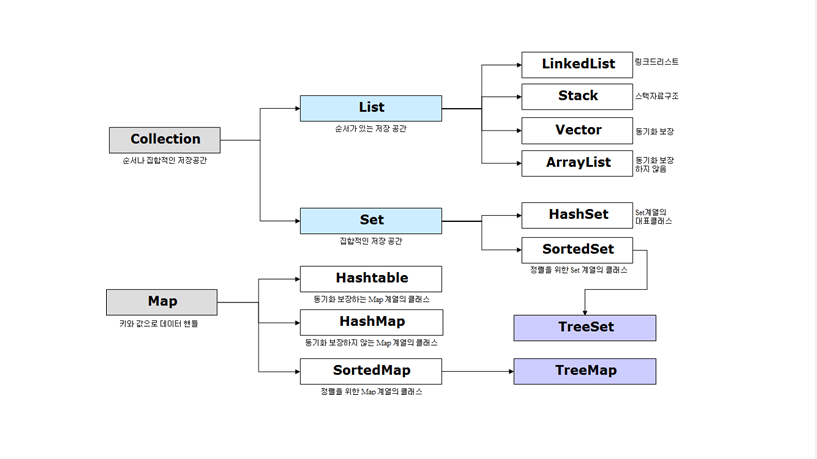

# Java

## Collection

### # Collection이란?

- 데이터의 집합, 그룹을 의미한다.
- JCF(Java Collections Framework) = 데이터와 자료구조인 컬렉션과 이를 구현하는 클래스를 정의하는 인터페이스를 제공
- `List`, `Map`, `Set` 인터페이스를 기준으로 여러 구현체가 존재 (+ `Stack`, `Queue` 인터페이스도 존재)

### # Collection을 사용하는 이유는?

- 다수의 `Data`를 다루는데 `표준화된 클래스들을 제공`해주기 때문이다.
- `DataStructure`를 직접 구현하지 않고 `편하게 사용`할 수 있기 때문이다.
- 배열과 다르게 `객체를 보관하기 위한 공간을 미리 정하지 않아도 된다.`
- 상황에 따라 `객체의 수를 동적으로` 정할 수 있다.
- 그래서 프로그램의 `공간적인 효율성을 높여준다.`

### # Collection의 인터페이스

- `List`
  - `순서가 있는 데이터의 집합`으로 `데이터의 중복을 허용`한다.
    - LinkedList
      - 양방향 포인터 구조로 데이터의 삽입, 삭제가 빈번할 경우 데이터의 위치정보만 수정하면 되기에 유용
      - 스택, 큐, 양방향 큐 등을 만들기 위한 용도로 쓰임
    - Vector
      - 과거에 대용량 처리를 위해 사용했으며, 내부에서 자동으로 동기화처리가 일어나 비교적 성능이 좋지 않고 무거워 잘 쓰이지 않음
    - ArrayList
      - 단방향 포인터 구조로 각 데이터에 대한 인덱스를 가지고 있어 조회 기능에 성능이 뛰어남
  - List 인터페이스를 직접 @Override를 통해 사용자가 정의하여 사용할 수도 있으며
  - 대표적인 구현체로는 ArrayList가 존재한다.
  - 이는 기존에 있었던 Vector를 개선한 것이다.
  - 이외에도 LinkedList 등의 구현체가 있다.
- `Map`
  - `키(Key)`, `값(Value)`의 쌍으로 이루어진 데이터의 집합이다.
  - `순서는 유지되지 않으며` `키(Key)의 중복을 허용하지 않으나` `값(Value)의 중복은 허용`한다.
    - Hashtable
      - HashMap보다는 느리지만 동기화 지원
      - null불가
    - HashMap
      - 중복과 순서가 허용되지 않으며 null값이 올 수 있다.
    - TreeMap
      - 정렬된 순서대로 키(Key)와 값(Value)을 저장하여 검색이 빠름
  - 대표적인 구현체로 HashMap이 존재한다.
  - key-value 의 구조로 이루어져 있으며 Map 에 대한 구체적인 내용은 DataStructure 부분의 hashtable 과 일치한다.
  - key 를 기준으로 중복된 값을 저장하지 않으며 순서를 보장하지 않는다.
  - key 에 대해서 순서를 보장하기 위해서는 LinkedHashMap을 사용한다.
- `Set`
  - `순서를 유지하지 않는 데이터의 집합`으로 `데이터의 중복을 허용하지 않는다.`
    - HashSet
      - 가장빠른 임의 접근 속도
      - 순서를 예측할 수 없음
    - TreeSet
      - 정렬방법을 지정할 수 있음
  - 대표적인 구현체로 HashSet이 존재한다. value에 대해서 중복된 값을 저장하지 않는다.
  - 사실 Set 자료구조는 Map 의 key-value 구조에서 key 대신에 value 가 들어가 value 를 key 로 하는 자료구조일 뿐이다.
  - 마찬가지로 순서를 보장하지 않으며 순서를 보장해주기 위해서는 LinkedHashSet을 사용한다.
- `Stack` & `Queue`
  - Stack 객체는 직접 new 키워드로 사용할 수 있다.
  - Queue 인터페이스는 JDK 1.5 부터 LinkedList에 new 키워드를 적용하여 사용할 수 있다.

### # JCF의 상속구조

- Collection 인터페이스는 List, Set, Queue로 크게 3가지 상위 인터페이스로 분류할 수 있다.
- Map의 경우 Collection 인터페이스를 상속받고 있지 않지만 Collection으로 분류된다.

### # 참조

- [JaeYeopHan/Interview_Question_for_Beginner](https://github.com/JaeYeopHan/Interview_Question_for_Beginner/tree/master/Java#collection)
- [DEV.GA/[JAVA] Java 컬렉션(Collection) 정리](https://gangnam-americano.tistory.com/41)
