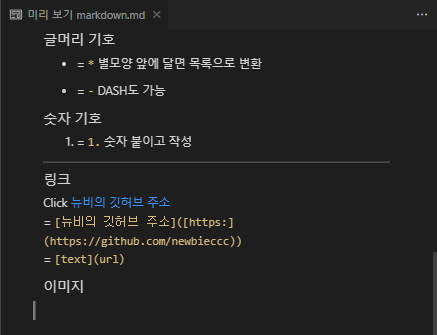

# 마크다운(Markdown)

- [마크다운(Markdown) 6분 순삭 정리 + 깃허브 리드미(ReadMe) 파일 작성 팁 ⭐️ - 드림코딩](https://www.youtube.com/watch?v=kMEb_BzyUqk&list=PLSGXVEmOeRV4Jyt7w4G07ZDMlDRHIrQVg&index=1&t=30s)

## 사용하는 이유

- Github README.md 파일작성 및 PR 설명에 효과적으로 전달이 가능하다.

## 마크다운 문법

<!-- Heading -->
### Heading

# Heading 1

## Heading 2

### Heading 3

#### Heading 4

##### Heading 5

###### Heading 6

- Heading 1의 경우 underline이 자동으로 추가 된다.
- 해쉬태그 없이 작성하면 일반 텍스트처럼 작성 된다.

---

### 수평선

`---` = -(마이너스) 3개.

---

### **굵기**

**`bold`** = `**`별표 두개 감싸고 텍스트`**`

### *기울임*

*italic* = `*`별표 한개 감싸고 텍스트`*`

### ~~취소선~~

~~strikethrough~~ = `~~`물결 두개 감싸고 텍스트`~~`

---

### 인용구

>quote </br> `>` 안에 작성

### 글머리 기호

* = `*` 별모양 앞에 달면 목록으로 변환

- = `-` DASH도 가능

### 숫자 기호

1. = `1.` 숫자 붙이고 작성

---

### 링크

Click [뉴비의 깃허브 주소](https://github.com/newbieccc) </br>= `[뉴비의 깃허브 주소]([https:](https://github.com/newbieccc))`
</br>= `[text](url)`

### 이미지


</br>= ``
</br>= ``
</br>- 절대주소 / 상대주소 가능

---

### 테이블

|Header|Description|
|--|--|
|Cell1|Cell2|
|Cell1|Cell2|
|Cell1|Cell2|
|Cell1|Cell2|

</br>

`|Header|Description|` </br>
`|--|--|` </br>
`|Cell1|Cell2|` </br>
`|Cell1|Cell2|` </br>
`|Cell1|Cell2|` </br>

- right align

></br>|Header|Description|
></br>|--:|--:|
></br>|Cell1|Cell2|

- left align

></br>|Header|Description|
></br>|:--|:--|
></br>|Cell1|Cell2|

- center align

></br>|Header|Description|
></br>|:--:|:--:|
></br>|Cell1|Cell2|

---

### 특정한 코드 강조

`가독성` = `` `백틱 안에 감싸고 코드` ``

### 코드 블럭

```java
public string void main (string[] args){
    System.out.print("Hello World");
}
```

` ```java = 백틱 3개와 사용할 언어

public string void main (string[] args){ </br>
&nbsp;&nbsp;&nbsp;&nbsp;    System.out.print("Hello World"); </br>
}

``` ` = 백틱 3개로 닫기

---

### 작업 목록

- [x] README.md 작성
- [ ] Java 공부
- [ ] Spring 공부

</br>

- `[x]` 텍스트
- `[ ]` 텍스트
- `[ ]` 텍스트
