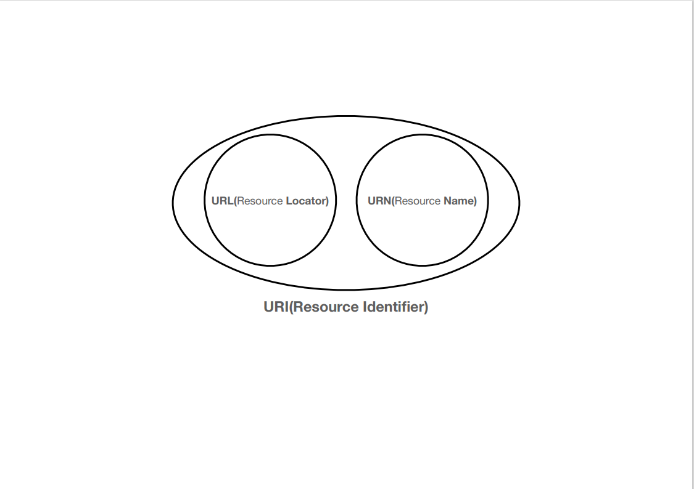
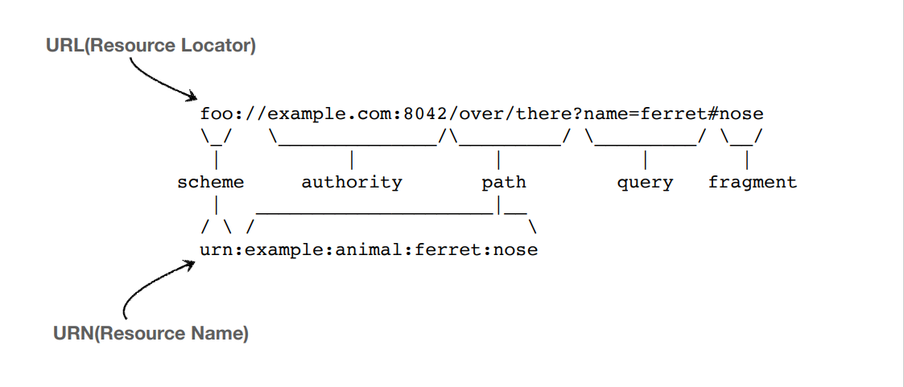

# 네트워크 URI, URL, URN

## URI (Uniform Resource Identifier)

- 인터넷에 있는 자원을 나타내는 유일한 주소
- URI의 존재는 인터넷에서 요구되는 기본조건으롯서 인터넷 프로토콜에 항상 붙어 다닌다.
- URI는 로케이터(locator), 이름(name) 또는 둘다 추가로 분류될 수 있다.
- URI 표준 스펙 링크(https://www.ietf.org/rfc/rfc3986.txt)

### # URI의 형태

- URL(Resouce Locator)은 리소스의 위치
- URN(Resource Name)은 리소스의 이름

### # URL과 URN의 예

- URN의 경우 이름을 부여하는데 찾을 수가 없다.  예시로 URL과 URN 둘다 코를 가리키지만 URN은 맵핑이 안 되있기 때문에 찾을 수 없기에 URL을 사용하게 된다.  URN은 이런게 있다 정도로만...

### # URI란

- Uniform : 리소스 식별하는 통일된 방식
- Resource : 자원, URI로 식별할 수 있는 모든 것(제한 없음)
- Identifier : 다른 항목과 구분하는데 필요한 정보
  
- URL - locator : 리소스가 있는 위치를 지정
- URN - name : 리소스에 이름을 부여
- 위치는 변할 수 있지만, 이름은 변하지 않는다.
- urn:isbn:8960777331 (어떤 책의 isbn URN)
- URN 이름만으로 실제 리소스를 찾을 수 있는 방법이 보편화 되지 않음.
- 앞으로 URI를 URL과 같은 의미로 이야기 한다.

### # URL 전체 문법

- `scheme://[userinfo@]host[:port][/path][?query][#fragment]`
- ex)`https://www.google.com:443/search?q=hello&hl=ko`
  
- 프로토콜(https)
- 호스트명(www.google.com)
- 포트번호(443)
- 패스(/search)
- 쿼리 파라미터(q=hello&hl=ko)

### # scheme

- 주로 프로토콜 사용
- 프로토콜 : 어떤 방식으로 자원에 접근할 것인가 하는 약속 규칙
  - ex) http, https, ftp 등등
- http는 80포트, https는 443 포트를 주로 사용, 포트는 생략 가능
- https는 http에 보안 추가 (HTTP Secure)

### # userinfo

- URL에 사용자정보를 포함해서 인증
- 거의 사용하지 않음

### # host

- 호스트명
- 도메인명 또는 IP 주소를 직접 사용가능

### # port

- 포트(PORT) / 접속포트
- 일반적으로 생략, 생략시 http는 80, https는 443

### # path

- 리소스의 경로(path), 계층적 구조
- 예시
  - /home/file1.jpg
    - 홈이라는 파일1 jpg가 계층적으로 디렉토리 처럼 되어있다거나
  - /members
    - 회원들의 정보를 보여주는 웹사이트거나
  - /members/100, /items/iphone12
    - 100번의 회원을 본다거나

### # query

- key = value 형태
- ?로 시작, &로 추가 가능
  - ?keyA=valueA&keyB=valueB
- query parameter, query string 등으로 불림, 웹서버에 제공하는 파라미터, 문자 형태

### # fragment

- html 내부 북마크 등에 사용
- 서버 전송하는 정보 아님

---

### 참조

- [인프런 - 모든 개발자를 위한 HTTP 웹 기본 지식 / 김영한님](https://www.inflearn.com/course/http-%EC%9B%B9-%EB%84%A4%ED%8A%B8%EC%9B%8C%ED%81%AC/dashboard)
- [통합 자원 식별자 - 위키백과](https://ko.wikipedia.org/wiki/%ED%86%B5%ED%95%A9_%EC%9E%90%EC%9B%90_%EC%8B%9D%EB%B3%84%EC%9E%90)
